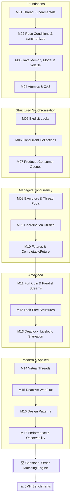

# ⚡ Concurrency Curriculum

**A hands-on path from `Thread t = new Thread()` to a lock-free, virtual-thread-powered matching engine — every concept demonstrated in runnable Java, wired into a real Spring Boot application.**


---

## Why this exists

Concurrency is usually taught as a grab-bag of keywords — `synchronized`, `volatile`, `Atomic*`, `ExecutorService` — with no throughline connecting them. This repo teaches it as one continuous story instead: **every module solves the problem the previous module's solution wasn't quite good enough for**, from a plain `Thread` all the way to a lock-free order-matching engine running on virtual threads.

Every module is:
- **Runnable.** Every concept has a `main()` demo you execute directly — no slides, no pseudocode.
- **Tested.** Correctness claims are backed by JUnit 5 + AssertJ + Awaitility, not "trust me."
- **Documented.** Every module folder has its own README with a mental model, a diagram, pitfalls, and sample output.
- **Real.** It all lives inside one working Spring Boot application — several modules expose actual REST endpoints you can `curl` while threads contend for real resources.

## 🗺️ The Learning Path



The modules are numbered for a reason — each one leans on an idea the previous one introduced. That said, every module also stands alone: if you already know threads and just want CAS, jump straight to M04.

## 📚 Module Index

| # | Module | What it answers |
|---|--------|------------------|
| 01 | [Thread Fundamentals](concurrency-lab/src/main/java/com/concurrency/lab/m01_thread_fundamentals/README.md) | How do you create and control a thread, and what do its lifecycle states actually mean? |
| 02 | [Race Conditions & `synchronized`](concurrency-lab/src/main/java/com/concurrency/lab/m02_race_conditions_and_synchronized/README.md) | Why does `counter++` lose updates under concurrency, and what's the simplest fix? |
| 03 | [Java Memory Model & `volatile`](concurrency-lab/src/main/java/com/concurrency/lab/m03_java_memory_model_and_volatile/README.md) | Why can one thread never see another thread's write — and why is that a *different* problem from atomicity? |
| 04 | [Atomics & CAS](concurrency-lab/src/main/java/com/concurrency/lab/m04_atomic_and_cas/README.md) | How do you get thread-safety *without* a lock, and what is the ABA problem? |
| 05 | [Explicit Locks](concurrency-lab/src/main/java/com/concurrency/lab/m05_explicit_locks/README.md) | What can `ReentrantLock`/`StampedLock` do that `synchronized` can't? |
| 06 | [Concurrent Collections](concurrency-lab/src/main/java/com/concurrency/lab/m06_concurrent_collections/README.md) | Which built-in collection is safe for your access pattern, and where do "atomic" collections still let compound operations race? |
| 07 | [Producer/Consumer & Blocking Queues](concurrency-lab/src/main/java/com/concurrency/lab/m07_producer_consumer_blocking_queues/README.md) | How do you connect producers and consumers with built-in backpressure, no polling? |
| 08 | [Executors & Thread Pools](concurrency-lab/src/main/java/com/concurrency/lab/m08_executors_and_thread_pools/README.md) | How do you size a pool, tune its queue, and shut it down without leaking threads or dropping work? |
| 09 | [Coordination Utilities](concurrency-lab/src/main/java/com/concurrency/lab/m09_coordination_utilities/README.md) | How do independent threads rendezvous, gate on resources, or swap data — `CountDownLatch`, `CyclicBarrier`, `Semaphore`, `Exchanger`, `Phaser`? |
| 10 | [Futures & CompletableFuture](concurrency-lab/src/main/java/com/concurrency/lab/m10_futures_and_completablefuture/README.md) | How do you compose async operations instead of blocking on each one? |
| 11 | [Fork/Join & Parallel Streams](concurrency-lab/src/main/java/com/concurrency/lab/m11_fork_join_and_parallel_streams/README.md) | How does divide-and-conquer parallelism work, and how do you avoid starving the common pool? |
| 12 | [Lock-Free Structures](concurrency-lab/src/main/java/com/concurrency/lab/m12_lock_free_structures/README.md) | How do you build a stack or ring buffer with zero locks, and when is that actually worth it? |
| 13 | [Deadlock, Livelock & Starvation](concurrency-lab/src/main/java/com/concurrency/lab/m13_deadlock_livelock_starvation/README.md) | How do these failure modes actually happen, and what are the standard fixes for each? |
| 14 | [Virtual Threads & Structured Concurrency](concurrency-lab/src/main/java/com/concurrency/lab/m14_virtual_threads_structured_concurrency/README.md) | Why do virtual threads make blocking I/O cheap again, and where's the sharp edge (pinning)? |
| 15 | [Reactive Programming (Project Reactor)](concurrency-lab/src/main/java/com/concurrency/lab/m15_reactive_webflux/README.md) | What does backpressure mean when nothing is blocking at all? |
| 16 | [Concurrency Design Patterns](concurrency-lab/src/main/java/com/concurrency/lab/m16_concurrency_design_patterns/README.md) | Rate limiter, bounded pool, actor/worker-pool, lazy singleton, circuit breaker — the patterns that keep coming up. |
| 17 | [Performance & Observability](concurrency-lab/src/main/java/com/concurrency/lab/m17_performance_and_observability/README.md) | How do you *prove* what your threads are doing — thread dumps, contention monitoring, JFR? |
| 🏆 | [Capstone: Order Matching Engine](concurrency-lab/src/main/java/com/concurrency/lab/capstone_order_matching_engine/README.md) | Can you combine all of the above into one coherent, correct, high-throughput system? |
| 📊 | [Benchmarks](benchmarks/README.md) | What do these tradeoffs actually cost, in real numbers, measured properly with JMH? |

## 🧱 Project Structure

```
concurrency/
├── pom.xml                          # aggregator (Java 21, Spring Boot 3.3.5 parent)
├── concurrency-lab/                 # the Spring Boot app — one package per module
│   ├── pom.xml
│   └── src/
│       ├── main/java/com/concurrency/lab/
│       │   ├── ConcurrencyLabApplication.java
│       │   ├── m01_thread_fundamentals/        (demos + README.md)
│       │   ├── m02_race_conditions_and_synchronized/
│       │   ├── ...
│       │   ├── m17_performance_and_observability/
│       │   └── capstone_order_matching_engine/
│       └── test/java/com/concurrency/lab/      # mirrors main, one test package per module
└── benchmarks/                      # JMH micro-benchmarks (separate module — see below)
    ├── pom.xml
    └── src/main/java/com/concurrency/benchmarks/
```

**Why `benchmarks` is a separate module:** JMH's annotation processor and Spring Boot's fat-jar repackaging both want to control the build's executable-jar shape. Keeping them apart avoids a well-known class of build headaches. `concurrency-lab` publishes its plain jar (Spring Boot's executable jar is built under the `exec` classifier instead) so `benchmarks` can depend on it like any normal library — including its capstone `MatchingEngine`.

## 🚀 Getting Started

**Prerequisites:** JDK 21, Maven 3.9+.

Build everything:
```bash
mvn clean install
```

Run any module's standalone demo directly:
```bash
mvn -pl concurrency-lab exec:java -Dexec.mainClass=com.concurrency.lab.m02_race_conditions_and_synchronized.RaceConditionDemo
```

Run the whole test suite:
```bash
mvn -pl concurrency-lab test
```

Run just one module's tests:
```bash
mvn -pl concurrency-lab test -Dtest="com.concurrency.lab.m04_atomic_and_cas.*"
```

Start the Spring Boot app (needed for the REST-exposed demos in m08, m14, m16, m17, and the capstone):
```bash
mvn -pl concurrency-lab spring-boot:run
```

Run the JMH benchmarks:
```bash
mvn -pl benchmarks -am package -DskipTests
java -jar benchmarks/target/benchmarks.jar
```

## 🎯 How to Use This Repo
1. Start at M01 if threads are new to you; jump straight to whichever module matches a gap you already know you have otherwise.
2. Open the module's `README.md` first — it sets up the mental model and the pitfalls *before* you read code.
3. Run the demos. Concurrency bugs are notoriously invisible in prose; they're much less invisible when you can watch a counter come out wrong on your own machine.
4. Read the tests — they're the executable proof of the README's claims, and a template for how to test concurrent code deterministically (latches and Awaitility, not `Thread.sleep` and hope).
5. Once you've been through M01–M17, read the [capstone](concurrency-lab/src/main/java/com/concurrency/lab/capstone_order_matching_engine/README.md) — it's a table mapping *every* design decision in a real system back to the module that taught it.

## 🔗 Further Reading
- Brian Goetz et al., *Java Concurrency in Practice* — still the definitive book on this subject.
- [The Java Language Specification, Chapter 17 (Threads and Locks)](https://docs.oracle.com/javase/specs/jls/se21/html/jls-17.html) — the actual Java Memory Model.
- [JEP 444: Virtual Threads](https://openjdk.org/jeps/444), [JEP 453: Structured Concurrency (Preview)](https://openjdk.org/jeps/453)
- [Project Reactor Reference Guide](https://projectreactor.io/docs/core/release/reference/)
- [JMH samples](https://github.com/openjdk/jmh/tree/master/jmh-samples/src/main/java/org/openjdk/jmh/samples)
