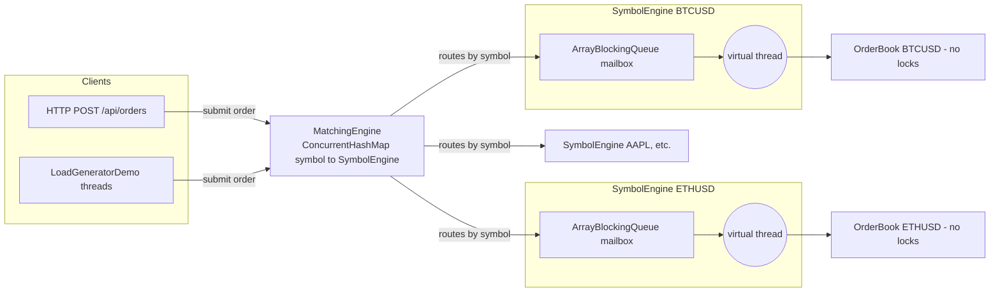

# Capstone — Concurrent Order Matching Engine

## 🎯 Learning Objectives
- Combine everything the curriculum taught into one coherent, realistic system instead of isolated demos.
- See the **single-writer / actor pattern** (m16) used as the primary correctness tool, replacing locks almost entirely.
- Understand how **bounded blocking queues** (m07) provide backpressure between producers and a matching engine.
- Use **virtual threads** (m14) to cheaply give every symbol — and every concurrent HTTP request — its own thread without exhausting OS threads.
- See **atomics and `LongAdder`** (m04) used for cheap, lock-free cross-cutting counters layered on top of a lock-free core.
- Exercise the whole thing under real concurrent load and verify correctness with a conservation-style test, not just eyeballing output.

## 📖 Concept
A matching engine takes incoming buy/sell orders for a symbol and crosses them against resting orders at compatible prices. The hard part is never the matching *algorithm* — it's making it correct under concurrent access without paying for a lock on every single order.

This implementation sidesteps the problem entirely: **only one thread is ever allowed to touch a given symbol's order book.**



Every symbol gets its own `SymbolEngine`: a bounded `ArrayBlockingQueue<Order>` mailbox plus one dedicated virtual thread that drains it and drives the `OrderBook`. Because exactly one thread ever calls `OrderBook.match()`, the book's `TreeMap` price levels need **zero synchronization** — the concurrency problem is pushed entirely into the mailbox, where a well-tested `BlockingQueue` already solves it correctly. Different symbols run fully in parallel with no contention between them at all.

## 🧩 How This Ties the Curriculum Together
| Design decision | Curriculum module |
|---|---|
| No locks inside `OrderBook` — single-writer thread owns it | m16 concurrency design patterns (actor/worker-pool) |
| `ArrayBlockingQueue` mailbox blocks producers when full (backpressure) | m07 producer-consumer / blocking queues |
| One virtual thread per symbol, and per inbound HTTP request | m14 virtual threads |
| `ConcurrentHashMap.computeIfAbsent` to lazily create per-symbol engines | m06 concurrent collections (and its `computeIfAbsent` locking caveat) |
| `LongAdder` counters for orders/trades processed | m04 atomics |
| `AtomicLong` order-id generator | m04 atomics |
| Graceful `@PreDestroy` shutdown of every worker thread | m08 executors / graceful shutdown |
| Concurrency correctness proven with a latch-driven load test, not eyeballing | m09 coordination utilities |

## ⚠️ Common Pitfalls
- **Don't** be tempted to add a lock "just in case" inside `OrderBook` — that would defeat the entire design and reintroduce contention the actor pattern was meant to remove.
- `computeIfAbsent`'s mapping function runs while the `ConcurrentHashMap` holds the bin lock. `SymbolEngine`'s constructor only starts a virtual thread (cheap), which is safe — but a slower mapping function (e.g. one that blocks) would serialize unrelated symbols hashing to the same bin.
- The mailbox is bounded on purpose: an unbounded queue would let a slow matching thread accumulate unlimited memory under overload. `submit()` blocking on a full queue is the backpressure signal propagating back to callers — including HTTP clients, whose request thread will simply wait.
- This is a teaching model, not a production exchange: no order cancellation, no market orders, no persistence/recovery, and price-time priority only within a level (FIFO), not across levels.

## 🧪 Demos in This Module
| Class | What it demonstrates | Run command |
|---|---|---|
| `LoadGeneratorDemo` | Submits 50,000 orders from thousands of virtual threads directly against a `MatchingEngine`, reports submission vs. end-to-end drain throughput | `mvn -pl concurrency-lab exec:java -Dexec.mainClass=com.concurrency.lab.capstone_order_matching_engine.LoadGeneratorDemo` |
| `OrderController` (REST) | Live HTTP surface for submitting orders and inspecting the book/trades/stats | `mvn -pl concurrency-lab spring-boot:run`, then see curl examples below |

## ▶️ How to Run

**Standalone load test (no Spring context needed):**
```bash
mvn -pl concurrency-lab exec:java -Dexec.mainClass=com.concurrency.lab.capstone_order_matching_engine.LoadGeneratorDemo
```

**Live REST demo:**
```bash
mvn -pl concurrency-lab spring-boot:run
```
```bash
curl -X POST localhost:8080/api/orders \
  -H "Content-Type: application/json" \
  -d '{"symbol":"AAPL","side":"BUY","price":101,"quantity":10}'

curl -X POST localhost:8080/api/orders \
  -H "Content-Type: application/json" \
  -d '{"symbol":"AAPL","side":"SELL","price":100,"quantity":4}'

curl localhost:8080/api/orders/book/AAPL
curl localhost:8080/api/orders/trades/AAPL
curl localhost:8080/api/orders/stats
```

Load it concurrently with a quick shell loop to watch it stay correct under contention:
```bash
for i in $(seq 1 200); do
  curl -s -X POST localhost:8080/api/orders \
    -H "Content-Type: application/json" \
    -d "{\"symbol\":\"AAPL\",\"side\":\"$([ $((i % 2)) -eq 0 ] && echo BUY || echo SELL)\",\"price\":$((95 + RANDOM % 10)),\"quantity\":$((1 + RANDOM % 5))}" &
done
wait
curl localhost:8080/api/orders/stats
```

Run the tests:
```bash
mvn -pl concurrency-lab test -Dtest="com.concurrency.lab.capstone_order_matching_engine.*"
```

## 📊 Sample Output
```
Submitted 50000 orders across 3 symbols
Submission time:        612 ms (81699 orders/sec)
End-to-end drain time:  1830 ms (27322 orders/sec)
Orders processed: 50000, Trades executed: 18774
BTCUSD book: BookSnapshot[symbol=BTCUSD, bids=[PriceLevel[price=128, totalQuantity=41, orderCount=5], ...], asks=[...]]
ETHUSD book: BookSnapshot[symbol=ETHUSD, bids=[...], asks=[...]]
AAPL book: BookSnapshot[symbol=AAPL, bids=[...], asks=[...]]
```
(Exact numbers are machine-dependent — the interesting part is submission throughput vastly exceeding what a single-threaded matching loop alone could sustain, while per-symbol processing stays fully correct and contention-free.)

## 🔗 Further Reading
- [LMAX Disruptor whitepaper](https://lmax-exchange.github.io/disruptor/) — the classic single-writer, mechanical-sympathy design this module is inspired by.
- [Real Logic / Aeron](https://github.com/real-logic/aeron) — production-grade single-writer messaging.
- Martin Thompson, "Single Writer Principle" — the design philosophy behind avoiding locks by construction rather than by clever synchronization.
