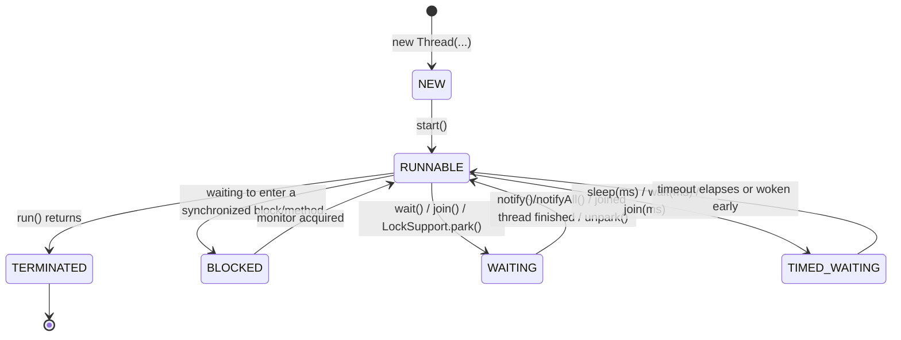

# M01 — Thread Fundamentals

## 🎯 Learning Objectives
- Create threads in every standard way: `Thread` subclass, `Runnable`, lambda, and `Callable` + `FutureTask`.
- Read and interpret every value of `Thread.State` and know which JDK API calls trigger each transition.
- Understand the difference between daemon and non-daemon threads and how each affects JVM shutdown.
- Use `join()` (with and without a timeout) and `interrupt()` correctly, including restoring the interrupt status instead of swallowing `InterruptedException`.
- Build intuition for the real cost of spawning/scheduling many OS threads versus doing the same work on one thread.

## 📖 Concept
A `Thread` in the JVM is a thin wrapper around an OS-scheduled thread. Its lifecycle is captured by `Thread.State`:



Key mental model: `RUNNABLE` in Java means "eligible to run" (could be actually running on a core, or simply waiting for the OS scheduler) — it does not distinguish "running" from "ready". `BLOCKED` is specifically for contending on an intrinsic (`synchronized`) monitor; `WAITING`/`TIMED_WAITING` are for cooperative waiting (latches, `wait()`, `join()`, `sleep()`).

Threads are relatively expensive: each one gets its own OS-level stack and requires kernel-level context switches to schedule. `ContextSwitchCostDemo` gives an informal feel for that overhead by comparing the same total work done by 1 thread vs. many.

## ⚠️ Common Pitfalls
- Swallowing `InterruptedException` (empty catch block) — this discards the cooperative-cancellation signal; always either propagate it or call `Thread.currentThread().interrupt()` to restore the flag.
- Assuming `RUNNABLE` means "currently executing on a CPU core" — it only means eligible to run.
- Forgetting that a non-daemon thread keeps the JVM alive even after `main()` returns.
- Calling `join()` without a timeout on a thread that might never finish, causing the caller to hang forever.
- Treating `Thread.getState()` snapshots as perfectly deterministic in tests — always synchronize observation points with a latch/Awaitility rather than a fixed `Thread.sleep`.

## 🧪 Demos in This Module
| Class | What it demonstrates | Run command |
|---|---|---|
| `ThreadCreationDemo` | Four ways to create and start a thread (subclass, `Runnable`, lambda, `Callable`+`FutureTask`) | `mvn -pl concurrency-lab exec:java -Dexec.mainClass=com.concurrency.lab.m01_thread_fundamentals.ThreadCreationDemo` (or: run main() from your IDE) |
| `ThreadLifecycleDemo` | Observing `NEW`, `RUNNABLE`, `BLOCKED`, `WAITING`, `TIMED_WAITING`, `TERMINATED` | `mvn -pl concurrency-lab exec:java -Dexec.mainClass=com.concurrency.lab.m01_thread_fundamentals.ThreadLifecycleDemo` (or: run main() from your IDE) |
| `DaemonThreadDemo` | Daemon vs non-daemon thread effect on JVM shutdown | `mvn -pl concurrency-lab exec:java -Dexec.mainClass=com.concurrency.lab.m01_thread_fundamentals.DaemonThreadDemo` (or: run main() from your IDE) |
| `ThreadJoinAndInterruptDemo` | `join(timeout)`, `interrupt()`, correct `InterruptedException` handling | `mvn -pl concurrency-lab exec:java -Dexec.mainClass=com.concurrency.lab.m01_thread_fundamentals.ThreadJoinAndInterruptDemo` (or: run main() from your IDE) |
| `ContextSwitchCostDemo` | Informal timing comparison: 1 thread vs many threads doing the same total increments | `mvn -pl concurrency-lab exec:java -Dexec.mainClass=com.concurrency.lab.m01_thread_fundamentals.ContextSwitchCostDemo` (or: run main() from your IDE) |

## ▶️ How to Run
Each demo class has its own `main()` method and is plain Java (no Spring context needed) — run it directly from your IDE, or via Maven's `exec:java` plugin as shown in the table above.

Run this module's tests with:
```
mvn -pl concurrency-lab test -Dtest=m01_thread_fundamentals.**
```

## 📊 Sample Output
```
== NEW and RUNNABLE ==
Before start(): NEW
Shortly after start(): RUNNABLE
After join(): TERMINATED
== BLOCKED (contending on a monitor) ==
blocked-thread state while waiting on monitor: BLOCKED
blocked-thread finally acquired the lock
== WAITING (CountDownLatch.await() with no timeout) ==
waiter-thread state: WAITING
== TIMED_WAITING (Thread.sleep) ==
sleeper-thread state: TIMED_WAITING
== TERMINATED ==
finishing quickly
terminated-demo state after join(): TERMINATED
```

## 🔗 Further Reading
- [Thread.State javadoc](https://docs.oracle.com/en/java/javase/21/docs/api/java.base/java/lang/Thread.State.html)
- Java Concurrency in Practice, Chapter 1 & 7 (Brian Goetz et al.)
- [Baeldung: A Guide to the Thread Life Cycle in Java](https://www.baeldung.com/java-thread-lifecycle)
