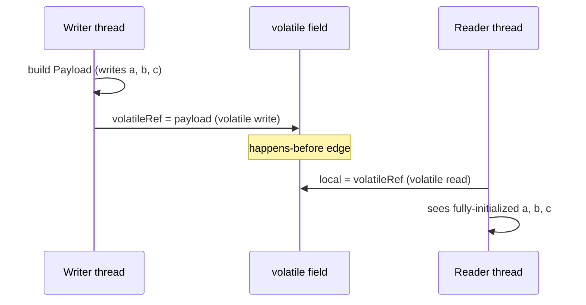

# M03 — Java Memory Model and `volatile`

## 🎯 Learning Objectives
- Distinguish *visibility* problems from *atomicity* problems — `volatile` solves the former, not the latter.
- Explain, informally, what a happens-before edge is and why it matters for safe publication.
- Safely publish an object built by one thread to another using a `volatile` reference.
- Recognize false sharing as a performance (not correctness) problem and how padding avoids it.

## 📖 Concept
Without synchronization, the Java Memory Model (JMM) does not guarantee that a write made by one thread becomes visible to another thread in a timely manner, or at all. A thread's local view of a variable can legally be cached in a CPU register or reordered by the compiler/JIT, so a plain busy-loop like `while (!stopRequested) {}` may never observe another thread's plain write to `stopRequested`.

`volatile` fixes this by establishing a **happens-before** relationship: a write to a volatile field happens-before any subsequent read of that same field by another thread, and — critically — *everything the writing thread did before that write* also becomes visible to the reading thread after it performs the read. This is what makes "safe publication" possible: build an object fully, then publish its reference through a volatile field.



What `volatile` does **not** do: make compound operations like `count++` atomic. `volatile` only guarantees visibility of individual reads/writes, not read-modify-write atomicity — for that you still need `synchronized` or an atomic type (see M02/M04).

False sharing is a different, purely performance-related issue: if two variables written by two different threads happen to sit on the same CPU cache line, every write from one thread invalidates the other thread's cached copy of that line, even though the threads never touch each other's variable. Padding the layout so each variable owns its own cache line avoids this cross-thread cache-coherency traffic.

## ⚠️ Common Pitfalls
- Believing `volatile` makes `count++` thread-safe — it does not; that is still a non-atomic read-modify-write.
- Relying on plain (non-volatile) fields for stop-flags/shutdown signals shared between threads — may "work" during testing and hang unpredictably in production depending on JIT optimization.
- Publishing an object reference through a non-volatile field/plain setter and assuming the receiving thread sees fully-constructed state — the JMM does not guarantee that without a happens-before edge.
- Treating false sharing as a correctness bug — it only affects performance, not the final result.
- Assuming timing numbers from `VisibilityProblemDemo` or `FalseSharingDemo` are portable — both are inherently machine/JIT/JVM dependent (see notes below).

## 🧪 Demos in This Module
| Class | What it demonstrates | Run command |
|---|---|---|
| `VisibilityProblemDemo` | Best-effort demo of a stale read on a non-volatile flag; includes a safety timeout so it always terminates | `mvn -pl concurrency-lab exec:java -Dexec.mainClass=com.concurrency.lab.m03_java_memory_model_and_volatile.VisibilityProblemDemo` (or: run main() from your IDE) |
| `VolatileFixDemo` | Same scenario with a `volatile` flag — always terminates promptly | `mvn -pl concurrency-lab exec:java -Dexec.mainClass=com.concurrency.lab.m03_java_memory_model_and_volatile.VolatileFixDemo` (or: run main() from your IDE) |
| `HappensBeforeDemo` | Safe publication via a `volatile` reference vs. unsafe publication via a plain reference | `mvn -pl concurrency-lab exec:java -Dexec.mainClass=com.concurrency.lab.m03_java_memory_model_and_volatile.HappensBeforeDemo` (or: run main() from your IDE) |
| `FalseSharingDemo` | Timing difference between adjacently-packed counters (false sharing) and padded counters | `mvn -pl concurrency-lab exec:java -Dexec.mainClass=com.concurrency.lab.m03_java_memory_model_and_volatile.FalseSharingDemo` (or: run main() from your IDE) |

## ▶️ How to Run
Each demo class has its own `main()` method and is plain Java (no Spring context needed) — run it directly from your IDE, or via Maven's `exec:java` plugin as shown above.

**Note on `VisibilityProblemDemo`:** it is a best-effort demonstration. On many modern JVMs/hardware it may still terminate quickly even without `volatile` (visibility bugs are JIT/optimization-level and hardware dependent) — the worker thread is started as a daemon and the demo has a 3-second safety timeout so it never actually hangs the JVM, but the point is best understood by comparing it against `VolatileFixDemo`, which is guaranteed to terminate promptly every time.

**Note on `FalseSharingDemo`:** absolute timings are entirely machine/core-topology/JIT dependent; run it a few times and compare the *relative* difference between the packed and padded runs on your own machine.

Run this module's tests with:
```
mvn -pl concurrency-lab test -Dtest=m03_java_memory_model_and_volatile.**
```

## 📊 Sample Output
```
== VolatileFixDemo ==
main setting stopRequested = true (volatile write)
worker observed stopRequested and exited after 84213193 iterations
worker terminated within 1 ms of the volatile write - the write happens-before the worker's next read, so visibility is guaranteed, not just likely.

== FalseSharingDemo ==
Packed (false sharing) : 812 ms
Padded (no false sharing): 301 ms
(Absolute numbers are machine/JIT/core-topology dependent; what matters is the relative difference between the two runs.)
```

## 🔗 Further Reading
- [JLS §17.4 — Memory Model](https://docs.oracle.com/javase/specs/jls/se21/html/jls-17.html#jls-17.4)
- Java Concurrency in Practice, Chapter 3 & 16 (Brian Goetz et al.)
- [Aleksey Shipilëv — Close Encounters of The Java Memory Model Kind](https://shipilev.net/blog/2014/jmm-pragmatics/)
- [Martin Thompson — False Sharing](https://mechanical-sympathy.blogspot.com/2011/07/false-sharing.html)
