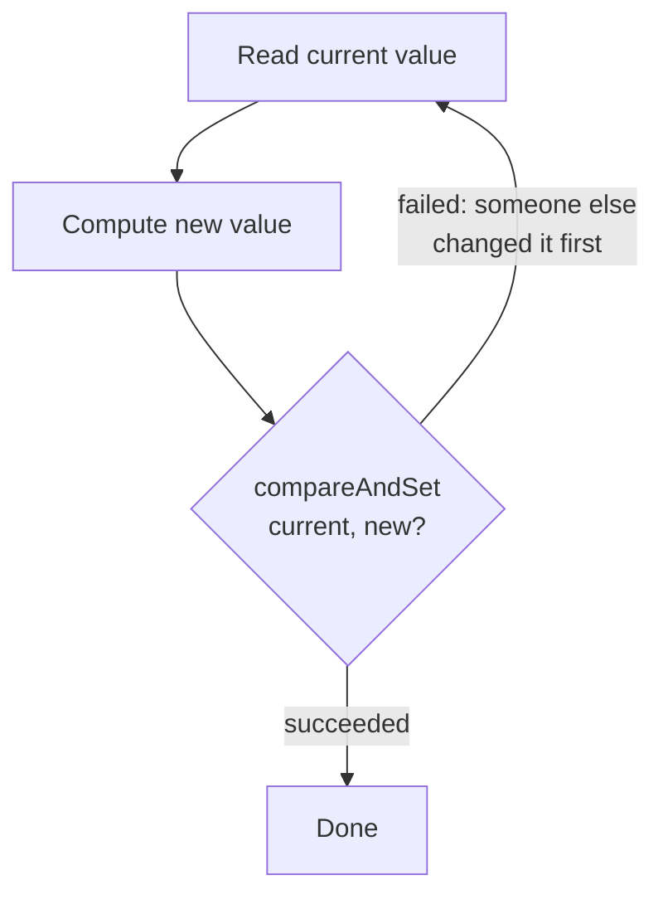

# M04 — Atomics and Compare-And-Swap (CAS)

## 🎯 Learning Objectives
- Use `AtomicInteger`/`AtomicLong` convenience methods and understand what a manual CAS retry loop looks like.
- Explain the ABA problem and why a plain `AtomicReference` cannot detect it.
- Fix ABA with `AtomicStampedReference` and explain why the stamp closes the gap.
- Compare `LongAdder` and `AtomicLong` under contention and know when to reach for which.

## 📖 Concept
Atomic classes give you lock-free thread safety by wrapping a single memory location and relying on a hardware **compare-and-swap (CAS)** instruction instead of a lock. CAS says: "set this location to `newValue`, but only if it currently equals `expectedValue`; tell me whether that succeeded." Every atomic increment is really a retry loop under the hood:



Because there's no lock, no thread ever blocks — a thread that loses the race just retries. This scales very well under low-to-moderate contention.

**The ABA problem:** CAS only compares *identity/equality* of the current value against the expected value. If a value changes from A to B and back to A between your read and your CAS, the CAS will spuriously succeed — even though the structure it points into may have changed shape in between (e.g., in a lock-free stack, nodes may have been popped and a *different* node happened to be pushed back with the same reference, due to node-pool reuse). `AtomicStampedReference` fixes this by pairing every reference with a monotonically-increasing integer stamp; a successful CAS now requires both the reference **and** the stamp to match what the thread originally observed, so an A→B→A round trip is detected because the stamp moved even though the reference looks unchanged.

**`LongAdder` vs `AtomicLong`:** `AtomicLong` funnels every writer through CAS on a single shared memory location — under high contention, many threads spin-retry against that same cache line. `LongAdder` instead maintains an internal array of per-thread/per-core `Cell`s that different threads update independently (striping away contention), and only sums them up when you call `sum()`. That makes `LongAdder` much faster for write-heavy, highly-contended counters, at the cost of `sum()` being an eventually-consistent snapshot rather than a strictly linearizable read — which is why `AtomicLong` (or `AtomicInteger`) is still the right choice for low-contention counters or whenever you need the exact current value after every single update.

## ⚠️ Common Pitfalls
- Forgetting the retry loop around `compareAndSet` — a single CAS attempt can fail (return `false`) any time another thread wins the race; you must loop until it succeeds (or decide to give up deliberately).
- Assuming a plain `AtomicReference` CAS that succeeds implies "nothing changed in between" — it only implies the reference is currently equal to what you expected; ABA can still have happened.
- Reaching for `LongAdder` when you need the precise running total at every step (e.g., inside an invariant check) — use `AtomicLong` there instead.
- Using `LongAdder` for low-contention counters expecting a speed win — its striping overhead can make it slightly slower than `AtomicLong` when there's no real contention to relieve.
- Confusing `getAndUpdate` (returns the OLD value) with `updateAndGet` (returns the NEW value).

## 🧪 Demos in This Module
| Class | What it demonstrates | Run command |
|---|---|---|
| `AtomicCounterDemo` | `AtomicInteger`/`AtomicLong` basics, a manual CAS retry loop, `getAndUpdate`/`accumulateAndGet` | `mvn -pl concurrency-lab exec:java -Dexec.mainClass=com.concurrency.lab.m04_atomic_and_cas.AtomicCounterDemo` (or: run main() from your IDE) |
| `AbaProblemDemo` | ABA problem on a lock-free stack with `AtomicReference`, then fixed with `AtomicStampedReference` | `mvn -pl concurrency-lab exec:java -Dexec.mainClass=com.concurrency.lab.m04_atomic_and_cas.AbaProblemDemo` (or: run main() from your IDE) |
| `LongAdderVsAtomicLongDemo` | Informal throughput comparison of `AtomicLong` vs `LongAdder` under high contention | `mvn -pl concurrency-lab exec:java -Dexec.mainClass=com.concurrency.lab.m04_atomic_and_cas.LongAdderVsAtomicLongDemo` (or: run main() from your IDE) |

## ▶️ How to Run
Each demo class has its own `main()` method and is plain Java (no Spring context needed) — run it directly from your IDE, or via Maven's `exec:java` plugin as shown above.

Run this module's tests with:
```
mvn -pl concurrency-lab test -Dtest=m04_atomic_and_cas.**
```

## 📊 Sample Output
```
== ABA problem with plain AtomicReference ==
other thread popped A then B for real, top is now C
other thread re-pushed the SAME 'A' node object (e.g. from a node pool); top is A again, reference-equal to what popper first saw
popper CAS(top: A -> B) succeeded=true even though B was already removed by another thread - stack is now corrupted
Final top value = B (should logically be 'A' or 'C', but the stale B pointer corrupted the stack)

== Fixed with AtomicStampedReference ==
other thread re-pushed the SAME 'A' node object again; reference is A again but the stamp has advanced from 0 to 2
popper CAS(top: A -> B, stamp check) succeeded=false (correctly rejected because the stamp changed while the reference was reused)
Final top value = A (correct: popper's stale CAS was rejected, no corruption)
```

## 🔗 Further Reading
- [java.util.concurrent.atomic package javadoc](https://docs.oracle.com/en/java/javase/21/docs/api/java.base/java/util/concurrent/atomic/package-summary.html)
- Java Concurrency in Practice, Chapter 15 (Brian Goetz et al.)
- [Doug Lea et al. — JEP-adjacent notes on LongAdder / Striped64 design](https://gee.cs.oswego.edu/dl/jsr166/dist/docs/java/util/concurrent/atomic/LongAdder.html)
- [Wikipedia — ABA problem](https://en.wikipedia.org/wiki/ABA_problem)
