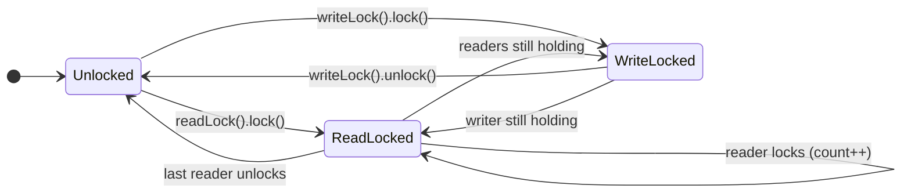

# M05 — Explicit Locks (java.util.concurrent.locks)

## 🎯 Learning Objectives
- Replace `synchronized` with explicit `Lock` objects and understand what you gain: `tryLock()`, timed acquisition, interruptible acquisition, and separate condition queues.
- Use `ReentrantLock` correctly: always `lock()` outside a `try`, always `unlock()` in a `finally`.
- Model multiple wait-conditions on one lock with `Condition` objects instead of a single intrinsic monitor.
- Use `ReentrantReadWriteLock` to let readers run in parallel while writers get exclusive access.
- Use `StampedLock`'s optimistic-read mode to avoid taking any lock at all on the common, uncontended read path.

## 📖 Concept
`synchronized` gives you exactly one implicit lock per object, with no timeout, no fairness control, and one wait-set. `java.util.concurrent.locks` gives you a family of building blocks that separate "the lock" from "the mutual-exclusion policy":

- `ReentrantLock` — a drop-in replacement for `synchronized` as a `Lock`, but acquired/released with explicit method calls, so it can be held across method boundaries, tried without blocking, or tried with a timeout.
- `Condition` — like `Object.wait()/notify()`, but a `ReentrantLock` can create *several* independent `Condition`s, each with its own wait set, instead of one shared monitor wait set.
- `ReentrantReadWriteLock` — splits one lock into a shared read lock and an exclusive write lock, so any number of readers can hold the read lock simultaneously as long as no writer holds the write lock.
- `StampedLock` — adds a third mode, *optimistic read*, which takes no lock at all: it hands out a `stamp`, lets the reader read the fields unprotected, and the reader then `validate()`s the stamp to check whether a write happened concurrently. If validation fails, the reader retries under a real read lock.

Lock state machine for `ReentrantReadWriteLock`:



`StampedLock` optimistic-read flow:

```
stamp = lock.tryOptimisticRead()   // no blocking, no CAS on shared lock state
read fields into locals
if lock.validate(stamp):           // did a write happen since the stamp was issued?
    use the locals                 //   no  -> safe, we're done, and it was essentially free
else:
    stamp = lock.readLock()        //   yes -> fall back to a real (blocking) read lock
    re-read fields
    lock.unlockRead(stamp)
```

## ⚠️ Common Pitfalls
- Calling `lock()` *inside* the `try` block. If `lock()` itself throws, the `finally` will call `unlock()` on a lock this thread never acquired — always `lock()` first, then `try { ... } finally { unlock(); }`.
- Forgetting `unlock()` in a `finally` at all — an exception mid-critical-section then leaves the lock permanently held.
- Using `if (condition)` instead of `while (condition)` around `Condition.await()`: a thread can wake up (spuriously, or because *some* signal fired) while the condition it actually needs still doesn't hold. Always re-check in a loop.
- Signaling the wrong `Condition` (or always calling `signalAll()` on both) defeats the purpose of splitting `notEmpty`/`notFull` — you want each signal to wake only the threads that could now make progress.
- Assuming `ReentrantReadWriteLock` readers are literally free: under heavy write traffic, readers can starve unless you pick a fair lock — the default is non-fair and biased against starving writers, not readers.
- Using the fields read under `tryOptimisticRead()` *without* calling `validate()` afterward — that's not "optimistic reading", that's just reading unprotected shared state with no safety net.
- Writing inside a `StampedLock` read section: `readLock()`/`tryOptimisticRead()` do not prevent the *same* thread from also trying to acquire the write lock re-entrantly — `StampedLock` is **not** reentrant, unlike `ReentrantLock`/`ReentrantReadWriteLock`. Recursively acquiring the same lock mode from the same thread will deadlock.

## 🧪 Demos in This Module
| Class | What it demonstrates | Run command |
|---|---|---|
| `ReentrantLockBasicsDemo` | `lock()`/`unlock()` in try/finally, `tryLock()` and `tryLock(timeout)`, fair vs unfair throughput under contention | `mvn -pl concurrency-lab exec:java -Dexec.mainClass=com.concurrency.lab.m05_explicit_locks.ReentrantLockBasicsDemo` |
| `ConditionVariableBoundedBufferDemo` | Bounded buffer with `ReentrantLock` + two `Condition`s (`notEmpty`/`notFull`) | `mvn -pl concurrency-lab exec:java -Dexec.mainClass=com.concurrency.lab.m05_explicit_locks.ConditionVariableBoundedBufferDemo` |
| `ReadWriteLockDemo` | `ReentrantReadWriteLock` protecting a cache: parallel readers, exclusive writer | `mvn -pl concurrency-lab exec:java -Dexec.mainClass=com.concurrency.lab.m05_explicit_locks.ReadWriteLockDemo` |
| `StampedLockOptimisticReadDemo` | Optimistic read + `validate()`, falling back to a real read lock | `mvn -pl concurrency-lab exec:java -Dexec.mainClass=com.concurrency.lab.m05_explicit_locks.StampedLockOptimisticReadDemo` |

## ▶️ How to Run
Each demo is a plain class with a `main()` method — run it directly with `exec:java` as shown in the table above, or run it from your IDE like any other `main()`.

To run just this module's tests:
```
mvn -pl concurrency-lab test -Dtest=m05_explicit_locks.**
```
or target an individual test class:
```
mvn -pl concurrency-lab test -Dtest=ReentrantLockCounterTest
```

## 📊 Sample Output
```
== 3. Fair vs unfair ReentrantLock under contention ==
-- Unfair (default) --
ReentrantLock -> final value=160000, elapsed=42ms
-- Fair --
ReentrantLock -> final value=160000, elapsed=187ms
Unfair throughput advantage: fair took 187ms vs unfair 42ms (fair locks pay for FIFO ordering,
unfair locks favor a fresh acquirer -> less throughput lost to context switches)
```

## 🔗 Further Reading
- [`java.util.concurrent.locks` package Javadoc](https://docs.oracle.com/en/java/javase/21/docs/api/java.base/java/util/concurrent/locks/package-summary.html)
- Brian Goetz, *Java Concurrency in Practice*, Chapter 13 (Explicit Locks) and 14 (Building Custom Synchronizers)
- [`StampedLock` Javadoc](https://docs.oracle.com/en/java/javase/21/docs/api/java.base/java/util/concurrent/locks/StampedLock.html) — see the optimistic-read example in the class description
- Module `m02_race_conditions_and_synchronized` for the intrinsic-lock (`synchronized` + `wait`/`notify`) version of the bounded buffer this module's `Condition`-based version contrasts with
