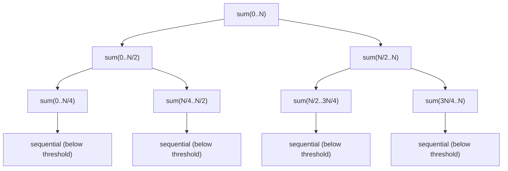

# M11 — Fork/Join and Parallel Streams

## 🎯 Learning Objectives
- Understand the fork/join divide-and-conquer model: `RecursiveTask<V>` (returns a value) vs `RecursiveAction` (returns nothing).
- Choose a sensible sequential-cutoff threshold and explain why "fork everything down to size 1" is slower, not faster.
- Recognize the two big parallel-stream traps: mutating shared, non-thread-safe state, and blocking calls inside `ForkJoinPool.commonPool()`.
- Know how to isolate blocking parallel-stream work onto a dedicated `ForkJoinPool` so it cannot starve unrelated work.

## 📖 Concept
Fork/join splits a big piece of work into halves recursively, computes the halves (possibly on different worker threads), and joins the results back together. Below a threshold, splitting further costs more than it saves (task-creation and scheduling overhead), so the recursion bottoms out into a plain sequential loop.



Parallel streams (`.parallelStream()`, `IntStream...parallel()`) are built on the *same* fork/join machinery, and by default they all share one process-wide pool: `ForkJoinPool.commonPool()`, sized to `availableProcessors() - 1` by default. That sharing is invisible and is exactly what causes both pitfalls in this module:

1. **Shared mutable state** — a `.forEach(list::add)` from multiple worker threads is a plain data race on `ArrayList`; there's nothing about "parallel stream" that makes `list.add` thread-safe.
2. **Blocking the common pool** — if one parallel stream blocks (I/O, `Thread.sleep`, a lock wait) inside `commonPool()`, every *other, unrelated* parallel stream anywhere in the same JVM (including ones in a web framework or a library you didn't write) queues up behind the same limited worker set.

## ⚠️ Common Pitfalls
- Recursing all the way down to trivial sizes — the overhead of creating and scheduling tasks dwarfs the work per task. Always pick a threshold and measure it.
- `fork()` + `compute()` + `join()` in the wrong order: fork one side, `compute()` the other side inline, then `join()` the forked side — never `fork()` both sides and then `join()` both (that gives up the "compute one on this thread" optimization).
- Mutating a shared `ArrayList`, `HashMap`, or a plain `int`/`long` field from inside `.parallel().forEach(...)` — this compiles fine and silently loses updates or throws `ArrayIndexOutOfBoundsException`/`ConcurrentModificationException` under contention.
- Calling a blocking operation (JDBC, `Thread.sleep`, blocking HTTP client, `Future.get()`) inside a parallel stream that runs on `commonPool()` — this starves every other parallel stream in the JVM, not just your own code.
- Assuming `.parallel()` is always faster — for small collections or cheap per-element work, the fork/join scheduling overhead can make it slower than sequential.

## 🧪 Demos in This Module
| Class | What it demonstrates | Run command |
|---|---|---|
| `RecursiveTaskSumDemo` | Parallel array sum via `RecursiveTask<Long>` with a sequential threshold; prints speedup vs sequential | `mvn -pl concurrency-lab exec:java -Dexec.mainClass=com.concurrency.lab.m11_fork_join_and_parallel_streams.RecursiveTaskSumDemo` |
| `RecursiveActionSortDemo` | Parallel merge sort via `RecursiveAction` with a sequential-below-threshold cutoff | `mvn -pl concurrency-lab exec:java -Dexec.mainClass=com.concurrency.lab.m11_fork_join_and_parallel_streams.RecursiveActionSortDemo` |
| `ParallelStreamPitfallsDemo` | Racy shared `ArrayList`/counter mutation from `.parallel().forEach`, then the safe `Collectors.toList()` / `IntStream.sum()` / `AtomicLong` fixes | `mvn -pl concurrency-lab exec:java -Dexec.mainClass=com.concurrency.lab.m11_fork_join_and_parallel_streams.ParallelStreamPitfallsDemo` |
| `CommonPoolStarvationDemo` | A blocking parallel stream starving `ForkJoinPool.commonPool()` for unrelated work, then the fix: run blocking work on a dedicated pool via `pool.submit(...).get()` | `mvn -pl concurrency-lab exec:java -Dexec.mainClass=com.concurrency.lab.m11_fork_join_and_parallel_streams.CommonPoolStarvationDemo` |

## ▶️ How to Run
```bash
mvn -pl concurrency-lab exec:java -Dexec.mainClass=com.concurrency.lab.m11_fork_join_and_parallel_streams.RecursiveTaskSumDemo
mvn -pl concurrency-lab test -Dtest="com.concurrency.lab.m11_fork_join_and_parallel_streams.*"
```

## 📊 Sample Output
```
Sequential sum = 2425000000 in 62 ms
Parallel sum   = 2425000000 in 19 ms using 8 workers
Speedup ~= 3.26x

== Unsafe: mutating a shared ArrayList from a parallel stream ==
attempt 1: expected size 200000, actual size 187342  <-- lost updates / corruption
...
== Safe fix #1: Collectors.toList() ==
size = 200000 (deterministic)

== Problem: blocking work saturates ForkJoinPool.commonPool() ==
unrelated parallel stream (sum=190) took 287 ms while commonPool was saturated with blocking work  <-- starved, delayed by the blockers

== Fix: run the blocking parallel stream on a dedicated pool ==
unrelated parallel stream (sum=190) took 2 ms while blocking work ran on its own dedicated pool  <-- commonPool stayed free
```

## 🔗 Further Reading
- [java.util.concurrent.ForkJoinPool Javadoc](https://docs.oracle.com/en/java/javase/21/docs/api/java.base/java/util/concurrent/ForkJoinPool.html)
- [java.util.concurrent.RecursiveTask Javadoc](https://docs.oracle.com/en/java/javase/21/docs/api/java.base/java/util/concurrent/RecursiveTask.html)
- Doug Lea, "A Java Fork/Join Framework" (the original paper behind `ForkJoinPool`)
- Stuart Marks / Brian Goetz talks on parallel stream pitfalls and the shared common pool
