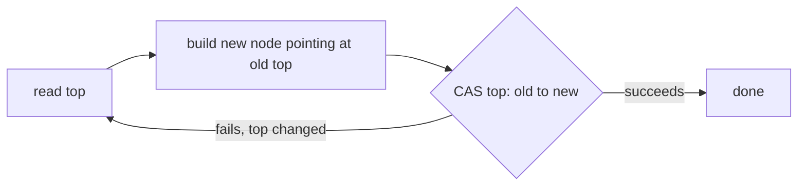

# M12 — Lock-Free Structures

## 🎯 Learning Objectives
- Implement a lock-free stack (Treiber stack) using `AtomicReference` and a compare-and-swap (CAS) retry loop.
- Implement a lock-free single-producer/single-consumer (SPSC) ring buffer using only volatile reads/writes for coordination.
- Compare lock-free vs `synchronized`-guarded throughput under contention and understand when each approach wins.

## 📖 Concept
Lock-free data structures make progress without ever putting a thread to sleep on a monitor. Instead of "acquire lock, mutate, release lock," a thread computes the new state optimistically and publishes it with a single atomic compare-and-swap. If another thread got there first, the CAS fails and the loop simply retries with the fresh state — no thread ever blocks waiting for another.

**Treiber stack CAS retry loop (push):**
```
loop:
  oldTop = top.get()
  newNode.next = oldTop
  if top.compareAndSet(oldTop, newNode):
      done
  else:
      retry   // someone else pushed/popped first — recompute and try again
```



The SPSC ring buffer takes a different, even cheaper approach: because there is exactly one producer and one consumer, no CAS is needed at all. The producer owns the write index, the consumer owns the read index, and each side only ever *reads* the other's index. A `volatile` write to the index after writing the data element establishes happens-before, so the consumer never observes a slot before its data is visible — this is the same "safe publication" guarantee from `M03`, applied to a ring buffer instead of a single field.

## ⚠️ Common Pitfalls
- Publishing the data element *after* the index instead of before — this looks harmless in testing but breaks the happens-before guarantee and can let the consumer read a half-written or stale slot.
- Forgetting to retry on CAS failure — a CAS loop that gives up after one failed attempt silently drops the operation instead of retrying.
- The ABA problem: `compareAndSet` only checks reference equality, so if a value is popped and a *different* node happens to be allocated at a spot that makes `old == current` true again, a naive CAS-based algorithm can be fooled. Treiber's stack sidesteps this for our purposes because each `Node` is a fresh object, but it's a classic trap in more general lock-free algorithms (mitigated with tagged/versioned references or `AtomicStampedReference`).
- Assuming lock-free always means faster — under very high contention, CAS retries also spin and burn CPU; a blocked thread parks and yields the core to someone making progress.
- Using a plain (non-power-of-two) ring buffer capacity with `%` instead of a bitmask — works, but `& mask` is the idiomatic, faster form once capacity is a power of two.

## 🧪 Demos in This Module
| Class | What it demonstrates | Run command |
|---|---|---|
| `LockFreeStackDemo` | Treiber stack (CAS-based lock-free stack) under many concurrent pushers/poppers, final size verified | `mvn -pl concurrency-lab exec:java -Dexec.mainClass=com.concurrency.lab.m12_lock_free_structures.LockFreeStackDemo` |
| `SpscRingBufferDemo` | Lock-free SPSC ring buffer transferring items in order between one producer and one consumer thread | `mvn -pl concurrency-lab exec:java -Dexec.mainClass=com.concurrency.lab.m12_lock_free_structures.SpscRingBufferDemo` |
| `LockFreeVsLockedThroughputDemo` | Throughput comparison: `synchronized`-guarded stack vs Treiber stack across increasing thread counts | `mvn -pl concurrency-lab exec:java -Dexec.mainClass=com.concurrency.lab.m12_lock_free_structures.LockFreeVsLockedThroughputDemo` |

## ▶️ How to Run
```bash
mvn -pl concurrency-lab exec:java -Dexec.mainClass=com.concurrency.lab.m12_lock_free_structures.LockFreeStackDemo
mvn -pl concurrency-lab test -Dtest="com.concurrency.lab.m12_lock_free_structures.*"
```

## 📊 Sample Output
```
Starting 8 threads pushing 50000 items each...
Pushed 400000 items in 41 ms
Final stack size = 400000 (expected 400000)
Popped 400000 items back off, stack now empty = true

Transferred 5000000 / 5000000 items in 118 ms
Out-of-order deliveries = 0 (expected 0)

threads    locked (ms)          lock-free (ms)
1          9                    8
2          34                   21
4          88                   52
8          201                  119
16         410                  247
```

## 🔗 Further Reading
- R. K. Treiber, "Systems Programming: Coping with Parallelism" (1986) — the original lock-free stack
- [java.util.concurrent.atomic package Javadoc](https://docs.oracle.com/en/java/javase/21/docs/api/java.base/java/util/concurrent/atomic/package-summary.html)
- Martin Fowler / Martin Thompson, "Mechanical Sympathy" blog — SPSC ring buffers and the LMAX Disruptor
- Maurice Herlihy & Nir Shavit, *The Art of Multiprocessor Programming* — chapters on lock-free stacks/queues and the ABA problem
