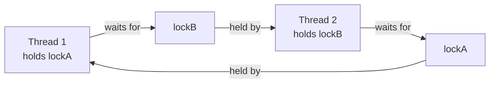

# M13 — Deadlock, Livelock, and Starvation

## 🎯 Learning Objectives
- Reproduce a real, reliable deadlock and recognize its signature in `jstack` output.
- Fix deadlock two different ways: a consistent global lock-ordering, and `tryLock` with timeout + backoff.
- Reproduce livelock — two threads that are both "running" but making no progress — and fix it with jittered backoff.
- Reproduce starvation under an unfair lock and contrast it with a fair `ReentrantLock(true)`.

## 📖 Concept
**Deadlock** happens when two (or more) threads each hold a resource the other needs, and neither will let go — a cycle in the "waits-for" graph.



Both classic fixes remove one of the four Coffman deadlock conditions:
- **Lock ordering** removes *circular wait* — if every thread acquires lockA before lockB (globally, not per-thread), the cycle above can never form.
- **`tryLock` + backoff** removes *hold and wait* — a thread that cannot get the second lock releases the first one instead of holding it forever, then retries after a random delay.

**Livelock** is different: threads are not blocked, they are actively running — but their actions perfectly cancel each other out, so the system makes no forward progress. Think of two people in a hallway who each politely step aside for the other, and end up doing that back and forth forever because they always react at the same instant. Random jitter breaks the lockstep symmetry so one side wins almost immediately.

**Starvation** is a fairness problem, not a correctness problem: an unlucky thread *can* eventually get the lock, but under an unfair scheduling/lock policy a steady stream of other threads keeps "barging" ahead of it. `ReentrantLock(true)` (fair mode) fixes it by strictly serving the longest-waiting thread first — at the cost of throughput, because it forces context switches and queueing instead of letting a thread that's already running just keep the CPU hot with the lock.

## ⚠️ Common Pitfalls
- Believing lock ordering "usually" works because you tested it and it didn't deadlock — deadlock from inconsistent ordering is timing-dependent; it can pass thousands of test runs and then deadlock in production.
- Applying lock ordering *per-thread* instead of *globally* — each thread must derive the same order (e.g. from `identityHashCode`), not just "be consistent with itself."
- Forgetting to release a partially-acquired lock in the `tryLock` failure path — always unlock in a `finally` block, and only unlock what you actually acquired.
- Assuming livelock "can't happen" because no thread is blocked — livelock is invisible to deadlock detectors (`jstack` won't report it) because no thread is actually stuck waiting on a monitor.
- Confusing starvation with deadlock — a starved thread's stack trace looks perfectly normal (it's just waiting its turn); the tell is a long-run statistic (near-zero acquisitions), not a stuck thread.
- Reaching for `ReentrantLock(true)` everywhere "to be safe" — fair locks trade throughput for fairness; use them only where starvation is a real risk (e.g. a shared resource under sustained high contention), not by default.

## 🧪 Demos in This Module
| Class | What it demonstrates | Run command |
|---|---|---|
| `DeadlockDemo` | ⚠️ Hangs on purpose — run manually, Ctrl-C to stop, then `jstack <pid>` to observe the deadlock. | `mvn -pl concurrency-lab exec:java -Dexec.mainClass=com.concurrency.lab.m13_deadlock_livelock_starvation.DeadlockDemo` |
| `DeadlockFixLockOrderingDemo` | Same two-resource scenario as `DeadlockDemo`, fixed via a consistent global lock-acquisition order; completes and prints timing | `mvn -pl concurrency-lab exec:java -Dexec.mainClass=com.concurrency.lab.m13_deadlock_livelock_starvation.DeadlockFixLockOrderingDemo` |
| `DeadlockFixTryLockBackoffDemo` | Same scenario fixed with `tryLock` + timeout + randomized backoff-and-retry; completes and prints retry counts | `mvn -pl concurrency-lab exec:java -Dexec.mainClass=com.concurrency.lab.m13_deadlock_livelock_starvation.DeadlockFixTryLockBackoffDemo` |
| `LivelockDemo` | Two polite threads perpetually yielding to each other (bounded, prints "no progress made"), then the jittered-backoff fix that makes progress | `mvn -pl concurrency-lab exec:java -Dexec.mainClass=com.concurrency.lab.m13_deadlock_livelock_starvation.LivelockDemo` |
| `StarvationDemo` | An unlucky thread starved under an unfair lock vs. served fairly under `new ReentrantLock(true)`, with per-thread wait-time stats | `mvn -pl concurrency-lab exec:java -Dexec.mainClass=com.concurrency.lab.m13_deadlock_livelock_starvation.StarvationDemo` |

## ▶️ How to Run
```bash
# Safe demos + tests
mvn -pl concurrency-lab exec:java -Dexec.mainClass=com.concurrency.lab.m13_deadlock_livelock_starvation.DeadlockFixLockOrderingDemo
mvn -pl concurrency-lab test -Dtest="com.concurrency.lab.m13_deadlock_livelock_starvation.*"

# DeadlockDemo: run manually in its own terminal, it will NOT return
mvn -pl concurrency-lab exec:java -Dexec.mainClass=com.concurrency.lab.m13_deadlock_livelock_starvation.DeadlockDemo
# in a second terminal, once you see "waiting for lockB" / "waiting for lockA":
jstack <pid>
# then Ctrl-C the first terminal to stop it
```

## 📊 Sample Output
```
Both threads started and are acquiring locks in opposite order (A->B vs B->A).
This JVM (pid 48213) will now deadlock and hang forever -- that is expected.

To observe the deadlock, run in another terminal:
    jstack 48213
Look for the line: "Found one Java-level deadlock"

Press Ctrl-C to stop this process (both threads are daemon threads).
thread-A-then-B acquired lockA, waiting for lockB
thread-B-then-A acquired lockB, waiting for lockA
```

Example `jstack` excerpt for `DeadlockDemo`:
```
Found one Java-level deadlock:
=============================
"thread-B-then-A":
  waiting to lock monitor 0x00007f2b3c003a08 (object 0x000000076ac21a10, a java.lang.Object),
  which is held by "thread-A-then-B"
"thread-A-then-B":
  waiting to lock monitor 0x00007f2b3c006328 (object 0x000000076ac21a20, a java.lang.Object),
  which is held by "thread-B-then-A"

Java stack information for the threads listed above:
===================================================
"thread-B-then-A":
        at com.concurrency.lab.m13_deadlock_livelock_starvation.DeadlockDemo.lambda$main$1(DeadlockDemo.java:33)
        - waiting to lock <0x000000076ac21a10> (a java.lang.Object)
        - locked <0x000000076ac21a20> (a java.lang.Object)
"thread-A-then-B":
        at com.concurrency.lab.m13_deadlock_livelock_starvation.DeadlockDemo.lambda$main$0(DeadlockDemo.java:21)
        - waiting to lock <0x000000076ac21a20> (a java.lang.Object)
        - locked <0x000000076ac21a10> (a java.lang.Object)

Found 1 deadlock.
```

Fixed demos:
```
Completed 40000 lock acquisitions across 2 threads requesting opposite orders in 14 ms without deadlock

== Livelock: two polite threads that always yield to each other ==
no progress made after 20 attempts

== Fix: random jittered backoff breaks the symmetry ==
progress made = true

== Unfair lock: an unlucky thread can be starved ==
[unfair] unlucky    acquisitions=41       avgWaitMicros=812.4
[unfair] greedy threads combined acquisitions=58900

== Fair lock: new ReentrantLock(true) eventually serves everyone ==
[fair]   unlucky    acquisitions=8123     avgWaitMicros=95.1
[fair]   greedy threads combined acquisitions=48950
```

## 🔗 Further Reading
- [Oracle: Deadlock, Starvation, and Livelock (Java Concurrency tutorial)](https://docs.oracle.com/javase/tutorial/essential/concurrency/deadlock.html)
- [ReentrantLock Javadoc — fairness policy](https://docs.oracle.com/en/java/javase/21/docs/api/java.base/java/util/concurrent/locks/ReentrantLock.html)
- `jstack` / `jcmd <pid> Thread.print` documentation for deadlock detection
- Brian Goetz et al., *Java Concurrency in Practice*, chapter 10 ("Avoiding Liveness Hazards")
