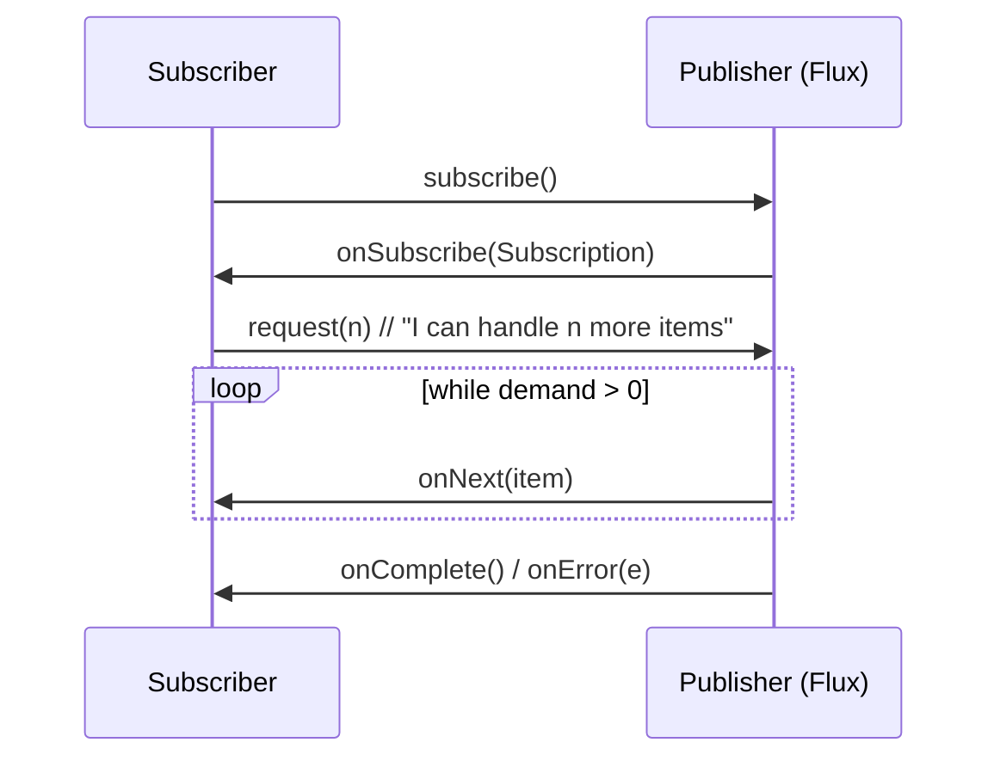

# M15 — Reactive Programming with Project Reactor

## 🎯 Learning Objectives
- Understand `Mono`/`Flux` as lazy, composable descriptions of an asynchronous pipeline rather than eagerly-running code.
- See backpressure not as an edge case but as the defining feature that separates reactive streams from a plain callback or `CompletableFuture` chain.
- Learn where blocking work still belongs in a reactive pipeline (`Schedulers.boundedElastic()`) and why running it on the wrong scheduler is dangerous.
- Handle errors declaratively with `onErrorResume`/`onErrorReturn`/`retry`/`retryWhen` instead of try/catch.

## 📖 Concept
A `Mono<T>` is 0-or-1 values, a `Flux<T>` is 0-to-N values, both delivered over time via the Reactive Streams protocol: a `Publisher` never pushes an item the `Subscriber` hasn't already asked for.



This request(n) signal is backpressure: the producer is contractually forbidden from sending more items than the subscriber has requested. That's fundamentally different from a `BlockingQueue` (module m07), where a fast producer blocks a producer *thread* on a full queue — here, no thread blocks at all; the producer simply doesn't emit until asked.

Note this module's app-wide caveat: `concurrency-lab` has both `spring-boot-starter-web` and `spring-boot-starter-webflux` on the classpath (needed elsewhere in the app for REST controllers), and Spring Boot defaults to the Servlet stack when both are present. So these demos use Reactor as a **library** — composing `Mono`/`Flux` pipelines and verifying them with `StepVerifier` — rather than standing up a reactive HTTP server.

## ⚠️ Common Pitfalls
- Calling `.block()` inside a reactive pipeline (rather than at the very edge, in a `main()` for printing, as these demos do) defeats the entire point of being non-blocking and can deadlock on a single-threaded scheduler.
- Requesting unbounded demand (`request(Long.MAX_VALUE)`, the default for `.subscribe(onNext)`) from a producer that emits faster than you can process opts you right back into the overflow problems backpressure exists to prevent.
- Running blocking calls (JDBC, `Thread.sleep`, blocking HTTP clients) on `Schedulers.parallel()` or `Schedulers.single()` starves those schedulers for every other reactive task sharing them — always use `Schedulers.boundedElastic()` for blocking work.
- `retry(n)` re-subscribes from the very beginning of the chain, re-running every upstream operator — it is not a resume-from-failure-point mechanism.

## 🧪 Demos in This Module
| Class | What it demonstrates | Run command |
|---|---|---|
| `MonoFluxBasicsDemo` | Creating `Mono`/`Flux`, `map`/`filter`/`flatMap`, and why `.block()` only belongs at the edge | `mvn -pl concurrency-lab exec:java -Dexec.mainClass=com.concurrency.lab.m15_reactive_webflux.MonoFluxBasicsDemo` |
| `BackpressureDemo` | A naive fixed-demand subscriber overflowing, a pulling `BaseSubscriber` that never overflows, `onBackpressureDrop`, `onBackpressureBuffer` | `mvn -pl concurrency-lab exec:java -Dexec.mainClass=com.concurrency.lab.m15_reactive_webflux.BackpressureDemo` |
| `ReactiveVsBlockingComparisonDemo` | 20 sequential blocking calls vs. `flatMap(..., concurrency)` on `boundedElastic`, wall-clock time compared | `mvn -pl concurrency-lab exec:java -Dexec.mainClass=com.concurrency.lab.m15_reactive_webflux.ReactiveVsBlockingComparisonDemo` |
| `ReactiveErrorHandlingDemo` | `onErrorResume`, `onErrorReturn`, `retry(n)`, `retryWhen` with bounded backoff | `mvn -pl concurrency-lab exec:java -Dexec.mainClass=com.concurrency.lab.m15_reactive_webflux.ReactiveErrorHandlingDemo` |

## ▶️ How to Run
Run any demo's `main()` directly via the `exec:java` commands above, or from your IDE.

Run the tests (which use `StepVerifier` instead of blocking assertions):
```bash
mvn -pl concurrency-lab test -Dtest="com.concurrency.lab.m15_reactive_webflux.*"
```

## 📊 Sample Output
```
== Blocking, sequential calls to a slow downstream service ==
Blocking total: 2019 ms for 20 calls

== Reactive, concurrent calls via flatMap + boundedElastic ==
Reactive total: 118 ms for 20 calls (concurrency=20)

The blocking loop pays the full 100 ms latency 20 times sequentially. flatMap(...,
concurrency) fans the same calls out onto up to 20 concurrent subscriptions, so the
wall-clock time approaches a single call's latency instead of the sum.
```

## 🔗 Further Reading
- [Reactor 3 Reference Guide](https://projectreactor.io/docs/core/release/reference/)
- [Reactive Streams specification](https://www.reactive-streams.org/)
- [Spring WebFlux documentation](https://docs.spring.io/spring-framework/reference/web/webflux.html)
