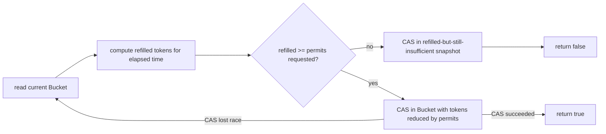

# M16 — Concurrency Design Patterns

## 🎯 Learning Objectives
- Recognize a handful of recurring shapes that solve most real-world concurrency problems, instead of reasoning about locks from scratch every time.
- Compare a CAS-retry-loop implementation against a lock-guarded one for the same problem, and understand when each is the better default.
- See the actor/worker-pool pattern (mailbox + one dedicated thread) as an alternative to synchronizing shared state directly.
- Understand the three correct lazy-singleton idioms in Java and why two of the three historically "correct-looking" ones are traps.

## 📖 Concept

**Token bucket rate limiter** — `TokenBucketRateLimiter` holds an immutable `Bucket(tokens, lastRefillNanos)` behind an `AtomicReference`, updated with a CAS retry loop instead of a lock:


A lock would serialize every caller through a single critical section; the CAS loop only makes a caller redo cheap arithmetic on the rare occasion it loses a race, which is why this module picks CAS over `ReentrantLock` for a computation this short.

**Bounded connection pool** — `BoundedConnectionPool` pairs a `Semaphore` (bounds *how many* callers hold a connection) with a `BlockingQueue` (hands out *which* instance). A permit is only ever granted once its matching connection is already sitting in the queue, so `poll()` right after `acquire()` can never race against an empty queue.

**Actor / worker-pool** — `WorkerPoolActorStyleDemo.Actor` owns a private mailbox (`BlockingQueue<Message>`) drained by exactly one dedicated thread. Because only that thread ever touches the actor's `total` field, no lock or atomic is needed inside the actor at all — this is the same single-writer idea the capstone module builds an entire order-matching engine on top of.

**Lazy singletons** — three idioms, one correct-by-construction winner:
| Idiom | Needs synchronization? | Why |
|---|---|---|
| Double-checked locking | Yes — `volatile` + re-check inside the monitor | Without `volatile`, a reader can observe a partially-constructed instance through instruction reordering |
| Holder class | No | The JVM guarantees a class initializes at most once, lazily, on first active use — `Holder.INSTANCE` gets that guarantee for free |
| `enum` singleton | No | Same JVM class-init guarantee, plus serialization/reflection-proof for free |

**Circuit breaker** — `CircuitBreaker` is a `CLOSED → OPEN → HALF_OPEN → CLOSED` state machine held in an `AtomicReference<State>`, with an `AtomicBoolean` CAS gate ensuring exactly one caller gets to run the `HALF_OPEN` trial call while everyone else is rejected until it resolves.

## ⚠️ Common Pitfalls
- A CAS retry loop that publishes a "insufficient" snapshot only on a *successful* CAS (as `TokenBucketRateLimiter.tryAcquire` does) is intentional — don't "fix" the unconditional-return-false path into a retry, or a losing race would silently drop a legitimate refill update.
- Testing a rate limiter's capacity ceiling with a very high refill rate is a trap: if the bucket refills faster than your test's own contention window, you'll legitimately grant more than "capacity" permits and see a flaky-looking failure that isn't actually a limiter bug (see `TokenBucketRateLimiterTest` for the fix — use a refill rate slow enough to be negligible over the test's runtime).
- Double-checked locking without `volatile` on the field is a classic, subtle bug: it *looks* correct and usually works in testing, but the Java Memory Model permits observing a non-null reference to a not-yet-fully-constructed object.
- An actor's mailbox must remain the *only* way to touch its state — adding a "just this one" public getter that reads the actor's fields from another thread reintroduces the exact race the pattern was meant to eliminate.

## 🧪 Demos in This Module
| Class | What it demonstrates | Run command |
|---|---|---|
| `TokenBucketRateLimiter` + `RateLimiterController` (REST) | Lock-free token-bucket limiter exposed over HTTP | `mvn -pl concurrency-lab spring-boot:run`, see curl examples below |
| `BoundedConnectionPoolDemo` | Semaphore + BlockingQueue bounded pool, threads blocking until a connection frees up | `mvn -pl concurrency-lab exec:java -Dexec.mainClass=com.concurrency.lab.m16_concurrency_design_patterns.BoundedConnectionPoolDemo` |
| `WorkerPoolActorStyleDemo` | Mailbox-per-actor pattern under concurrent producers, with a grand-total correctness check | `mvn -pl concurrency-lab exec:java -Dexec.mainClass=com.concurrency.lab.m16_concurrency_design_patterns.WorkerPoolActorStyleDemo` |
| `ThreadSafeLazySingletonDemo` | 32 threads racing to construct each of the 3 singleton idioms, confirming a single instance each time | `mvn -pl concurrency-lab exec:java -Dexec.mainClass=com.concurrency.lab.m16_concurrency_design_patterns.ThreadSafeLazySingletonDemo` |
| `CircuitBreakerDemo` | CLOSED/OPEN/HALF_OPEN transitions guarding a flaky simulated call | `mvn -pl concurrency-lab exec:java -Dexec.mainClass=com.concurrency.lab.m16_concurrency_design_patterns.CircuitBreakerDemo` |

## ▶️ How to Run
Run any standalone demo's `main()` via the `exec:java` commands above.

For the rate limiter's live REST endpoint:
```bash
mvn -pl concurrency-lab spring-boot:run
```
```bash
# hammer it concurrently and watch 429s appear once the bucket (capacity 10, refills 5/sec) is drained
for i in $(seq 1 20); do curl -s -o /dev/null -w "%{http_code}\n" localhost:8080/api/rate-limiter/try & done; wait
```

Run the tests:
```bash
mvn -pl concurrency-lab test -Dtest="com.concurrency.lab.m16_concurrency_design_patterns.*"
```

## 📊 Sample Output
```
$ WorkerPoolActorStyleDemo
actor-alice final total = 3334
actor-bob final total = 3333
actor-carol final total = 3333
grand total = 10000 (expected 10000) -> CORRECT
```
```
$ ThreadSafeLazySingletonDemo
Double-checked locking: distinct instances observed = 1
Holder idiom: distinct instances observed = 1
Enum singleton: distinct instances observed = 1
```

## 🔗 Further Reading
- Brian Goetz, *Java Concurrency in Practice* — ch. 16 covers the Java Memory Model subtleties behind double-checked locking.
- [Bill Pugh's original Initialization-on-Demand Holder writeup](https://en.wikipedia.org/wiki/Initialization-on-demand_holder_idiom)
- Michael Nygard, *Release It!* — the circuit breaker pattern's origin, for production failure-handling context.
