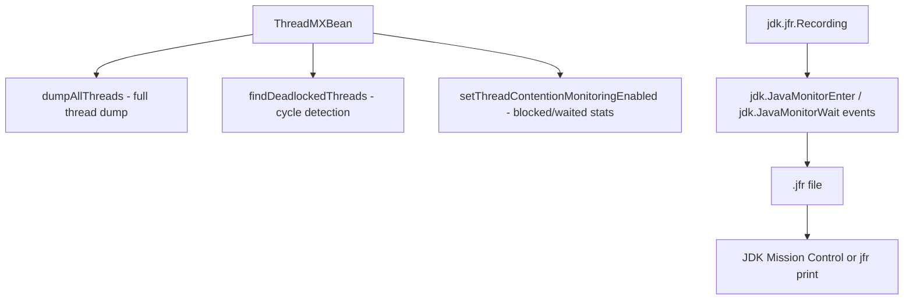

# M17 — Performance & Observability

## 🎯 Learning Objectives
- Move from "my code looks correct" to "I can prove what my threads are actually doing" using the JDK's own instrumentation.
- Detect deadlocks programmatically with `ThreadMXBean.findDeadlockedThreads()`, not just by eyeballing a hung process.
- Quantify lock contention (blocked count/time, waited count/time) instead of guessing at it.
- Capture a JDK Flight Recorder recording around a contended workload and know how to open it.
- Expose live `ThreadPoolExecutor` internals over REST as a stepping stone to real metrics (Micrometer/Actuator).

## 📖 Concept
Every JVM ships a management API (`java.lang.management`) that can answer questions about live threads without attaching a debugger:



`ThreadDumpAnalysisDemo` builds a self-contained two-lock deadlock (daemon threads, so the JVM can still exit) and then polls `findDeadlockedThreads()` until it reports the cycle — the same detection `jstack` uses under the hood ("Found one Java-level deadlock"), just called from your own code.

`ContentionMonitoringDemo` turns on `setThreadContentionMonitoringEnabled(true)` and runs several threads through a shared `synchronized` block, then reads each thread's `blockedCount`/`blockedTime` (time spent waiting to *enter* a monitor) and `waitedCount`/`waitedTime` (time spent in `Object.wait()`/`Thread.join()`/parking) straight off `ThreadInfo`.

`JfrRecordingDemo` starts a `jdk.jfr.Recording` scoped to `jdk.JavaMonitorEnter`/`jdk.JavaMonitorWait` events around a contended workload and writes a `.jfr` file — the same event stream JDK Mission Control visualizes, but captured programmatically here so you can see exactly what triggers it.

`ExecutorMetricsController` exposes a `ThreadPoolExecutor`'s live `getPoolSize()`/`getActiveCount()`/`getQueue().size()`/`getCompletedTaskCount()` over `/api/observability/pool-stats`, fed a continuous synthetic workload so the numbers actually move — the same getters you'd register as Micrometer `Gauge`s in a real service.

## ⚠️ Common Pitfalls
- A terminated thread's contention counters are no longer queryable via `ThreadMXBean.getThreadInfo(long)` — if you need to inspect them, snapshot `ThreadInfo` *before* the thread exits (both demos park their worker threads on a second latch for exactly this reason).
- Thread contention monitoring must be explicitly enabled (`setThreadContentionMonitoringEnabled(true)`) and isn't guaranteed supported on every JVM — always check `isThreadContentionMonitoringSupported()` first.
- `findDeadlockedThreads()` only detects deadlocks that exist *at the moment you call it* — poll for a bounded window rather than calling it once immediately after starting the suspect threads.
- Enabling JFR events with `withThreshold(Duration.ZERO)` captures every occurrence, which is fine for a short demo but would be far too much data (and overhead) left running in production — real profiles use a non-zero threshold or the default profile.

## 🧪 Demos in This Module
| Class | What it demonstrates | Run command |
|---|---|---|
| `ThreadDumpAnalysisDemo` | Programmatic deadlock detection via `findDeadlockedThreads()` | `mvn -pl concurrency-lab exec:java -Dexec.mainClass=com.concurrency.lab.m17_performance_and_observability.ThreadDumpAnalysisDemo` |
| `ContentionMonitoringDemo` | Per-thread blocked/waited counts and durations under a contended `synchronized` block | `mvn -pl concurrency-lab exec:java -Dexec.mainClass=com.concurrency.lab.m17_performance_and_observability.ContentionMonitoringDemo` |
| `JfrRecordingDemo` | Programmatic JFR recording of monitor-contention events to a `.jfr` file | `mvn -pl concurrency-lab exec:java -Dexec.mainClass=com.concurrency.lab.m17_performance_and_observability.JfrRecordingDemo` |
| `ExecutorMetricsController` (REST) | Live `ThreadPoolExecutor` stats fed by a continuous synthetic workload | `mvn -pl concurrency-lab spring-boot:run`, see curl examples below |

## ▶️ How to Run
Run any standalone demo's `main()` via the `exec:java` commands above.

For the live pool-stats endpoint and the built-in Actuator thread dump:
```bash
mvn -pl concurrency-lab spring-boot:run
```
```bash
curl localhost:8080/api/observability/pool-stats
curl localhost:8080/actuator/threaddump | head -50
```

Inspect a JFR recording produced by `JfrRecordingDemo`:
```bash
jfr print --events jdk.JavaMonitorEnter /tmp/.../contention-recording.jfr
# or open it in JDK Mission Control: File > Open File...
```

Run the tests:
```bash
mvn -pl concurrency-lab test -Dtest="com.concurrency.lab.m17_performance_and_observability.*"
```

## 📊 Sample Output
```
=== Deliberate two-lock deadlock ===
Deadlock detected among 2 threads:
"deadlock-thread-A" ... waiting to lock <0x...> (a java.lang.Object)
"deadlock-thread-B" ... waiting to lock <0x...> (a java.lang.Object)
```
```
=== Contention report (contention monitoring enabled) ===
contended-worker-0    blockedCount=170    blockedTimeMs=340   waitedCount=0     waitedTimeMs=0
contended-worker-1    blockedCount=165    blockedTimeMs=330   waitedCount=0     waitedTimeMs=0
...
```

## 🔗 Further Reading
- [`java.lang.management` package documentation](https://docs.oracle.com/en/java/javase/21/docs/api/java.management/java/lang/management/package-summary.html)
- [JDK Flight Recorder documentation](https://docs.oracle.com/en/java/javase/21/docs/specs/man/jfr.html)
- [Micrometer + Spring Boot Actuator metrics](https://docs.spring.io/spring-boot/reference/actuator/metrics.html)
