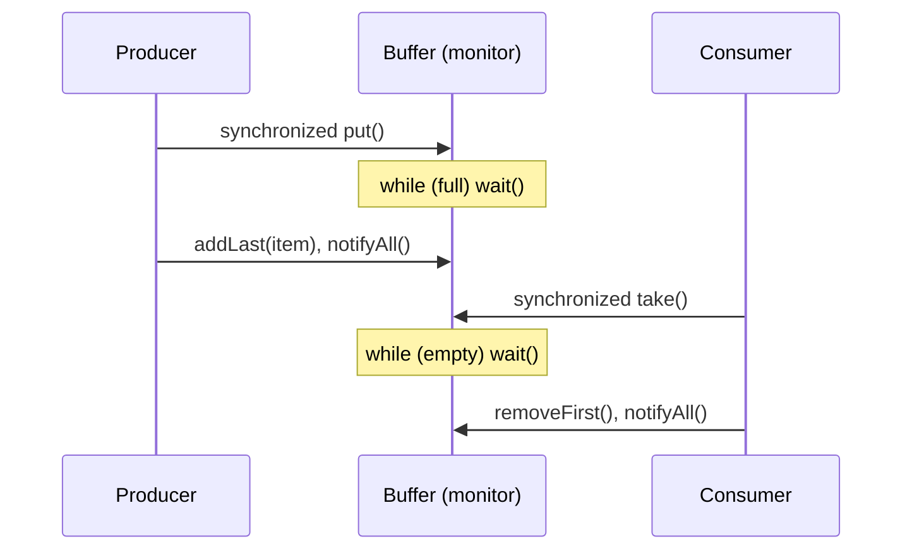

← [01. Thread Fundamentals](01-thread-fundamentals.md) | **02. Race Conditions & `synchronized`** | Next → [03. JMM & `volatile`](03-java-memory-model-and-volatile.md)

# 02 — Race Conditions and `synchronized`

## The failure, first

Ten threads each increment a shared counter 100,000 times. You expect
1,000,000 at the end. You get 941,873. No exception was thrown, nothing
crashed, no thread logged an error — the program simply produced a wrong
number, silently, and would produce a *different* wrong number if you ran it
again. That's the signature of a race condition: not a crash, a quiet loss
of correctness that looks exactly like success unless you check the answer.

The repo's `RaceConditionDemo` runs precisely this pair side by side —
`UnsafeCounter` losing updates, `SafeSynchronizedCounter` never losing one —
so the "before" isn't hypothetical. Here's `UnsafeCounter` in full:

```java
public class UnsafeCounter {
    private int count;
    public void increment() { count++; }
    public int get() { return count; }
}
```

Nothing here looks dangerous. `count++` reads like one atomic step. It
isn't.

## Mental model: one key, one room

`count++` is actually three separate instructions: **read** `count` into a
register, **add** 1, **write** the register back to `count`. Picture two
people sharing one notepad, each doing "read the number, add one in my head,
write the new number back":

```
Thread A: read count (0)
Thread B: read count (0)
Thread A: write count = 1
Thread B: write count = 1   <-- Thread A's increment vanished
```

Both threads read `0` before either had written anything back — B's write
simply overwrites A's, as if A's increment never happened. This is a **lost
update**, and it needs no bad luck beyond "two threads happened to interleave
those three steps this way," which at a million iterations is not bad luck
at all — it's a near-certainty.

`synchronized` is Java's built-in fix, and the mental model for it is: every
object has exactly one **monitor**, which behaves like a room with a single
key. `synchronized (obj) { ... }` means "take `obj`'s key, enter the room,
do the work, leave the key at the door for the next person." Only one
thread can hold a given object's key at a time — so if both `increment()`
calls synchronize on the same object, the three-step read/add/write
sequence can never be interleaved, because the second thread physically
cannot enter the room until the first one has left it, key back on the
hook. That's `SafeSynchronizedCounter`:

```java
public class SafeSynchronizedCounter {
    private int count;
    public synchronized void increment() { count++; }
    public synchronized int get() { return count; }
}
```

The mutual exclusion is only half of what you're buying, though — the other
half is a **happens-before** edge: releasing a monitor and another thread
later acquiring the *same* monitor guarantees the second thread sees every
write the first thread made before releasing it. Locking isn't just "no two
threads in the room together," it's also "the room's whiteboard is
guaranteed legible to whoever walks in next." (Module 03 is entirely about
what goes wrong when you only get the second half of that guarantee, or
neither half.)

## Concept, from first principles

### Locking granularity: one big room, or several small ones

`synchronized` on a whole method (or on `this`) locks *the entire object*,
even when two callers are touching completely unrelated fields. The repo's
`SynchronizedBlockVsMethodDemo` makes this concrete with a two-account
class: `CoarseGrainedAccount` synchronizes whole methods, so a deposit to
`checking` and a deposit to `savings` — which share nothing — still queue up
behind the same monitor and run one at a time. `FineGrainedAccount` gives
each field its **own private lock object**:

```java
static class FineGrainedAccount {
    private final Object checkingLock = new Object();
    private final Object savingsLock = new Object();
    private int checkingBalance;
    private int savingsBalance;

    public void depositChecking(int amount) {
        synchronized (checkingLock) { checkingBalance += amount; }
    }
    public void depositSavings(int amount) {
        synchronized (savingsLock) { savingsBalance += amount; }
    }
}
```

Now checking-deposits and savings-deposits genuinely run in parallel — two
different rooms, two different keys, no reason for one to wait on the
other — while each field is still fully protected against concurrent
access to *itself*. Measuring both side by side (as the demo does) turns
"granularity matters" from a rule of thumb into a number: the fine-grained
version measurably finishes faster under contention, for doing the exact
same work.

### Never hand your room key to a stranger

A lock object only protects you if only your code can reach it.
`SynchronizedBlockVsMethodDemo`'s `DangerouslyExposedLock` exposes its lock
as a public field:

```java
static class DangerouslyExposedLock {
    public final Object lock = new Object();
    public void doInternalWork() { synchronized (lock) { /* ... */ } }
}
```

Any outside code can do `synchronized (exposed.lock) { ... }` too — and the
demo shows exactly that: a "hostile" outside thread grabs the same public
lock and holds it for 300ms doing something unrelated, and the class's own
legitimate internal work is blocked behind it the entire time, with no way
for the class to know or prevent it. Synchronizing on `this` in a class with
a public API is the same mistake in disguise — anyone holding a reference to
your object can `synchronized (yourObject)` and stall you. The fix is always
a `private final Object lock = new Object()` that nothing outside the class
can ever reach.

### The bounded buffer: `wait()`/`notifyAll()` as a guarded room

A producer/consumer buffer needs more than mutual exclusion — a consumer
calling `take()` on an empty buffer needs to actually *wait* until there's
something to take, without spinning in a busy loop burning CPU. `wait()`
does that: called inside a `synchronized` block, it atomically releases the
monitor and parks the thread, to be woken by another thread's `notify()`/
`notifyAll()` on the same monitor. `WaitNotifyBoundedBuffer` is the
canonical shape:

```java
public synchronized void put(T item) throws InterruptedException {
    while (buffer.size() == capacity) {
        wait();
    }
    buffer.addLast(item);
    notifyAll();
}

public synchronized T take() throws InterruptedException {
    while (buffer.isEmpty()) {
        wait();
    }
    T item = buffer.removeFirst();
    notifyAll();
    return item;
}
```



The **`while`, never `if`**, is not a style preference — it's mandatory for
two independent reasons. First, `wait()` can return via a *spurious
wakeup*, with no matching `notify()` at all — the JLS explicitly permits
this, so the condition must be re-checked regardless of why you woke up.
Second, even with a real `notifyAll()`, several waiting consumers can all
wake, but only one re-acquires the monitor first and takes the item — by
the time the second one gets the monitor, the buffer might be empty again.
An `if` would proceed on a stale assumption; `while` re-verifies the actual
state every time before acting on it.

## Misconceptions worth naming directly

- **Belief: "`count++` is a single, atomic operation."**
  Wrong, because it's really read-modify-write across three separate steps
  that can interleave with another thread's three steps. Proof: run 10
  threads × 100,000 increments on `UnsafeCounter` and the final value comes
  out lower than 1,000,000, every time, non-deterministically.

- **Belief: "If it's `synchronized`, granularity doesn't matter — it's
  correct either way."**
  True for correctness, false for cost: whole-object synchronization is
  still correct, but it serializes operations on *unrelated* state that
  never needed to wait on each other. Proof: `CoarseGrainedAccount`'s
  concurrent checking+savings deposits measurably take longer than
  `FineGrainedAccount`'s, despite touching completely disjoint fields.

- **Belief: "Any object works fine as a lock, as long as I `synchronized`
  on it consistently."**
  Wrong if that object is reachable from outside your class — `this` in a
  class with a public API, a public field, or worse, an interned `String`
  or cached boxed `Integer` (which other, unrelated code in the *same JVM*
  might also happen to synchronize on). Proof:
  `DangerouslyExposedLock`'s legitimate internal work sits blocked for
  ~300ms because unrelated outside code grabbed the same public lock
  first.

- **Belief: "`if (buffer.isEmpty()) wait();` is equivalent to using
  `while`, just less verbose."**
  Wrong, because a spurious wakeup or a beaten-to-the-punch waiter both
  leave the condition just as false as before `wait()` returned — `if`
  would barrel ahead on stale information (e.g. removing from a buffer
  that's actually still empty), while `while` re-checks and waits again.

## Where this shows up for real

Every in-memory counter, cache, or connection-pool bookkeeping structure in
a real service is one dropped `synchronized` away from a lost-update bug
that only shows up under production load, never in a single-threaded test.
The lock-granularity lesson here is exactly why real systems shard state
(per-key locks, per-partition counters) instead of guarding everything with
one global lock — and the `wait()`/`notifyAll()` pattern is the direct
ancestor of every blocking queue you'll use in module 07, which solves the
same problem with less ceremony and fewer ways to get it wrong.

## Check yourself

1. Why does `count++` need synchronization even though it's one line of
   source code?
2. What two distinct guarantees does acquiring and releasing the same
   monitor give you — not just "mutual exclusion," the other one too?
3. Two unrelated fields are both guarded by `synchronized` methods on the
   same object. Are they safe? Are they fast under concurrent access from
   different fields? Why might those answers differ?
4. Why must the condition around a `wait()` call be checked in a `while`
   loop rather than an `if`, even when you're confident you'll only ever
   call `notify()` (not `notifyAll()`) correctly?

---

<details>
<summary>Answers</summary>

1. Because it compiles to three separate operations — read, add, write —
   and another thread can interleave its own read/add/write in between any
   of those steps, silently discarding one thread's update.
2. Mutual exclusion (only one thread in the monitor at a time) *and* a
   happens-before edge (releasing the monitor makes all prior writes
   visible to the next thread that acquires it) — visibility, not just
   exclusivity.
3. Safe, yes — `synchronized` on the whole object still prevents any lost
   update on either field. Fast, not necessarily — both fields share one
   monitor, so operations on the unrelated field still queue up behind each
   other, costing real throughput for no correctness benefit.
4. Because `wait()` can return due to a spurious wakeup with no `notify()`
   at all (permitted by the JLS), and even with a real `notify()`/
   `notifyAll()`, another thread might grab the monitor and change the
   state first — the condition can be false again by the time this thread
   actually resumes, so it must be re-checked, not assumed.

</details>

---

← [01. Thread Fundamentals](01-thread-fundamentals.md) | Next → [03. JMM & `volatile`](03-java-memory-model-and-volatile.md)
