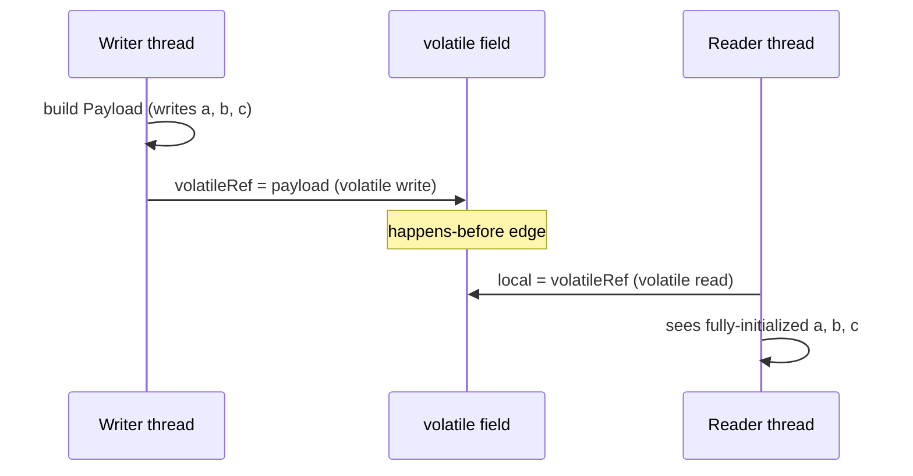

← [02. Race Conditions & `synchronized`](02-race-conditions-and-synchronized.md) | **03. JMM & `volatile`** | Next → [04. Atomics & CAS](04-atomics-and-cas.md)

# 03 — Java Memory Model and `volatile`

## The failure, first

A main thread flips a plain `boolean stopRequested = true` to signal a
worker loop to exit. On some machines, some JVMs, some optimization levels,
the worker thread **never notices** — it spins forever, even though the
write definitely happened. Nothing was locked, nothing raced in the M02
sense (there's no read-modify-write here, just a plain write and a plain
read) — and yet the update can simply fail to arrive. That's a different
kind of bug from a lost update, and it needs a different fix.

`VisibilityProblemDemo` reproduces exactly this: a daemon worker spins on
`while (!stopRequested) { iterations++; }`, main sleeps 200ms and sets
`stopRequested = true`, and then waits up to 3 seconds. Whether the worker
notices in time is genuinely **not guaranteed** by the language — it depends
on the JIT, the hardware, and optimization level. That unpredictability
*is* the lesson: correctness that depends on "it happened to work on my
machine" is not correctness.

## Mental model: a shared whiteboard vs. a private notebook

Module 02 established that two threads sharing state need a *lock* to avoid
stepping on each other's read-modify-write. This module is about a
completely separate question: even with no interleaving problem at all
(just one plain write, one plain read), **is the reader even looking at the
same whiteboard as the writer?**

Each CPU core keeps its own private cache — think of it as each thread
working from a personal notebook copy of shared values instead of walking
over to the one shared whiteboard every time. The JVM and hardware are
explicitly permitted to let a thread keep reading from its own notebook
indefinitely, never re-checking the whiteboard, unless something tells it
"go look at the real whiteboard now." A plain field gives no such
instruction. `volatile` is that instruction: it forces every read of that
field to go to the shared whiteboard, and every write to that field to be
published to it immediately, for every thread.

## Concept, from first principles

### Why "it compiled to one instruction" doesn't mean "visible immediately"

Without synchronization, the JVM's optimizer is free to keep a variable in
a CPU register for the lifetime of a loop — from the compiler's point of
view, if nothing in the loop body could have changed `stopRequested`
(it can't prove another thread might, because there's no memory barrier
telling it to check), hoisting the read out of the loop entirely is a valid
optimization. The **Java Memory Model** (JLS §17.4) is the specification
that says exactly when a write by one thread is guaranteed visible to a
read by another — and "plain field, no lock, no volatile" is simply outside
its guarantees. This isn't a JVM bug; it's the JMM correctly telling you
that you asked for nothing, so you got nothing promised.

### `volatile` buys you a happens-before edge, not just "no caching"

`volatile` does two things, and the second one is the part people forget:

1. Every read/write of that field goes through main memory, not a
   thread-private cache — so the *field itself* is never stale.
2. **A write to a volatile field happens-before any subsequent read of that
   same field by another thread** — and happens-before is transitive over
   everything that came before it in program order. That means every plain
   field the writer touched *before* the volatile write also becomes
   visible to the reader, once the reader performs the corresponding
   volatile read.

That second point is what makes **safe publication** possible.
`HappensBeforeDemo` builds a `Payload` with three fields, then publishes it
two ways:

```java
// UNSAFE: no happens-before edge
private static Payload unsafeRef;
unsafeRef = new Payload(42);   // writer thread
Payload local = unsafeRef;     // reader thread — may see a≠b≠c!

// SAFE: volatile reference
private static volatile Payload volatileRef;
Payload payload = new Payload(42);
volatileRef = payload;          // writer thread — volatile write
Payload local = volatileRef;    // reader thread — volatile read
// happens-before guarantees local.a == local.b == local.c == 42, always
```

Without the happens-before edge, the JMM technically permits the reader to
observe the reference update *before* it observes the constructor's field
writes — the reader could see a `Payload` object whose fields aren't fully
initialized yet from its own point of view, even though the writer thread
wrote them "first" in program order. This is why "just make the reference
volatile" is the entire recipe for safe publication of an immutable object
built by one thread and handed to another: the reference write is the one
volatile operation, and it drags every earlier write along with it across
the happens-before edge.



### What `volatile` explicitly does not fix

`volatile` guarantees visibility of *individual* reads and writes — it says
nothing about read-modify-write sequences. `volatile int count; count++;`
is exactly as broken as module 02's `UnsafeCounter` — `count++` is still
read, add, write across three separate steps, and `volatile` doesn't bundle
them into one atomic operation. If you need "visible *and* atomic," you
need `synchronized` (module 02) or an atomic class (module 04) — `volatile`
alone answers a narrower question than "is this thread-safe."

### False sharing: a correctness non-issue that costs real performance

A completely different problem lives at the hardware level: CPU caches
don't track individual variables, they track fixed-size **cache lines**
(commonly 64 bytes). If two `volatile long` fields written by two different
threads happen to land on the same cache line, every write by either thread
invalidates the *whole line* in the other core's cache — even though the
two threads never touch each other's variable. `FalseSharingDemo` shows the
cost directly:

```java
static class PackedCounters {
    volatile long counter1;
    volatile long counter2;      // shares a cache line with counter1
}

static class PaddedCounters {
    volatile long counter1;
    long p1, p2, p3, p4, p5, p6, p7;   // padding: pushes counter2 onto its own line
    volatile long counter2;
}
```

Two threads, each hammering only their own counter, run measurably slower
against `PackedCounters` than `PaddedCounters` — same logic, same
correctness, purely a cache-coherency-traffic cost. This is why you'll see
`@Contended`-style padding in high-performance concurrent data structures
(including this repo's lock-free structures in module 12): it's not
paranoia, it's removing invisible cross-core cache traffic between threads
that have no logical relationship to each other.

## Misconceptions worth naming directly

- **Belief: "If a write happened, another thread will eventually see it —
  it's just a matter of time."**
  Wrong — without a happens-before edge, the JMM makes no visibility
  guarantee at all, not even an eventual one; a JIT-optimized loop can
  legally never re-read a plain field. Proof: `VisibilityProblemDemo`'s
  worker can spin past its 3-second safety timeout without ever observing a
  plain-field write that unquestionably occurred.

- **Belief: "`volatile` makes `count++` thread-safe, since it's about
  visibility of the counter."**
  Wrong — `volatile` guarantees each individual read and write is visible,
  but `count++` is three operations, and nothing stops two threads'
  read-add-write sequences from interleaving exactly as in module 02.
  Visibility and atomicity are different guarantees, and `volatile`
  provides only the first.

- **Belief: "If I publish an object reference through a plain field after
  fully constructing it, the receiving thread will see the fully
  constructed object, since the constructor obviously ran first."**
  Wrong, because "ran first" in the writer's program order doesn't
  guarantee "observed first" by the reader without a happens-before edge —
  the JMM permits the reader to see the reference before it sees the
  fields it points to are initialized. Proof: `HappensBeforeDemo`'s unsafe
  publication path can print `TORN/PARTIAL READ` for a reader that saw the
  reference but not (yet) all three consistent field values.

- **Belief: "False sharing is a bug I need to fix for correctness."**
  Wrong — it never changes the answer, only how long it takes to get
  there; two threads writing to `PackedCounters` still each end up with the
  right final count, just slower than the padded version, because of
  cache-line contention that has nothing to do with the program's logic.

## Where this shows up for real

Every "stop flag," "shutdown requested," or "config reloaded" boolean
shared between a control thread and a worker thread needs exactly this fix
— it's one of the most common real-world bugs that "works in dev, hangs in
prod" precisely because visibility bugs are JIT/hardware-dependent, not
deterministic. Safe publication via `volatile` (or via `final` fields set
in a constructor, which the JMM also treats specially) is the mechanism
underneath double-checked locking and lazy singleton initialization (module
16). False sharing padding shows up by name in JMH benchmark harnesses and
in the internals of high-throughput libraries like `LongAdder` (module 04)
and the Disruptor, wherever independent counters must not fight over a
cache line.

## Check yourself

1. A plain (non-volatile) `boolean` flag is set by one thread and read in a
   loop by another. Why is "it always worked when I tested it" not
   evidence that the code is correct?
2. What two separate things does `volatile` actually guarantee — and which
   of the two is the one people usually forget?
3. Why does making a reference field `volatile` make it safe to publish a
   fully-built immutable object to another thread, when making a `count`
   field `volatile` does *not* make `count++` safe?
4. Two threads each increment their own `volatile long` counter, no shared
   logical state at all. Under what condition can they still measurably
   slow each other down, and why doesn't that affect the final values?

---

<details>
<summary>Answers</summary>

1. Because visibility bugs depend on JIT optimization level, hardware, and
   timing — the JMM makes no guarantee for a plain field, so "it worked in
   my test" is just one observed outcome among the legally permitted ones,
   not proof the behavior is guaranteed.
2. It forces reads/writes through main memory instead of a thread-local
   cache, *and* it establishes a happens-before edge (a volatile write
   happens-before a subsequent volatile read of the same field by another
   thread) — the happens-before edge, and everything it drags along
   transitively, is the part most people forget.
3. Because the happens-before edge from the volatile reference write
   carries along every plain write that happened *before* it in program
   order (the constructor's field writes) — but `count++` is a
   read-modify-write itself, and `volatile` only makes each individual read
   or write visible, not the three-step sequence atomic.
4. If the two counters happen to sit on the same CPU cache line, each
   thread's write invalidates the line in the other core's cache (false
   sharing) — it costs cache-coherency traffic and time, but each thread is
   still only ever writing its own variable, so the final values are
   unaffected.

</details>

---

← [02. Race Conditions & `synchronized`](02-race-conditions-and-synchronized.md) | Next → [04. Atomics & CAS](04-atomics-and-cas.md)
