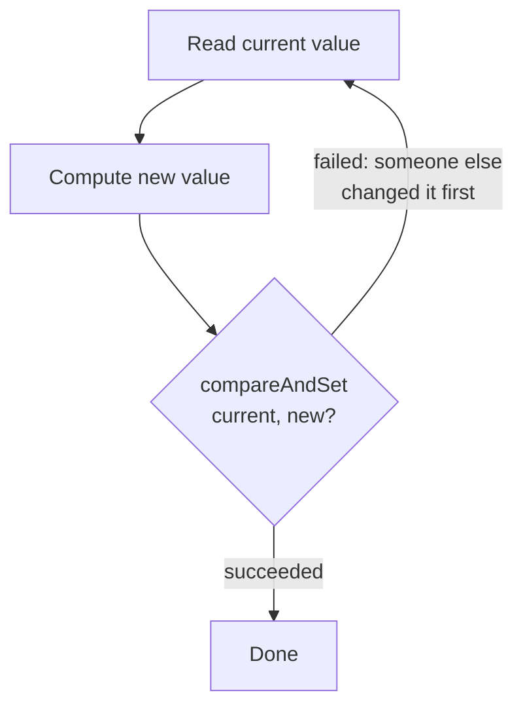

← [03. JMM & `volatile`](03-java-memory-model-and-volatile.md) | **04. Atomics & CAS** | Next → [05. Explicit Locks](05-explicit-locks.md)

# 04 — Atomics and Compare-And-Swap (CAS)

## The failure, first

You have a lock-free stack. A thread reads the top node, `A`, and its
`next` pointer, `B`, planning to CAS `top` from `A` to `B` to pop. Before it
gets to the CAS, two other things happen: another thread genuinely pops `A`
*and* `B` for real (top is now `C`), and then — because nodes are recycled
from a pool to avoid allocation — that same `A` object gets pushed right
back on top. When the first thread finally runs its CAS, it compares `top`
against `A`... and `top` **is** `A` again. The CAS succeeds. The thread sets
`top` to `B` — a node that was already removed, whose own `next` pointer is
now stale garbage. The stack is corrupted, and the CAS reported success the
entire time.

This is the **ABA problem**, and it's the sharpest edge in this module: CAS
only ever asks "does the current value equal what I last saw?" — it cannot
ask "has anything happened since I last looked?" A value going A → B → A is
indistinguishable, to a plain CAS, from nothing happening at all.

## Mental model: swap the lock on the door, but only if it still looks like the one you left

Locks (module 02/05) work by *blocking* — a thread that can't get in just
waits. Atomics take the opposite bet: never block, just try the swap, and
if you find someone else already changed it, throw away your attempt and
retry from scratch with fresh information. Picture handing someone a key
and saying "swap this lock for a new one, but only if it's still the exact
lock I left here" — that's `compareAndSet(expected, new)`. If someone
already swapped the lock while you were away, your swap is refused, and you
just try again with the lock as it is now. The ABA problem is what happens
when someone swaps the lock away and then swaps back an *indistinguishable*
copy — your "is it still the one I left?" check can't tell the difference,
because it never had a way to count how many swaps happened, only what the
lock currently looks like.

## Concept, from first principles

### Every atomic increment is a retry loop in disguise

`AtomicInteger.incrementAndGet()` looks like a single operation, but under
the hood it's this loop, made visible by `AtomicCounterDemo`'s manual
version:

```java
AtomicInteger value = new AtomicInteger(10);
int oldValue;
int newValue;
do {
    oldValue = value.get();
    newValue = oldValue * 2;
} while (!value.compareAndSet(oldValue, newValue));
```



`compareAndSet(expected, new)` is a single hardware instruction: atomically,
"if the memory location currently equals `expected`, set it to `new` and
return true; otherwise change nothing and return false." No thread ever
*blocks* waiting for a lock — a thread that loses the race just discards
its stale `oldValue`/`newValue` pair and loops back to read the (now
current) value and try again. That's why this scales well under light-to-
moderate contention: there's no lock queue, no context-switch cost for a
blocked thread — just cheap retries. It's also why forgetting the loop is
the most common bug in this space: a single `compareAndSet` call can
legitimately return `false` any time another thread won the race, and code
that doesn't loop on that just silently drops the update.

`getAndUpdate`/`updateAndGet`/`accumulateAndGet` are the same retry loop
generalized to an arbitrary function instead of a fixed `* 2`:

```java
int old = value.getAndUpdate(v -> v + 100); // returns the OLD value
int result = value.accumulateAndGet(3, (current, x) -> current * x); // returns the NEW value
```

The `getAnd*` vs `*AndGet` naming is consistent everywhere in this package:
`getAndX` returns the value *before* the update, `XAndGet` returns the value
*after* — mixing them up silently uses a stale number one step behind.

### ABA: why "the reference matches" isn't "nothing changed"

`AbaProblemDemo` builds a three-node stack `A → B → C` and deliberately
interleaves two threads: one starts popping (reads `top=A`, computes
`next=B` as the value it intends to CAS in), then pauses. While it's
paused, a second thread genuinely pops `A` and `B` (top is now `C`), then
pushes the *same* `A` object back on top (as a pooled/reused node would be).
When the first thread resumes:

```java
boolean success = top.compareAndSet(oldTop /* A */, expectedNewTop /* B */);
// succeeded=true — top really does equal A again — but B was already
// popped by the other thread; the stack is now silently corrupted
```

The CAS is not lying — `top` genuinely does equal `A` at that instant. But
"equals `A`" and "nothing happened since I last looked" are not the same
claim, and CAS can only ever make the first one. The fix,
`AtomicStampedReference`, pairs every reference with a monotonically
increasing integer stamp, and requires **both** to match:

```java
AtomicStampedReference<Node<String>> top = new AtomicStampedReference<>(a, 0);
// ...
boolean success = top.compareAndSet(oldTop, expectedNewTop, oldStamp, oldStamp + 1);
// succeeded=false — the reference is A again, but the stamp moved from
// oldStamp to a higher number while the reference was reused, so the CAS
// correctly detects "something happened" and refuses
```

The stamp is what turns "looks the same" into "provably nothing happened in
between" — every mutation bumps it, so an A→something→A round trip is
visible even though the reference alone can't show it.

### `LongAdder` vs. `AtomicLong`: spreading out the contention instead of winning it

`AtomicLong` funnels every incrementing thread through CAS against **one**
shared memory location — under high contention (many threads, one hot
counter), most CAS attempts fail and retry, all spinning against the same
cache line. `LongAdder` takes a different approach: internally, it
maintains an array of per-thread/per-core `Cell`s that different threads
usually update independently (no shared location to contend on at all), and
only combines them into a total when you call `sum()`.
`LongAdderVsAtomicLongDemo` measures both under identical concurrent load
and `LongAdder` comes out faster — but the trade-off is real: `sum()` is an
eventually-consistent snapshot (it walks the cells and adds them up, with
no atomicity across the whole read), not a strictly linearizable "the exact
value right now." If your code needs the precise running total at every
single step (an invariant check, a balance that must never be read stale),
`AtomicLong` is still the right tool — `LongAdder` trades exact-value-at-
every-instant for write throughput under contention.

## Misconceptions worth naming directly

- **Belief: "`compareAndSet` either succeeds or the value is safely
  unchanged, so I don't need a loop."**
  Wrong if your goal was actually to apply an update — a failed CAS means
  someone else changed the value first, and without retrying, your
  intended update is simply lost, silently, exactly like an unsynchronized
  `count++`. Proof: `AtomicCounterDemo`'s manual loop exists specifically
  because a single `compareAndSet` call is not the whole operation, only
  one attempt at it.

- **Belief: "If my `AtomicReference`'s CAS succeeds because the value
  matches what I expected, then nothing changed since I last read it."**
  Wrong — the value can have changed and changed back, and a plain
  reference CAS cannot tell the difference. Proof: `AbaProblemDemo`'s first
  scenario has the CAS report `succeeded=true` while the stack has already
  been corrupted underneath it.

- **Belief: "`LongAdder` is a strict upgrade over `AtomicLong` — just
  always use it."**
  Wrong on two counts: under low contention, the striping machinery adds
  overhead with nothing to relieve, so `LongAdder` can be slightly slower
  than `AtomicLong`; and `sum()` is only eventually consistent under
  concurrent writers, so code that needs the exact value after every single
  update should stay on `AtomicLong`.

- **Belief: "`getAndUpdate` and `updateAndGet` are interchangeable, they
  both just apply the function."**
  Wrong — they apply the same update, but `getAndUpdate` returns the value
  *before* the update and `updateAndGet` returns the value *after* — code
  that assumes the wrong one is silently working with a value one step
  stale.

## Where this shows up for real

CAS is the hardware primitive underneath essentially every non-blocking
data structure you'll meet later in this curriculum — `ConcurrentHashMap`'s
internal bucket updates (module 06), the lock-free stack and ring buffer in
module 12, and `AtomicStampedReference`-style versioning shows up directly
in optimistic concurrency control in databases (a row's version number is
exactly a stamp: "update this row only if its version is still what I read
it as"). `LongAdder` is the standard choice for hot request/error counters
in real services — metrics libraries (Micrometer, Dropwizard Metrics) use
this exact striping technique internally for high-throughput counters.

## Check yourself

1. Why does `incrementAndGet()` need an internal retry loop if it's
   ultimately backed by a single hardware CAS instruction?
2. Describe a concrete interleaving of two threads that produces the ABA
   problem on a plain `AtomicReference`-based stack, and explain exactly
   what `AtomicStampedReference` adds that prevents it.
3. Under what load pattern would you expect `LongAdder` to actually be
   *slower* than `AtomicLong`, and why?
4. What's the difference between what `getAndUpdate` and `updateAndGet`
   return, and how would picking the wrong one silently corrupt logic that
   assumes it has "the latest value"?

---

<details>
<summary>Answers</summary>

1. Because a single CAS attempt can fail — if another thread changed the
   value between this thread's read and its CAS, `compareAndSet` returns
   `false` and nothing was updated; the loop is what re-reads the new
   current value and tries again until an attempt actually succeeds.
2. Thread 1 reads `top=A`, plans to CAS to `A.next=B`, then pauses. Thread 2
   really pops `A` then `B` (top becomes `C`), then pushes the same `A`
   object back onto the stack. Thread 1 resumes and its CAS(`A`→`B`)
   succeeds because `top` does equal `A` again — corrupting the stack with
   a stale `B` reference. `AtomicStampedReference` adds a stamp that
   increments on every mutation, so even though the reference reads as `A`
   again, the stamp has moved — Thread 1's CAS (which also checks the
   stamp) correctly fails instead of succeeding.
3. Under low or no contention — the per-thread/per-core striping machinery
   (allocating and managing `Cell`s) adds bookkeeping overhead that has
   nothing to relieve when there's little or no actual contention on a
   single `AtomicLong` to begin with.
4. `getAndUpdate` returns the value *before* applying the update function;
   `updateAndGet` returns the value *after*. Code that calls `getAndUpdate`
   but treats the returned value as "the new current value" is actually
   working with a value one update behind, which can silently corrupt any
   logic built on "what did we just set this to."

</details>

---

← [03. JMM & `volatile`](03-java-memory-model-and-volatile.md) | Next → [05. Explicit Locks](05-explicit-locks.md)
