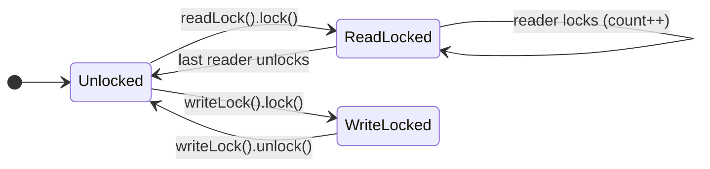

← [04. Atomics & CAS](04-atomics-and-cas.md) | **05. Explicit Locks** | Next → [06. Concurrent Collections](06-concurrent-collections.md)

# 05 — Explicit Locks (`java.util.concurrent.locks`)

## The failure, first

Module 02's `synchronized` gives you exactly one lock per object, with no
way to ask "is it free right now, without waiting?", no way to give up
after a timeout, and — subtlest of all — only **one** wait-set. A bounded
buffer with `wait()`/`notifyAll()` has to wake *every* waiter on every
signal, because there's no way to say "wake only the producers" or "wake
only the consumers" — they all share the same monitor's single queue. As
the buffer gets busier, that means threads that couldn't possibly make
progress get woken anyway, just to immediately re-check their condition and
go back to sleep. `synchronized` was never designed to be tunable; it's one
fixed policy.

`java.util.concurrent.locks` exists because real systems need to ask for
more: try without blocking, wait with a deadline, split "many readers" from
"one writer," or even read without taking a lock at all. Every class in
this module is unlocking one of those specific capabilities `synchronized`
structurally cannot provide.

## Mental model: the same room, but now with a doorbell, a timer, and separate call queues

If `synchronized`'s monitor is "one key, one room, no options," `Lock` is
the same room with a control panel bolted on: `tryLock()` is knocking once
and walking away if no one answers; `tryLock(timeout, unit)` is knocking and
waiting until a timer runs out; `lockInterruptibly()` is knocking but
agreeing to leave if someone taps you on the shoulder (an interrupt).
`Condition` objects are separate labeled call-buttons for the same room —
instead of one shared "someone, anyone, wake up" button
(`notifyAll()`), you get a `notEmpty` button and a `notFull` button, each
waking only the threads actually waiting on that specific condition.
`ReentrantReadWriteLock` splits the room into "many people can be inside
reading at once" vs. "exactly one person inside writing, and nobody else at
all." `StampedLock`'s optimistic mode goes further still: for the common
case, don't even ask to enter the room — peek through the window, then
double-check afterward that nobody rearranged the furniture while you were
looking.

## Concept, from first principles

### `ReentrantLock`: everything `synchronized` gives you, made explicit

```java
private final Lock lock = new ReentrantLock();
void increment() {
    lock.lock();
    try {
        value++;
    } finally {
        lock.unlock();
    }
}
```

Because acquiring and releasing are now explicit method calls instead of a
block boundary, `lock()` **must** be called *before* the `try`, never
inside it — if `lock()` itself were inside the `try` and threw, the
`finally` would call `unlock()` on a lock this thread never actually
acquired, releasing a lock some *other* thread holds. This ordering is the
single most important idiom in this entire module; every demo class follows
it exactly, with no exceptions.

`tryLock()` and `tryLock(timeout, unit)` are the capability `synchronized`
simply cannot offer:

```java
boolean acquiredQuickly = lock.tryLock();                       // false if held
boolean acquiredWithTimeout = lock.tryLock(200, TimeUnit.MILLISECONDS); // waits, then gives up
```

`ReentrantLockBasicsDemo` also measures **fair vs. unfair** locking under
real contention: a fair lock grants the lock in strict arrival order (FIFO),
which sounds obviously better, but costs real throughput — it has to check
and maintain that ordering on every handoff. An unfair lock (the default)
lets whichever thread happens to ask first *right now* barrel in, even if
others have been waiting longer; that's less "fair" but faster, because a
freshly-requesting thread is often already running and doesn't need a full
context switch to hand it the lock. The demo's own numbers make the
trade-off concrete: fair took roughly 4x longer than unfair for the same
160,000 increments under 8-way contention — fairness is not free, and most
code doesn't actually need it.

### `Condition`: giving each wait-reason its own wait-set

`ConditionVariableBoundedBufferDemo` is module 02's `wait()`/`notifyAll()`
buffer, rebuilt with two independent `Condition`s off the same lock:

```java
private final Lock lock = new ReentrantLock();
private final Condition notEmpty = lock.newCondition();
private final Condition notFull = lock.newCondition();

void put(T item) throws InterruptedException {
    lock.lock();
    try {
        while (items.size() == capacity) {
            notFull.await();
        }
        items.addLast(item);
        notEmpty.signal();     // wakes only a consumer, not a producer
    } finally {
        lock.unlock();
    }
}
```

The mutual exclusion is still one lock — but now a producer that just added
an item calls `notEmpty.signal()`, which wakes *only* threads waiting on
`notEmpty` (consumers), not the producers waiting on `notFull`. Compare
this to module 02's single `notifyAll()`, which had to wake everyone and
let them all re-check their own condition. The `while`, not `if`, rule
carries over unchanged and for the identical reason: a signal only means
"the condition might now hold," not "it does," so it must be re-verified
after waking.

### `ReentrantReadWriteLock`: many readers, one writer



A `ReentrantLock` treats every acquirer identically. But most real caches
are read-heavy: many threads want to look something up at once, and only
occasionally does one thread need to change it. `ReadWriteLockDemo` models
exactly this:

```java
V get(K key, long simulatedReadMillis) {
    lock.readLock().lock();
    try { sleepQuietly(simulatedReadMillis); return data.get(key); }
    finally { lock.readLock().unlock(); }
}
void put(K key, V value, long simulatedWriteMillis) {
    lock.writeLock().lock();
    try { sleepQuietly(simulatedWriteMillis); data.put(key, value); }
    finally { lock.writeLock().unlock(); }
}
```

Eight readers, each simulating a 100ms read, finish in roughly 100ms total,
not 800ms — the read lock lets them all hold it simultaneously, because
none of them mutate anything a concurrent reader could see torn. But the
moment a writer takes the write lock, it is genuinely exclusive: any
concurrent reader blocks until the writer releases it. The trade-off to
remember: the default `ReentrantReadWriteLock` is unfair and *not*
writer-preferring — under a constant stream of readers, a waiting writer
can be starved indefinitely, since there's no guarantee readers ever stop
arriving. If writers must make timely progress under heavy read load, you
need a fair lock or a different structure entirely.

### `StampedLock`: don't even take the lock, just verify nothing moved

`ReentrantReadWriteLock`'s read lock still requires every reader to update
shared lock-state (a reader count), which means readers *do* contend with
each other on that shared counter, even though they never contend on the
actual data. `StampedLock`'s optimistic mode removes that entirely for the
common case:

```java
long stamp = lock.tryOptimisticRead();   // no lock taken, no shared state touched
double currentX = x;
double currentY = y;
if (!lock.validate(stamp)) {             // did any write happen since the stamp was issued?
    stamp = lock.readLock();             // rare: fall back to a real, blocking read lock
    try { currentX = x; currentY = y; }
    finally { lock.unlockRead(stamp); }
}
```

```
stamp = lock.tryOptimisticRead()   // no blocking, no CAS on shared lock state
read fields into locals
if lock.validate(stamp):           // did a write happen since the stamp was issued?
    use the locals                 //   no  -> safe, we're done, and it was essentially free
else:
    stamp = lock.readLock()        //   yes -> fall back to a real (blocking) read lock
    re-read fields
    lock.unlockRead(stamp)
```

`StampedLockOptimisticReadDemo` runs this against a `Point` under a writer
hammering `move()` concurrently, and the overwhelming majority of optimistic
reads succeed on the first try, at essentially zero synchronization cost —
`validate()` only fails on the rare read that genuinely raced a write, and
only *then* does the thread pay for a real lock. This is why `StampedLock`
beats `ReentrantReadWriteLock` specifically on read-heavy, short-critical-
section workloads: readers never write to any shared lock state at all in
the common case, so they never contend with each other, only (rarely) with
an in-flight writer.

The one sharp edge: **`StampedLock` is not reentrant.** `ReentrantLock` and
`ReentrantReadWriteLock` both tolerate the same thread re-acquiring a lock
it already holds (hence "reentrant" in the name); `StampedLock` does not —
a thread that tries to acquire it again while already holding it (even in
read mode from a method that calls another method that also reads) will
deadlock against itself.

## Misconceptions worth naming directly

- **Belief: "It doesn't matter whether `lock()` is inside or outside the
  `try` block, as long as `unlock()` is in `finally`."**
  Wrong — if `lock()` is inside the `try` and throws before actually
  acquiring the lock, the `finally` still runs and calls `unlock()`,
  releasing a lock this thread never held (and potentially unlocking a
  lock another thread currently owns). `lock()` must always be the line
  immediately before the `try`.

- **Belief: "A fair lock is strictly better since it's, well, fair."**
  Wrong as a default choice — `ReentrantLockBasicsDemo` shows fairness
  costs real throughput (roughly 4x slower in its own measurement) because
  maintaining strict FIFO ordering is extra bookkeeping on every handoff;
  most code has no correctness requirement for arrival-order acquisition
  and pays for it needlessly by defaulting to `true`.

- **Belief: "Splitting `wait()`/`notify()` into separate `Condition`s is
  just cosmetic — `signal()` still wakes someone."**
  Wrong — the entire point is that `notEmpty.signal()` wakes only threads
  waiting on `notEmpty`, never threads waiting on `notFull`, which is
  precisely the wasted-wakeup problem a single intrinsic monitor's shared
  wait-set cannot avoid.

- **Belief: "`ReentrantReadWriteLock` readers never wait, so reads are
  basically free."**
  Wrong on two counts: readers still block behind an active writer, and
  under a constant stream of readers, a waiting writer can starve
  indefinitely with the default unfair policy — "readers run in parallel
  with each other" is not the same claim as "readers and writers never
  interact."

- **Belief: "I can use the fields read under `tryOptimisticRead()` right
  away, the stamp is just bookkeeping I can ignore."**
  Wrong — skipping `validate()` turns "optimistic read" into "reading
  unprotected shared state with no safety net," which reintroduces exactly
  the visibility/tearing problems module 03 exists to prevent. The stamp
  check is not optional decoration; it's the entire mechanism that makes
  this safe.

## Where this shows up for real

`ReentrantReadWriteLock` and `StampedLock` are the standard tools behind
any read-heavy in-memory cache or configuration store that's refreshed
occasionally but read constantly — exactly the shape of a feature-flag
cache or a routing table. `Condition` objects are what real thread-pool and
executor implementations (including the JDK's own) use internally to
implement multiple distinct wait-reasons off one lock, instead of the
coarser intrinsic-monitor wait-set. `StampedLock`'s optimistic-read pattern
is the same idea as optimistic concurrency control at the database
level — try the cheap path, verify, fall back only when contention actually
happened.

## Check yourself

1. Why must `lock()` always be called before the `try` block, never inside
   it?
2. What specific problem does splitting `notEmpty`/`notFull` into separate
   `Condition` objects solve that a single intrinsic monitor's
   `notifyAll()` cannot?
3. Under a constant stream of readers, why can a writer be starved with a
   default `ReentrantReadWriteLock`, even though "readers run in parallel"
   sounds like it should be strictly better for everyone?
4. What does `StampedLock.validate(stamp)` actually check, and what must
   happen if it returns `false`?
5. Why is it dangerous for the same thread to call `stampedLock.readLock()`
   from within a method that's already holding that same lock (directly or
   via a nested call)?

---

<details>
<summary>Answers</summary>

1. Because if `lock()` itself throws (rare, but possible) while inside the
   `try`, the `finally` block still executes and calls `unlock()` — on a
   lock this thread never actually acquired, which can release a lock
   another thread legitimately holds.
2. It lets a signal wake only the threads that could actually make progress
   (e.g. only consumers when an item was just added), instead of waking
   every waiter regardless of which condition they're blocked on, which is
   the only option a single shared monitor wait-set provides.
3. Because the default `ReentrantReadWriteLock` policy is unfair and not
   writer-preferring — as long as readers keep arriving, there's no
   built-in mechanism forcing the lock to eventually favor a waiting
   writer, so the writer can wait indefinitely.
4. It checks whether any write lock was acquired (i.e., a mutation
   happened) between when the stamp was issued and now. If it returns
   `false`, the optimistic read is invalid and the reader must fall back
   to acquiring a real read lock and re-reading the fields under it.
5. Because `StampedLock`, unlike `ReentrantLock`/`ReentrantReadWriteLock`,
   is not reentrant — a thread trying to acquire it again while it already
   holds it will block waiting for itself to release it first, which never
   happens: a self-deadlock.

</details>

---

← [04. Atomics & CAS](04-atomics-and-cas.md) | Next → [06. Concurrent Collections](06-concurrent-collections.md)
