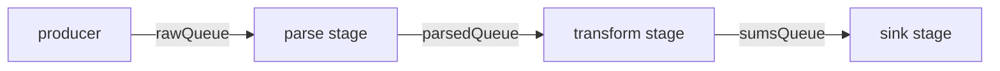

← [06. Concurrent Collections](06-concurrent-collections.md) | **07. Producer/Consumer Queues** | Next → [08. Executors & Thread Pools](08-executors-and-thread-pools.md)

# 07 — Producer/Consumer with Blocking Queues

## The failure, first

Module 02 and module 05 both built a bounded buffer by hand — first with
`synchronized`/`wait()`/`notifyAll()`, then with `ReentrantLock`/
`Condition`. Both versions work, and both required you to personally get
right: the mutual exclusion, the `while` loop around the wait condition,
signaling the correct condition, not leaking the lock. That's a lot of
hand-maintained machinery for an extremely common shape of problem —
"one or more producers, one or more consumers, a safe hand-off point in
between." Every time you write that from scratch, you're re-solving a
problem the standard library already solved once, carefully, and packaged
as `BlockingQueue`.

The real failure this module addresses isn't a bug — it's the cost of
reinventing this pattern badly: an unbounded queue "because it's simpler"
looks fine in testing and then grows without limit in production the
moment a producer outpaces its consumer, silently converting a design
choice into a future `OutOfMemoryError`.

## Mental model: a queue with a built-in "please slow down" signal

A `BlockingQueue` is a thread-safe hand-off point that already knows how to
make `put()` wait when there's no room and `take()` wait when there's
nothing to take — no manual lock, no manual condition variable, no manual
`while` loop required from you. The mental model worth keeping is
**backpressure**: a bounded queue is a dam, not a pipe. A producer that
outruns its consumer doesn't overflow memory — it simply gets forced to
slow down, blocked inside `put()`, until the consumer catches up. That's
not a limitation; it's the entire point of choosing a *bounded* queue over
an unbounded one — it converts "memory grows without limit" into "the
producer waits," which is almost always the behavior you actually want.

## Concept, from first principles

### `ArrayBlockingQueue`: the bounded buffer, now with backpressure built in

```java
BlockingQueue<Integer> queue = new ArrayBlockingQueue<>(3);
// producer thread:
queue.put(i);   // blocks here once the queue holds 3 items
// consumer thread:
int item = queue.take();  // blocks here when the queue is empty
```

`ArrayBlockingQueuePipelineDemo` deliberately makes the consumer slower than
the producer (a 50ms sleep per item) and watches `put()`'s blocking time
grow once the queue fills: the first three `put()` calls return instantly,
then every subsequent `put()` blocks for tens of milliseconds, waiting for
the consumer to make room. This *is* backpressure, made visible as a
number — the producer isn't failing, it's being correctly slowed to match
the consumer's actual pace, with a fixed, bounded amount of memory in use
the entire time.

### `SynchronousQueue`: capacity zero, a pure hand-off

`ArrayBlockingQueue` still buffers up to its capacity. `SynchronousQueue`
buffers **nothing at all** — capacity zero means `put()` cannot return
until another thread is *already* (or concurrently becomes) blocked in
`take()`, and vice versa. Every element is a direct thread-to-thread pass,
never sitting "in" the queue for even an instant:

```java
BlockingQueue<String> handoff = new SynchronousQueue<>();
// put() only returns once some other thread's take() is there to receive it
handoff.put(task);
```

`SynchronousQueueHandoffDemo` starts five consumer threads *before* the
producer, and each `put()` reports how long it blocked waiting for a
consumer to be ready to receive. This is the sharpest edge of the whole
module: if you start a producer against a `SynchronousQueue` with no
consumer thread anywhere yet running (or about to run), that `put()` simply
never returns — there is no buffer for it to place the item into while it
waits. This exact primitive is what `Executors.newCachedThreadPool()` uses
internally to hand a submitted task directly to an idle worker thread,
creating a new thread only when no idle one is available to receive the
hand-off immediately.

### `PriorityBlockingQueue`: `take()` returns "most urgent," not "oldest"

Every other queue here is FIFO. `PriorityBlockingQueue` reorders by a
`Comparator` instead:

```java
BlockingQueue<Task> queue = new PriorityBlockingQueue<>(11,
        Comparator.comparingInt(Task::priority).reversed());
queue.put(new Task("cleanup", 1));
queue.put(new Task("handle-payment", 9));
queue.put(new Task("log-metrics", 0));
// take() returns handle-payment first, regardless of production order
```

`PriorityBlockingQueueDemo` produces six tasks in an arbitrary, unsorted
order and confirms the consumer always drains them highest-priority-first —
production order is completely irrelevant to consumption order. The trade
to remember: elements of *equal* priority have no guaranteed relative
ordering among themselves, and under a sustained stream of high-priority
work, low-priority items have no fairness guarantee at all — a
`PriorityBlockingQueue` can starve them indefinitely. It answers "what's
most urgent right now," not "what's fair over time."

### Chaining queues into a pipeline

A multi-stage pipeline is just several `BlockingQueue`s connected by worker
threads, each stage reading from queue *N* and writing to queue *N+1*:



`MultiStageQueuePipelineDemo` wires exactly this: a `parse` stage turns
`"3,4"` into `[3, 4]`, a `transform` stage sums it to `7`, and a `sink`
stage accumulates a running total — three independent threads, each one
only aware of the queue it reads from and the queue it writes to, never
holding a direct reference to another stage. That decoupling is the whole
value of the pattern: you can add more worker threads to any single stage
to scale it, or splice a new stage into the middle, without touching the
others at all.

Notice the `POISON_PILL` sentinel value threaded through every stage:

```java
while (!(line = rawQueue.take()).equals(POISON_PILL)) {
    // process line
}
parsedQueue.put(SENTINEL_FOR_NEXT_STAGE); // propagate the shutdown signal onward
```

A worker whose only loop condition is "keep calling blocking `take()`" has
no way to know when producers are done — without an explicit termination
signal passed down the chain, every stage would block in `take()` forever
once upstream production actually stops. The poison pill is that signal,
and it must be forwarded stage-to-stage, not just handled by the first
consumer.

## Misconceptions worth naming directly

- **Belief: "An unbounded queue is simpler and safer — no risk of
  `put()` blocking unexpectedly."**
  Wrong — it removes a *visible, controlled* form of backpressure (a
  blocked `put()`) and replaces it with an *invisible, uncontrolled* one
  (unbounded memory growth), which fails much later and much worse, as an
  `OutOfMemoryError` instead of a slowed-down producer.

- **Belief: "`SynchronousQueue.put()` behaves like any other bounded
  queue's `put()`, just with capacity 1 instead of, say, 3."**
  Wrong — capacity 1 would still let one `put()` succeed with no consumer
  present; a `SynchronousQueue` requires a *concurrently waiting* consumer
  for `put()` to return at all — there is no buffer to place an item into
  in the meantime.

- **Belief: "A `PriorityBlockingQueue` is basically a FIFO queue that also
  happens to sort by priority when priorities differ."**
  Wrong to treat as a FIFO substitute — equal-priority elements have no
  guaranteed relative order, and sustained high-priority traffic can starve
  low-priority items indefinitely; it optimizes for "most urgent now," not
  fairness over time.

- **Belief: "Testing a producer/consumer pipeline by sleeping a fixed
  amount of time, then checking the result, is good enough."**
  Wrong — it's exactly the kind of timing assumption that makes tests
  flaky under load; `poll(timeout, unit)` (blocking with a deadline on the
  queue itself) replaces a guessed sleep duration with an actual
  synchronization point.

- **Belief: "A pipeline stage that only calls blocking `take()` in a loop
  will naturally stop once producers are done."**
  Wrong — without an explicit shutdown signal (a poison pill or
  equivalent) forwarded through every stage, a `take()`-only loop blocks
  forever the moment upstream production genuinely stops; nothing about an
  empty queue tells a blocked `take()` "no more is coming."

## Where this shows up for real

Every message queue, job queue, or event pipeline you'll build on top of
Kafka, RabbitMQ, or an internal task system is the same shape as this
module's `BlockingQueue` pipeline, just distributed across processes
instead of threads — the backpressure, ordering, and shutdown-signal
lessons all transfer directly. `SynchronousQueue`'s direct hand-off is
literally the mechanism inside `Executors.newCachedThreadPool()` (module
08). This module's queue-chaining pattern is also the conceptual seed for
module 15's reactive streams — a reactive pipeline is the same
producer/stage/consumer shape, but with the blocking replaced by
non-blocking backpressure signaling.

## Check yourself

1. Why does using an unbounded queue "to be safe" often make a producer/
   consumer system *less* safe in production, not more?
2. What must be true for `SynchronousQueue.put()` to return, and how is
   that different from `ArrayBlockingQueue.put()` on a queue with capacity
   1?
3. Why is `PriorityBlockingQueue` a poor substitute for a FIFO queue, even
   when most items have distinct priorities?
4. In a multi-stage pipeline built from chained `BlockingQueue`s, why does
   a stage that only calls blocking `take()` need an explicit shutdown
   signal, and what goes wrong without one?

---

<details>
<summary>Answers</summary>

1. Because it removes a visible, controlled backpressure signal (a blocked
   `put()`) and replaces it with unbounded memory growth that only fails
   later, and worse, as an `OutOfMemoryError` once a fast producer has
   outrun a slow consumer for long enough.
2. `SynchronousQueue.put()` only returns once another thread is already (or
   concurrently) blocked in `take()` to receive that exact element
   directly — there is no internal buffer at all. `ArrayBlockingQueue`
   with capacity 1 can accept one `put()` and let it return immediately
   even with no consumer present yet, since that one slot buffers it.
3. Because elements of equal priority have no guaranteed relative
   ordering, and under sustained higher-priority traffic, lower-priority
   elements have no fairness guarantee — they can be starved indefinitely,
   which a FIFO queue by definition never allows.
4. Because a `take()`-only loop has no other way to learn that no more
   items are coming — an empty queue causes it to block, not exit. Without
   a poison-pill-style signal forwarded through each stage, every stage
   blocks forever in `take()` once upstream production genuinely stops,
   and the pipeline never terminates.

</details>

---

← [06. Concurrent Collections](06-concurrent-collections.md) | Next → [08. Executors & Thread Pools](08-executors-and-thread-pools.md)
