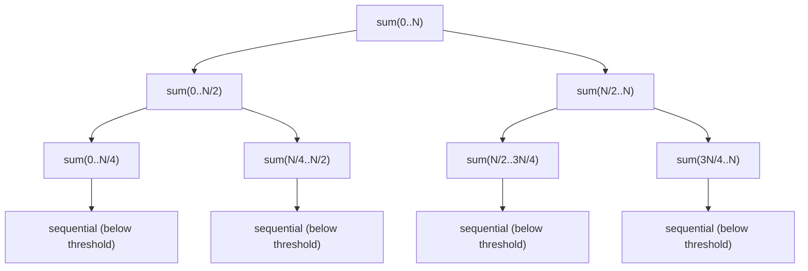

← [10. Futures & CompletableFuture](10-futures-and-completablefuture.md) | **11. Fork/Join & Parallel Streams** | Next → [12. Lock-Free Structures](12-lock-free-structures.md)

# 11 — Fork/Join and Parallel Streams

## The failure, first

Somewhere in a web application, an unrelated request calls
`.parallelStream()` on a 20-element list to sum some numbers — a completely
innocent, tiny piece of work. It takes 280 milliseconds. Not because
summing 20 numbers is slow — because, unbeknownst to whoever wrote that
line, a *different* part of the same JVM is running a parallel stream that
blocks each of its worker threads for 300ms doing I/O, and **every parallel
stream in the process shares the same fixed-size worker pool** by default.
The unrelated sum has to queue up behind the blocked workers. Nobody wrote
a bug in the traditional sense — two pieces of code that have never heard
of each other are silently fighting over the same limited resource, and the
victim's stack trace gives no hint why a trivial computation took 300x
longer than it should have.

`CommonPoolStarvationDemo` reproduces exactly this, and the fix it
demonstrates — routing blocking work to a dedicated pool — is the single
most important operational lesson in this module.

## Mental model: split the work like a recursive outline, but know when to stop splitting

Fork/join is divide-and-conquer, made literal: split a big task into two
halves, hand one half to another worker thread, keep the other half for
yourself, then combine the two results once both are done. Recursively.



The picture makes an easy-to-miss detail obvious: splitting has to stop
*somewhere*. Every split creates a new task object and schedules it — real
overhead. If you keep splitting all the way down to single elements, the
bookkeeping cost of managing millions of tiny tasks dwarfs the trivial work
each one does; below some threshold, "just compute it sequentially, right
here" is faster than "split it one more time." Parallel streams
(`.parallelStream()`, `IntStream...parallel()`) are built on this exact
machinery — and, critically, they all draw worker threads from **one
shared, process-wide pool**, `ForkJoinPool.commonPool()`, by default. That
sharing is invisible in the code and is the root cause of this module's
sharpest pitfall.

## Concept, from first principles

### `RecursiveTask`: fork one side, compute the other inline, then join

`RecursiveTaskSumDemo` sums a 50-million-element array with a hand-written
`RecursiveTask<Long>`:

```java
protected Long compute() {
    int length = end - start;
    if (length <= THRESHOLD) {              // sequential cutoff
        long sum = 0;
        for (int i = start; i < end; i++) sum += data[i];
        return sum;
    }
    int mid = start + length / 2;
    SumTask left = new SumTask(data, start, mid);
    SumTask right = new SumTask(data, mid, end);

    left.fork();                 // hand the left half to another worker
    long rightResult = right.compute();  // compute the right half ON THIS thread
    long leftResult = left.join();       // wait for the forked half to finish
    return leftResult + rightResult;
}
```

The order here is not arbitrary — `fork()` one side, `compute()` the
*other* side directly on the current thread, and only `join()` the forked
side at the end. Forking both sides and then joining both would throw away
a real optimization: this way, the current thread does useful work (the
right half) instead of sitting idle waiting for both children to be
scheduled elsewhere. The threshold (`10_000` in this demo) exists purely
because task-creation and scheduling overhead is real; the demo measures
roughly a 3x speedup on an 8-core machine with a sensibly chosen threshold
— the number that matters isn't "how many cores do I have," it's "at what
task size does splitting further stop paying for itself."

### Parallel streams share one pool — and don't make your code thread-safe for you

`ParallelStreamPitfallsDemo` runs the single most common parallel-stream
mistake:

```java
List<Integer> unsafeList = new ArrayList<>();
IntStream.range(0, 200_000).parallel().forEach(unsafeList::add);
// expected size 200000, actual size 187342  <-- lost updates
```

`.parallel()` does not make `ArrayList.add` thread-safe — it's the exact
same plain, unsynchronized `ArrayList` from module 06, now being mutated by
several worker threads at once, and it silently loses elements (or worse,
throws `ArrayIndexOutOfBoundsException`) under contention. The fix is never
"add synchronization to my `forEach`" — it's to use the stream's own
built-in, race-free reduction operations instead:

```java
List<Integer> safeList = IntStream.range(0, 200_000).parallel().boxed()
        .collect(Collectors.toList());     // deterministic, every time
int sum = IntStream.range(0, 200_000).parallel().sum();  // deterministic
```

`Collectors.toList()` and `IntStream.sum()` are designed from the ground up
to combine partial results from multiple worker threads correctly — the
race in the unsafe version isn't a flaw in parallel streams, it's a flaw in
reaching for `.forEach(sharedMutableState::mutate)` instead of the
collector/reduction API that exists specifically to avoid needing shared
mutable state at all.

### The starvation trap: blocking calls inside `commonPool()` hurt code that never touches yours

This is the pitfall that makes this module worth its own chapter beyond
"parallel streams need thread-safe operations." `CommonPoolStarvationDemo`
starts a parallel stream whose per-element work is `Thread.sleep(300)` —
purely blocking, no CPU work at all — and while that's running, measures
how long a completely unrelated 20-element parallel sum takes:

```java
// this stream's workers are all sleeping, tying up commonPool()
IntStream.range(0, BLOCKING_TASK_COUNT).parallel().forEach(i -> sleepQuietly(300));

// meanwhile, elsewhere in the JVM, something totally unrelated:
long unrelatedSum = IntStream.range(0, 20).parallel().mapToLong(i -> i).sum();
// takes ~300ms instead of ~1ms — starved, queued up behind the sleeping workers
```

The fix is to never let blocking work run on the shared common pool in the
first place — submit it to a **dedicated** `ForkJoinPool** sized for that
workload, and wait on it explicitly:

```java
ForkJoinPool dedicatedPool = new ForkJoinPool(BLOCKING_TASK_COUNT);
dedicatedPool.submit(() ->
        IntStream.range(0, BLOCKING_TASK_COUNT).parallel().forEach(i -> sleepQuietly(300))
).get();
// the unrelated 20-element sum now finishes in ~1-2ms, completely unaffected
```

The lesson generalizes past this specific demo: **any** blocking call
inside a parallel stream — a JDBC query, a blocking HTTP client call, even
a `Future.get()` — ties up one of `commonPool()`'s limited worker threads
for the duration of the block, and because that pool is shared
process-wide, the damage isn't contained to your own code. A library you
didn't write, running in the same JVM, pays for it too.

## Misconceptions worth naming directly

- **Belief: "Forking every task down to size 1 gives maximum parallelism,
  so it should be the fastest."**
  Wrong — every fork creates and schedules a real task object; below some
  threshold, the bookkeeping overhead of managing enormous numbers of
  trivial tasks outweighs whatever parallelism they add. A measured
  sequential cutoff is faster than forking everything.

- **Belief: "`.parallel()` automatically makes the operations inside my
  `forEach` thread-safe, since it's specifically designed for
  concurrency."**
  Wrong — `.parallel()` parallelizes the *iteration*, not the body you
  write; `unsafeList::add` on a plain `ArrayList` is exactly as unsafe
  under a parallel stream as under any other multi-threaded access,
  because nothing about the stream API changes what `ArrayList.add` does.

- **Belief: "A blocking call inside a parallel stream only slows down that
  one stream — it's isolated to my own code."**
  Wrong — because parallel streams share `ForkJoinPool.commonPool()`
  process-wide by default, blocking that pool's workers delays *every*
  other parallel stream running anywhere in the same JVM, including code
  in libraries and frameworks you don't control.

- **Belief: "`.parallel()` is always at least as fast as sequential, since
  it can only add more workers."**
  Wrong — for small collections or cheap per-element work, the fork/join
  scheduling and task-management overhead can make the parallel version
  slower than a plain sequential loop; parallelism has a fixed cost that
  only pays off once there's enough actual work to divide.

## Where this shows up for real

The "never block inside `commonPool()`" lesson is one of the most
frequently-violated rules in real production JVMs, precisely because it's
invisible in the code — any team using parallel streams anywhere for
CPU-bound work is implicitly sharing a resource with any other team doing
the same in the same process, and a blocking call slipped into either one
degrades both. `RecursiveTask`/`RecursiveAction`'s split-compute-combine
shape underlies parallel array/collection processing broadly, and the
sequential-cutoff-threshold decision is the same tuning knob you'll meet
again anywhere "how deep should this recursive parallel algorithm split"
comes up (parallel merge sort, parallel matrix operations).

## Check yourself

1. Why does recursively forking a task all the way down to single-element
   pieces typically make it *slower*, not faster, than stopping at a
   sensible threshold?
2. In `RecursiveTask.compute()`, why does the canonical pattern fork the
   left half and call `compute()` directly on the right half, rather than
   forking both halves and joining both?
3. Why does `IntStream.range(...).parallel().forEach(list::add)` on a
   plain `ArrayList` lose elements, when the exact same `.forEach` on a
   sequential stream would work fine?
4. Explain concretely how a blocking `Thread.sleep()` inside one parallel
   stream can slow down a completely unrelated parallel stream elsewhere
   in the same JVM.
5. What is the fix for the starvation problem in question 4, and why does
   it solve it?

---

<details>
<summary>Answers</summary>

1. Because every fork creates and schedules a real task object, and that
   bookkeeping has a fixed cost; once tasks get small enough, the total
   overhead of creating and scheduling enormous numbers of them exceeds
   whatever parallel speedup they could add — a sequential cutoff avoids
   paying that overhead for work too small to benefit from it.
2. Forking both sides and then joining both would leave the current
   thread idle while waiting for both children to be scheduled and run
   elsewhere. Computing the right half directly, inline, keeps the current
   thread doing useful work instead of sitting idle, while the forked left
   half still runs concurrently on another worker.
3. A sequential stream never has two threads calling `add` on the list at
   the same time, so there's no race. A parallel stream has multiple
   worker threads calling `add` concurrently on the same non-thread-safe
   `ArrayList`, which is exactly the same unguarded compound-mutation race
   any concurrent `ArrayList` access would produce — `.parallel()` changes
   nothing about the list's own thread-safety.
4. Parallel streams draw worker threads from one shared, process-wide
   `ForkJoinPool.commonPool()` by default. If one stream's per-element work
   blocks (e.g., sleeping) inside that pool, it occupies worker threads for
   the duration of the block — any other parallel stream, anywhere in the
   same JVM, that needs a worker thread has to wait for one to free up,
   even though its own work has nothing to do with the blocking stream.
5. Submit the blocking work to a separate, dedicated `ForkJoinPool`
   (sized appropriately) instead of letting it run on `commonPool()`. This
   works because it physically separates the blocked worker threads from
   the shared pool that unrelated code depends on — `commonPool()` stays
   free for other work regardless of how long the dedicated pool's workers
   are blocked.

</details>

---

← [10. Futures & CompletableFuture](10-futures-and-completablefuture.md) | Next → [12. Lock-Free Structures](12-lock-free-structures.md)
