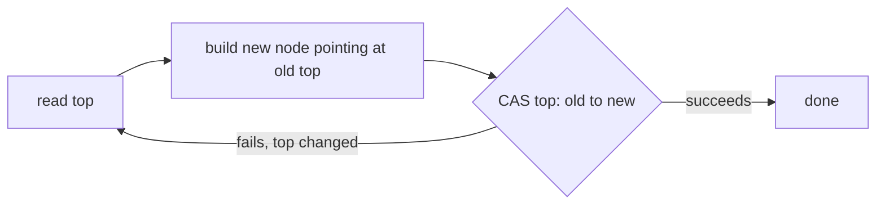

← [11. Fork/Join & Parallel Streams](11-fork-join-and-parallel-streams.md) | **12. Lock-Free Structures** | Next → [13. Deadlock, Livelock, Starvation](13-deadlock-livelock-starvation.md)

# 12 — Lock-Free Structures

## The failure, first

Sixteen threads hammer a `synchronized`-guarded stack, pushing and popping
as fast as they can. Every single push and pop takes the monitor, does a
couple of pointer assignments, and releases it — a tiny critical section,
but every thread beyond the first has to physically **block**, get
descheduled, and later get rescheduled by the OS just to take its turn.
Module 04 already showed the alternative: CAS lets a thread attempt an
update optimistically and simply retry if it loses the race, never
blocking at all. `LockFreeVsLockedThroughputDemo` measures both structures
side by side across 1, 2, 4, 8, and 16 threads, and the lock-free version
consistently comes out ahead as contention rises — not because CAS is
magic, but because a failed CAS costs a retry, while a blocked thread costs
a full context switch. This module is about building real data structures
on that insight, and about the two sharp edges that come with it: the ABA
problem (module 04) reappearing in a stack, and the discovery that with
exactly one producer and one consumer, you don't even need CAS at all.

## Mental model: retry instead of block, and know when you don't need to ask permission at all

A lock-free structure never says "wait your turn." It says "try the
update; if the world changed underneath you, throw away your attempt and
try again with fresh information" — the same CAS retry loop from module 04,
now organized around a real structure's shape (a linked stack, a ring
buffer) instead of a single counter. The deeper insight this module adds:
if you can guarantee, structurally, that only one thread will ever write to
a particular piece of state, you don't need CAS *or* a lock for that
piece — a plain `volatile` read/write is enough, because there's no
concurrent writer to race against in the first place. That's exactly the
shape of a single-producer/single-consumer pipeline.

## Concept, from first principles

### The Treiber stack: CAS retry loop applied to a linked structure

```java
public void push(T value) {
    Node<T> newHead = new Node<>(value);
    Node<T> currentHead;
    do {
        currentHead = top.get();
        newHead.next = currentHead;
    } while (!top.compareAndSet(currentHead, newHead));
}

public T pop() {
    Node<T> currentHead;
    Node<T> newHead;
    do {
        currentHead = top.get();
        if (currentHead == null) return null;
        newHead = currentHead.next;
    } while (!top.compareAndSet(currentHead, newHead));
    return currentHead.value;
}
```



This is module 04's retry loop, applied to `top`, a single
`AtomicReference<Node<T>>`. `push` builds a new node pointing at whatever
`top` currently is, then tries to swap `top` to point at the new node —
if another thread's push or pop got there first, the CAS fails, and this
thread simply re-reads the now-current `top` and tries again with a fresh
`next` pointer. `LockFreeStackDemo` runs 8 threads pushing 50,000 items
each with zero external synchronization, and every single item survives —
400,000 pushed, 400,000 popped back off, cleanly.

### The ABA problem, again — and why this particular stack sidesteps it

Module 04 introduced ABA in the abstract; this is where it would actually
bite a naive lock-free stack in production. If `top` goes from node `A` to
some other node and back to a node that is reference-equal to `A` (a pooled
or recycled node object, not a freshly allocated one), a CAS comparing
against the original `A` reference can spuriously "succeed" while the
structure underneath has actually changed shape — exactly the corruption
scenario from module 04's `AbaProblemDemo`. This module's `TreiberStack`
sidesteps the problem specifically because every `push` allocates a **brand
new** `Node` object — nothing in this implementation ever reuses or pools
node objects, so a reference can never legitimately reappear after being
removed. That's a property of *this* implementation, not a property of CAS
in general; any lock-free structure that pools or recycles nodes (common in
allocation-sensitive, high-throughput code) reopens exactly this door, and
needs `AtomicStampedReference` or an equivalent tagged-reference scheme to
close it again.

### The SPSC ring buffer: when you don't need CAS at all

`SpscRingBufferDemo` takes a different approach entirely, made possible by
a structural guarantee: **exactly one** producer thread and **exactly one**
consumer thread, ever.

```java
private volatile long tail = 0;   // only the producer ever writes this
private volatile long head = 0;   // only the consumer ever writes this

public boolean offer(T value) {
    long currentTail = tail;
    if (currentTail - head >= elements.length) return false; // full
    elements[(int) (currentTail & mask)] = value;
    tail = currentTail + 1;   // volatile write AFTER the data write
    return true;
}

public T poll() {
    long currentHead = head;
    if (currentHead >= tail) return null;  // empty
    T value = (T) elements[(int) (currentHead & mask)];
    head = currentHead + 1;
    return value;
}
```

Because the producer is the *only* thread that ever writes `tail`, and the
consumer is the *only* thread that ever writes `head`, there is never a
writer-writer race on either field — each side only ever *reads* the
other's index. No CAS, no lock, nothing but plain `volatile` fields, and
it's still perfectly correct under concurrent access. The one rule that
must never be violated: **the data write to the array must happen before
the volatile write to the index that publishes it.** This is module 03's
safe-publication pattern again, applied here instead of to a single object
reference — the volatile write to `tail` is what gives the consumer a
happens-before guarantee that the array slot it's about to read is fully
written, not a stale or half-written value. Writing the index first and the
data second would silently break that guarantee: the consumer could see an
incremented `tail` and read the slot before the producer's array write is
visible to it.

### Lock-free isn't automatically "faster" — it trades blocking cost for retry cost

`LockFreeVsLockedThroughputDemo`'s own numbers are worth internalizing
directly rather than just trusting "lock-free wins": as thread count rises,
the locked stack's time grows faster than the lock-free stack's, because
every blocked thread pays a real OS-level context-switch cost to be
descheduled and rescheduled, while a losing CAS attempt just retries
in-place, cheaply, without ever leaving user space. But this trade only
favors lock-free when critical sections are short and contention is
survivable — under **extremely** high contention, CAS retries themselves
start to cost real time (repeatedly re-reading and re-attempting, bouncing
the same cache line between cores), while a blocked thread, once parked,
burns zero CPU at all until it's actually woken. Locks can still win when
critical sections are long or retry costs are high; "lock-free" is a
specific trade-off, not a strictly dominant strategy.

## Misconceptions worth naming directly

- **Belief: "A CAS-based stack is immune to the ABA problem as long as
  it's using CAS correctly."**
  Wrong — `TreiberStack` avoids ABA only because it never reuses or pools
  `Node` objects; any lock-free structure that does recycle nodes (for
  allocation efficiency) reopens the exact same vulnerability module 04
  demonstrated, and needs a tagged/stamped reference to close it.

- **Belief: "Since there's no lock in the SPSC ring buffer, both `offer`
  and `poll` need CAS to stay correct."**
  Wrong — because exactly one thread ever writes `tail` and exactly one
  ever writes `head`, there's no writer-writer race to resolve at all;
  plain `volatile` reads/writes are sufficient, and CAS would be pure
  unneeded overhead here.

- **Belief: "As long as `tail` is `volatile`, the order in which I write
  the array slot versus the index doesn't matter — `volatile` handles
  visibility either way."**
  Wrong — `volatile` guarantees visibility of whichever write happens,
  but *program order* still determines what's visible to the reader at the
  moment it observes the volatile write. Writing the index before the data
  would let the consumer see an advanced `tail` and read a slot whose data
  write hasn't happened yet (or isn't visible yet), reintroducing exactly
  the visibility bug module 03 exists to prevent.

- **Belief: "Lock-free is strictly faster than lock-based, so it's always
  the right default for shared mutable state."**
  Wrong — it trades blocking cost for retry cost, which favors lock-free
  specifically under short critical sections and moderate-to-high (but not
  extreme) contention; `LockFreeVsLockedThroughputDemo`'s own numbers show
  the gap, but a sufficiently long critical section or pathological
  contention level can flip the trade-off back toward locks.

## Where this shows up for real

The SPSC ring buffer here is a simplified version of the exact mechanism
behind the LMAX Disruptor, used in low-latency trading systems for
lock-free inter-thread messaging — the "producer writes data, then
publishes an index" pattern is the entire trick. `ConcurrentHashMap`
(module 06) and the JDK's own concurrent collections use CAS-based,
Treiber-stack-like retry loops internally for their hot paths. This
module's capstone (module 18) puts the lock-free-vs-locked trade-off into
a real system: a matching engine's hot path is exactly the kind of
short-critical-section, high-contention code where this module's lessons
directly inform the design.

## Check yourself

1. In the Treiber stack's `push`, what happens on the iteration where
   `compareAndSet` fails, and why is that not a bug?
2. Why does this particular `TreiberStack` implementation avoid the ABA
   problem, and what specific change to the implementation would
   reintroduce it?
3. In the SPSC ring buffer, why is no CAS or lock needed on `head` or
   `tail`, when a multi-producer version of the same buffer would need
   one?
4. Why must the array write in `offer()` happen *before* the volatile write
   to `tail`, and what specifically goes wrong if the order is reversed?
5. Under what condition does a lock-based structure actually outperform a
   lock-free one, contrary to the usual "lock-free is faster" intuition?

---

<details>
<summary>Answers</summary>

1. The thread's locally computed `newHead`/expected old-head pair is now
   stale, because another thread's push or pop already changed `top` —
   the loop simply re-reads the current `top`, rebuilds `newHead.next`
   against the fresh value, and retries the CAS. It's not a bug; it's the
   retry mechanism working as designed, exactly like module 04's manual
   CAS loop.
2. It avoids ABA because every `push` allocates a brand-new `Node` object
   — no node is ever reused, so a reference can never legitimately
   reappear as `top` after being removed. Introducing a node pool or
   freelist that reuses `Node` objects (to reduce allocation) would
   reintroduce exactly the ABA scenario from module 04, requiring a
   stamped/tagged reference to detect it again.
3. Because exactly one thread ever writes `tail` (the producer) and
   exactly one ever writes `head` (the consumer) — there is never a
   writer-writer race on either field, so no atomic read-modify-write is
   needed. A multi-producer version would have multiple threads
   potentially writing `tail` concurrently, which would need CAS (or a
   lock) to resolve.
4. Because the volatile write to `tail` is what establishes a
   happens-before edge to the consumer's subsequent read of `tail` — and
   that edge only carries along writes that happened *before* it in
   program order. If the index were incremented first, the consumer could
   observe the new `tail` and read the corresponding array slot before the
   producer's write to that slot is guaranteed visible, reading stale or
   uninitialized data.
5. When critical sections are long, or when contention is so extreme that
   CAS retries themselves become expensive (repeated re-reads and
   cache-line bouncing across cores) — in that regime, a blocked thread
   that simply parks and burns no CPU until woken can outperform a thread
   endlessly retrying a CAS that keeps losing.

</details>

---

← [11. Fork/Join & Parallel Streams](11-fork-join-and-parallel-streams.md) | Next → [13. Deadlock, Livelock, Starvation](13-deadlock-livelock-starvation.md)
