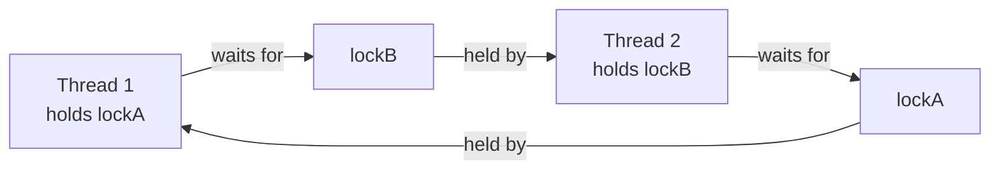

← [12. Lock-Free Structures](12-lock-free-structures.md) | **13. Deadlock, Livelock & Starvation** | Next → [14. Virtual Threads & Structured Concurrency](14-virtual-threads-and-structured-concurrency.md)

# 13 — Deadlock, Livelock, and Starvation

## The failure, first

Two threads each need two locks, `lockA` and `lockB`, to do their work.
Thread one grabs `lockA`, then tries for `lockB`. Thread two, at nearly the
same instant, grabs `lockB`, then tries for `lockA`. Neither will ever
release what it's holding until it gets the other lock — and neither ever
will. Both threads are technically "running" (not crashed, not
terminated), yet the program has permanently stopped making progress. This
is `DeadlockDemo`, and it is deliberately built to hang forever — the
demo's own output tells you to open a second terminal and run `jstack` on
it, because the entire point of this module is learning to recognize this
signature and never write it by accident.

The three failure modes in this module — deadlock, livelock, starvation —
are easy to lump together as "concurrency got stuck," but they are three
genuinely distinct failures with three distinct fixes, and confusing them
means reaching for the wrong tool.

## Mental model: three different ways "stuck" can look

- **Deadlock**: two threads, each holding what the other needs, both
  waiting forever. Picture two people each holding one of two keys, each
  refusing to hand theirs over until they receive the other's — a genuine,
  permanent standoff. `jstack` can see this directly, because both threads
  are truly blocked on a monitor.
- **Livelock**: two people in a hallway who each politely step aside for
  the other — and, because they react at exactly the same moment every
  time, keep stepping into each other's way forever. Both are constantly
  *moving*, technically making "progress" in the sense of doing work — but
  the system as a whole never actually gets anywhere. This is invisible to
  a deadlock detector, because no thread is ever blocked on a monitor —
  every thread is very busy accomplishing nothing.
- **Starvation**: not a standoff at all — an unlucky thread genuinely
  *can* get the lock eventually, but a steady stream of other threads keeps
  "cutting in line" ahead of it under an unfair scheduling policy. Its
  stack trace looks completely ordinary at any single instant (it's just
  waiting its turn); the tell only shows up as a long-run statistic — this
  thread's acquisition count is suspiciously, persistently near zero.

## Concept, from first principles

### Deadlock: a cycle in the "waits-for" graph



`DeadlockDemo` builds exactly this cycle: one thread acquires `lockA` then
tries for `lockB`; the other acquires `lockB` then tries for `lockA`. Once
each has its first lock, the cycle is locked in — neither can proceed, and
neither can be forced to give up what it's already holding. A real
`jstack` dump on this exact program reports it explicitly: `"Found one
Java-level deadlock"`, naming each thread, which monitor it's waiting on,
and which other thread holds it — this is the signature to recognize in
production the moment two threads or a request handler simply stop
responding with no CPU usage and no exception.

**Fix 1 — global lock ordering, which removes *circular wait*:**

```java
private static void acquireInOrder(Object requestedFirst, Object requestedSecond) {
    Object first = requestedFirst, second = requestedSecond;
    if (System.identityHashCode(first) > System.identityHashCode(second)) {
        first = requestedSecond;
        second = requestedFirst;   // swap so every caller uses the SAME global order
    }
    synchronized (first) {
        synchronized (second) {
            // both held, always in the same order, from every caller
        }
    }
}
```

`DeadlockFixLockOrderingDemo` runs the identical opposite-order scenario as
`DeadlockDemo` — one thread "wants" A-then-B, the other "wants" B-then-A —
but every acquisition is funneled through `acquireInOrder`, which derives a
single, consistent global order (here, by `identityHashCode`) regardless of
which order the caller asked for. If a cycle can never form because
*everyone* acquires in the same order, deadlock is structurally impossible,
not just unlikely. The critical detail: the ordering must be **global**,
not merely self-consistent per thread — a thread that's internally
consistent but uses a *different* order than another thread is exactly the
scenario that still deadlocks.

**Fix 2 — `tryLock` + backoff, which removes *hold and wait*:**

```java
boolean gotFirst = first.tryLock(50, TimeUnit.MILLISECONDS);
if (gotFirst) {
    boolean gotSecond = second.tryLock(50, TimeUnit.MILLISECONDS);
    if (gotSecond) { /* success, do the work, then unlock both */ }
    // if gotSecond is false: release gotFirst (in finally), then retry after a random backoff
}
```

`DeadlockFixTryLockBackoffDemo` never lets a thread hold one lock
indefinitely while waiting for a second — if the second `tryLock` times
out, the thread releases the first lock (in a `finally` block, unlocking
only what it actually acquired) and retries from scratch after a small
random delay. A thread that gives up what it's holding rather than waiting
forever cannot be part of a permanent cycle — this is why "hold and wait"
is one of the four Coffman conditions required for deadlock, and removing
it is just as valid a fix as removing "circular wait."

### Livelock: busy, moving, and going nowhere

`LivelockDemo` builds two "polite" threads that each check if the other
also wants a shared resource, and back off if so:

```java
while (attempts.get() < MAX_ATTEMPTS && !progressMade.get()) {
    if (theirs.get()) {
        mine.set(false);
        sleepQuietly(5);       // fixed delay -- both threads back off in lockstep
        mine.set(true);
        continue;
    }
    progressMade.set(true);
}
```

With a **fixed** backoff delay, both threads back off and retry on
*exactly* the same cadence — so they perpetually see each other wanting the
resource at the same instant, back off together, retry together, and
collide again, forever. The demo's unfixed version reports "no progress
made after 20 attempts" — both threads did real work (checking, backing
off, re-checking) the entire time; nothing was ever blocked. The fix is
**jitter** — a *random* backoff delay instead of a fixed one:

```java
sleepQuietly(ThreadLocalRandom.current().nextInt(1, 10));
```

Randomizing the delay breaks the lockstep symmetry: sooner or later, one
thread's random delay is shorter than the other's, so it checks first,
finds the resource free, and takes it — the demo's fixed version reports
`progress made = true` almost immediately once jitter is introduced. This
is precisely why retry/backoff logic throughout this curriculum (and in
real distributed systems, like exponential-backoff-with-jitter for retrying
failed network calls) always randomizes the delay — a deterministic retry
interval risks exactly this kind of synchronized collision between
independent actors.

### Starvation: a fairness problem, not a correctness problem

`StarvationDemo` runs six "greedy" threads and one "unlucky" thread all
competing for the same lock as fast as possible, for 1.5 seconds, and
counts acquisitions:

```java
// unfair (default): a lock might repeatedly favor whichever thread is already running
new ReentrantLock(false);
// [unfair] unlucky    acquisitions=41       avgWaitMicros=812.4
// [unfair] greedy threads combined acquisitions=58900

// fair: strictly serves the longest-waiting thread first
new ReentrantLock(true);
// [fair]   unlucky    acquisitions=8123     avgWaitMicros=95.1
// [fair]   greedy threads combined acquisitions=48950
```

Under the unfair (default) policy, the unlucky thread isn't blocked
forever — it genuinely does acquire the lock sometimes (41 times, in this
run) — but it's massively out-competed by threads that happen to already be
running and can "barge" ahead of a thread that just woke up from waiting.
This is the module 05 fairness trade-off, now shown as a *starvation*
problem rather than just a throughput number: the fair lock brings the
unlucky thread's acquisitions up by two orders of magnitude by strictly
serving the longest-waiting thread first — at a real cost, visible in the
combined greedy throughput dropping from 58,900 to 48,950 acquisitions over
the same window. Fairness and throughput are directly in tension; a fair
lock is the deliberate fix only when starvation is an actual risk you've
identified, not a default worth paying for everywhere.

## Misconceptions worth naming directly

- **Belief: "I tested this locking code under load and it never
  deadlocked, so the ordering must be safe."**
  Wrong — deadlock from inconsistent lock ordering is entirely
  timing-dependent; it can pass thousands of test runs and then deadlock
  in production the first time the timing lines up differently, because
  nothing about the code *prevents* the cycle, it just didn't happen to
  form yet.

- **Belief: "As long as each thread acquires its own locks in a consistent
  order internally, deadlock can't happen."**
  Wrong — the ordering must be the **same** order across every thread, not
  merely self-consistent per thread. Thread A consistently doing
  A-then-B and thread B consistently doing B-then-A is exactly
  `DeadlockDemo`'s scenario, and both threads are individually
  "consistent."

- **Belief: "Livelock can't be a real risk in my code because no thread
  is ever blocked — I'd notice threads stuck waiting."**
  Wrong — that's exactly why livelock is dangerous: every thread is
  actively running the entire time, so `jstack` and CPU monitoring both
  look "healthy," even though the system is making zero actual progress.

- **Belief: "A backoff-and-retry delay just needs to be short enough that
  retries happen quickly."**
  Wrong if the delay is fixed and deterministic — two independent actors
  retrying on the same fixed cadence can synchronize into a livelock
  exactly like `LivelockDemo`'s unfixed version; the delay needs
  randomness (jitter), not just brevity.

- **Belief: "If a thread eventually gets the lock sometimes, it's not
  really starving, just unlucky occasionally."**
  Wrong to dismiss — starvation isn't "never succeeds," it's "succeeds
  disproportionately rarely, indefinitely, under a policy that structurally
  favors other threads." `StarvationDemo`'s unlucky thread did acquire the
  lock 41 times — compared to 58,900 total acquisitions by six competitors
  — which is starvation in every practical sense even though it's not
  literally zero.

- **Belief: "Fair locks are strictly better since they prevent starvation,
  so I should use `ReentrantLock(true)` everywhere."**
  Wrong as a default — fairness has a real, measured throughput cost (the
  demo's own numbers show total combined throughput drop under the fair
  policy); reach for it specifically where starvation is a genuine risk,
  not universally "to be safe."

## Where this shows up for real

Deadlock from inconsistent lock ordering is one of the most common causes
of a production service that simply stops responding with no errors and no
CPU usage — exactly the symptom a `jstack`/thread-dump analysis (module 17)
is built to diagnose. Global lock ordering by a stable key (an account ID,
a resource's natural identifier) instead of object identity hash is the
standard real-world fix wherever code must lock multiple related resources
at once (e.g., transferring between two bank accounts). Jittered
exponential backoff is the standard retry strategy for any distributed
system's failed-request retries, for exactly the livelock-avoidance reason
this module demonstrates at thread scale. Starvation risk is why real
systems occasionally need fair queuing (a fair lock, a FIFO-guaranteed
request queue) specifically for a shared, contended resource where "always
serve whoever happens to be fastest" would systematically disadvantage some
callers.

## Check yourself

1. Two threads deadlock by acquiring the same two locks in opposite order.
   Describe two structurally different fixes, and which Coffman condition
   each one removes.
2. Why is a deadlock visible in a `jstack` dump, while a livelock is not?
3. In `LivelockDemo`, why does a *fixed* backoff delay fail to fix the
   livelock, while a *randomized* one does?
4. A thread acquires an unfair lock only 41 times in 1.5 seconds while six
   competitors acquire it a combined 58,900 times. Is this thread
   deadlocked? Why or why not, and what is it actually experiencing?
5. Why doesn't switching every lock in a system to `ReentrantLock(true)`
   come for free?

---

<details>
<summary>Answers</summary>

1. Fix one: enforce a single, global lock-acquisition order across every
   thread (e.g., by a stable identity hash), which removes *circular
   wait* — a cycle can't form if everyone acquires in the same order. Fix
   two: use `tryLock` with a timeout, releasing any already-acquired lock
   and retrying with backoff if the second lock isn't obtained in time,
   which removes *hold and wait* — no thread ever holds one resource while
   blocked indefinitely waiting for another.
2. Because in a genuine deadlock, both threads are truly blocked waiting to
   acquire a monitor — the JVM can see and report exactly which thread is
   waiting on which lock, held by which other thread. In a livelock, no
   thread is ever blocked on a monitor at all; every thread is actively
   executing (checking conditions, backing off, retrying), so there's
   nothing for a deadlock detector to find.
3. With a fixed delay, both threads back off and retry on exactly the same
   cadence, so they keep re-checking and colliding at the same instant,
   forever — the symmetry never breaks. A randomized delay makes it likely
   that one thread's wait ends before the other's on any given round,
   letting that thread proceed while the other still sees the resource as
   wanted, breaking the lockstep.
4. It is not deadlocked — it is starving. It's not permanently blocked (it
   does acquire the lock sometimes); it's just disproportionately,
   persistently out-competed under an unfair policy that lets other,
   already-running threads repeatedly acquire the lock ahead of it. The
   tell is the long-run acquisition-count disparity, not a stuck stack
   trace.
5. Because fairness requires strictly serving the longest-waiting thread
   first, which forces more context switches and queuing discipline
   instead of letting an already-running thread simply keep the lock hot
   — this measurably reduces overall throughput, as shown by the drop in
   combined greedy-thread acquisitions under the fair policy in
   `StarvationDemo`'s own numbers.

</details>

---

← [12. Lock-Free Structures](12-lock-free-structures.md) | Next → [14. Virtual Threads & Structured Concurrency](14-virtual-threads-and-structured-concurrency.md)
