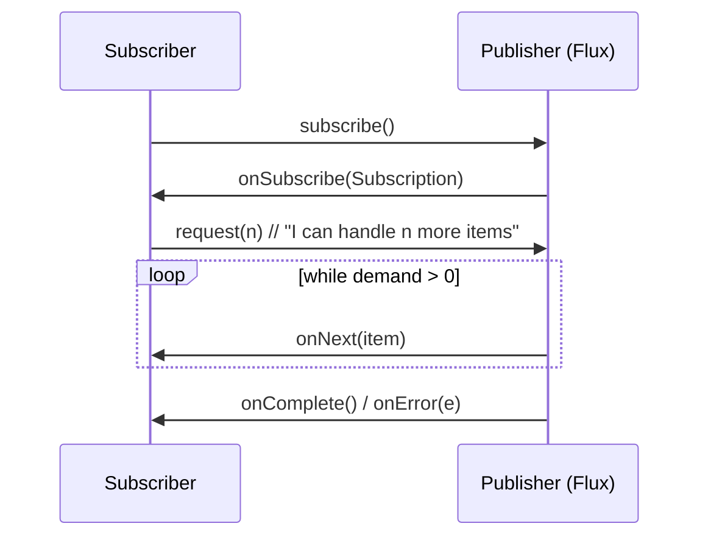

← [14. Virtual Threads & Structured Concurrency](14-virtual-threads-and-structured-concurrency.md) | **15. Reactive (Project Reactor)** | Next → [16. Concurrency Design Patterns](16-concurrency-design-patterns.md)

# 15 — Reactive Programming with Project Reactor

## The failure, first

A `Flux.interval(2ms)` ticks on its own timer no matter what — it doesn't
care whether anyone's ready for the next value. A subscriber requests
exactly 5 elements up front, then never asks for more. What happens to tick
number 6? There's no thread blocked anywhere, no queue quietly filling up
in the background — the producer, by contract, is simply not allowed to
send a 6th item until asked, and when it has nowhere to legally put the
next tick, `BackpressureDemo`'s naive subscriber gets an overflow error
instead. This is a genuinely different failure mode than anything earlier
in this curriculum: module 07's `BlockingQueue` handled "producer faster
than consumer" by blocking the producer's *thread*. Here, nothing blocks.
The producer simply refuses to emit past what's been requested — and a
subscriber that forgets to keep requesting starves itself into an error, on
purpose, because silent unbounded buffering is exactly the failure this
model is designed never to allow by default.

## Mental model: a pull, not a push — the consumer sets the pace

Every earlier concurrency tool in this curriculum eventually blocks a
*thread* to create backpressure: a full `BlockingQueue`'s `put()` blocks
the producer thread; a saturated thread pool blocks or rejects a caller.
Reactive streams solve the identical problem — "don't let a fast producer
overwhelm a slow consumer" — with **no blocked thread anywhere**. The
subscriber explicitly tells the producer "I can handle N more" via
`request(n)`, and the producer is contractually forbidden from emitting
more than that:



Think of it as a conversation where the listener says "go ahead, tell me
three things" instead of the speaker just talking as fast as they can and
hoping the listener keeps up (or building an ever-growing queue of
unsaid things). `Mono<T>` (0-or-1 values) and `Flux<T>` (0-to-N values) are
both lazy **descriptions** of this conversation — nothing runs until
something subscribes, which is itself worth internalizing: a `Mono`/`Flux`
pipeline you build and never subscribe to does absolutely nothing, ever.

## Concept, from first principles

### `Mono`/`Flux` are compositions, and `.block()` belongs only at the very edge

`MonoFluxBasicsDemo` composes pipelines with the same `map`/`filter`/
`flatMap` vocabulary as `Stream`:

```java
Flux.range(1, 10)
        .filter(n -> n % 2 == 0)
        .map(n -> n * n)
        .toIterable()
        .forEach(n -> System.out.println("even-squared: " + n));
```

`.block()`/`.toIterable()` appear throughout this demo purely so `main()`
can print a result — they are explicitly **not** how a real reactive
application consumes a pipeline. Calling `.block()` inside a pipeline that
a framework (WebFlux, R2DBC) is driving defeats the entire non-blocking
premise, and on a single-threaded scheduler it can deadlock outright — the
thread that's supposed to be delivering the value is the same thread now
stuck waiting for it. `.block()` has exactly one legitimate place: the very
outermost edge of a program (a `main()` method, like these demos, or a
test), never inside a chain a framework subscribes to on your behalf.

### Backpressure in practice: requesting less than everything, on purpose

`BackpressureDemo`'s `controlledPullingSubscriber` is the shape every real
subscriber should follow — request one, process it, request the next only
once you're actually ready:

```java
@Override
protected void hookOnSubscribe(Subscription subscription) {
    subscription.request(1);          // ask for exactly one to start
}
@Override
protected void hookOnNext(Long value) {
    simulateSlowWork(1);
    System.out.println("pulled and processed: " + value);
    request(1);                       // only NOW ask for the next one
}
```

Because demand is replenished one at a time, exactly as fast as this
subscriber can actually process, there is no way for the producer to ever
get ahead — no buffer to overflow, because nothing was ever requested that
isn't about to be handled immediately. Compare this to the naive version
that requests a fixed 5 up front and never asks again: fine as long as
production stops within that budget, an overflow error the moment it
doesn't. When a subscriber genuinely can't keep pace and buffering (rather
than erroring) is the desired behavior, `onBackpressureDrop`/
`onBackpressureBuffer` let you choose the failure mode explicitly —
silently discard excess elements, or buffer up to a bound and evict the
oldest — rather than letting an unbounded buffer grow without limit (module
07's lesson, reapplied here).

### Where blocking work still belongs: `Schedulers.boundedElastic()`

Reactive doesn't mean "nothing in the system ever blocks" — real downstream
calls (JDBC, a blocking HTTP client) often do, and that work has to run
*somewhere*. `ReactiveVsBlockingComparisonDemo` shows both the win and the
rule for where blocking work goes:

```java
private static Mono<Integer> callSlowServiceReactive(int id) {
    return Mono.fromCallable(() -> {
                Thread.sleep(SIMULATED_LATENCY_MILLIS);   // genuinely blocking
                return id;
            })
            .subscribeOn(Schedulers.boundedElastic());     // a pool SIZED for blocking work
}
// ...
Flux.range(0, CALL_COUNT)
        .flatMap(id -> callSlowServiceReactive(id), CONCURRENCY)  // fan out, don't run one at a time
        .collectList()
        .block();   // only at the very edge, to print a result
```

20 sequential blocking calls at 100ms each take just over 2 seconds — the
full latency paid 20 times, one after another. The reactive version fans
the same 20 calls out via `flatMap(..., concurrency)` onto `boundedElastic`
and finishes in roughly 118ms — the wall-clock time approaches a *single*
call's latency instead of the sum, because up to 20 calls are genuinely
in flight concurrently. The rule that makes this safe: **blocking work must
run on `Schedulers.boundedElastic()`**, a pool specifically sized and
intended for blocking calls — never on `Schedulers.parallel()` or
`Schedulers.single()`, which are meant to stay non-blocking and shared
across unrelated reactive work. Running a blocking call on the wrong
scheduler is this module's version of module 11's `ForkJoinPool.commonPool()`
starvation problem: one blocking call ties up a thread that other,
unrelated reactive work depends on.

### Error handling, declaratively: four operators, four different intents

`ReactiveErrorHandlingDemo` distinguishes four ways to react to a failure
in the pipeline, and they answer different questions:

```java
// onErrorResume: switch to an entirely different publisher on failure
flux.onErrorResume(e -> Flux.just(-1, -2));

// onErrorReturn: substitute one fixed fallback value
flux.onErrorReturn(-99);

// retry(n): RE-SUBSCRIBE FROM THE START, up to n times
flux.retry(3);

// retryWhen: retry under a declared policy (e.g. bounded exponential backoff)
flux.retryWhen(Retry.backoff(2, Duration.ofMillis(10)));
```

The sharpest detail here, and the one most likely to surprise someone
coming from imperative try/catch: **`retry(n)` re-subscribes to the entire
upstream chain from the beginning** — it is not a "resume from where it
failed" mechanism. Every upstream operator re-runs, including anything with
side effects, which matters enormously if any upstream step isn't
idempotent. `retryWhen(Retry.backoff(...))` adds a bounded budget and
exponential delay between attempts — directly echoing module 13's jittered
backoff, applied here to retrying a failed reactive operation instead of
retrying a lock acquisition.

## Misconceptions worth naming directly

- **Belief: "A `Mono`/`Flux` pipeline starts running as soon as I build
  it, like a `CompletableFuture.supplyAsync` call does."**
  Wrong — `Mono`/`Flux` are lazy descriptions; nothing executes until
  something actually subscribes. Building a pipeline and never subscribing
  to it does nothing at all, ever.

- **Belief: "Backpressure is basically the same idea as a bounded
  `BlockingQueue` blocking a producer thread, just with reactive syntax."**
  Wrong — a `BlockingQueue` creates backpressure by blocking a thread. A
  reactive `Publisher` creates it by contractually refusing to emit past
  requested demand — no thread ever blocks; the mechanism is a demand
  signal, not thread suspension.

- **Belief: "Calling `.block()` somewhere inside my reactive pipeline is
  fine as long as the overall chain still eventually returns a `Mono`."**
  Wrong — `.block()` anywhere inside a chain a framework drives defeats the
  non-blocking premise the whole framework depends on, and can deadlock
  outright on a single-threaded scheduler; it belongs only at the outermost
  edge of a program, never inside the pipeline itself.

- **Belief: "Running blocking calls on `Schedulers.parallel()` is fine as
  long as I've moved them off the main thread."**
  Wrong — `Schedulers.parallel()` (and `.single()`) are meant to stay
  non-blocking and are shared across unrelated reactive work; blocking on
  them starves every other task depending on that scheduler, exactly like
  blocking `ForkJoinPool.commonPool()` in module 11.

- **Belief: "`retry(3)` resumes the failed operation from where it broke,
  retrying just that step."**
  Wrong — it re-subscribes to the entire upstream chain from the very
  beginning, re-running every earlier operator; it's a resubscription
  mechanism, not a checkpoint/resume mechanism.

## Where this shows up for real

This is the exact model behind Spring WebFlux, R2DBC, and any reactive
HTTP client (Reactor Netty, RxJava-based clients) — a WebFlux controller
returning a `Mono<ResponseEntity<T>>` is handing the framework a lazy
pipeline it will subscribe to and drive itself, never something you call
`.block()` on inside the handler. The `boundedElastic` rule is the standard
answer to "how do I call a legacy blocking JDBC driver from a reactive
service" without poisoning the rest of the application's reactive
scheduling. `retryWhen`-style bounded backoff is the standard, declarative
way production reactive pipelines handle transient downstream failures
(a flaky network call, a momentarily overloaded dependency) without
resorting to imperative retry loops.

## Check yourself

1. Why does the naive subscriber in `BackpressureDemo` eventually get an
   overflow error, when nothing in the pipeline ever blocks a thread?
2. Contrast how a bounded `BlockingQueue` creates backpressure with how a
   `Flux`'s `request(n)` protocol creates it — what's fundamentally
   different about the mechanism, not just the syntax?
3. Why is calling `.block()` inside a reactive pipeline dangerous, rather
   than merely "not idiomatic"?
4. Why must blocking calls run on `Schedulers.boundedElastic()` instead of
   `Schedulers.parallel()`, and what specifically goes wrong if you get
   this backwards?
5. If an upstream `map` step has a side effect (e.g., incrementing a
   counter) and the pipeline uses `.retry(2)`, what happens to that side
   effect on a retry, and why does that matter?

---

<details>
<summary>Answers</summary>

1. Because the subscriber requested a fixed, small amount of demand once
   and never replenished it — the producer (`Flux.interval`) keeps ticking
   on its own timer regardless of demand, and once it has emitted as many
   items as were requested, it has no legal way to deliver the next one;
   Reactor surfaces that as an overflow error rather than silently
   buffering without bound.
2. A `BlockingQueue` creates backpressure by physically blocking the
   producer's *thread* inside `put()` until room is available. A `Flux`
   creates backpressure through a demand *signal* (`request(n)`) — the
   producer thread is never blocked; it simply doesn't emit past what's
   been requested, which is why no thread needs to be parked at all for
   the mechanism to work.
3. Because it defeats the pipeline's entire non-blocking premise, and on a
   single-threaded scheduler the thread trying to deliver the value can be
   the same thread now stuck blocked waiting for it — a genuine deadlock,
   not just a style violation.
4. `Schedulers.boundedElastic()` is a pool specifically sized and intended
   to absorb blocking work; `Schedulers.parallel()`/`.single()` are meant
   to stay non-blocking and are shared by other reactive tasks. Running a
   blocking call on the latter ties up a thread those other tasks depend
   on, starving unrelated reactive work — the same shared-resource
   starvation problem as blocking `ForkJoinPool.commonPool()` in module 11.
5. The side effect runs again — `retry(n)` re-subscribes to the entire
   upstream chain from the very beginning, so every upstream operator,
   including the one with the side effect, re-executes on each attempt.
   This matters because a non-idempotent side effect (like incrementing a
   counter, or sending an email) would then happen multiple times for what
   looks like "one retried operation."

</details>

---

← [14. Virtual Threads & Structured Concurrency](14-virtual-threads-and-structured-concurrency.md) | Next → [16. Concurrency Design Patterns](16-concurrency-design-patterns.md)
