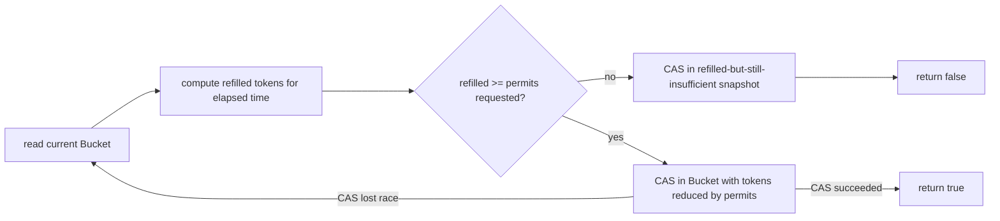

← [15. Reactive (Project Reactor)](15-reactive-webflux.md) | **16. Concurrency Design Patterns** | Next → [17. Performance & Observability](17-performance-and-observability.md)

# 16 — Concurrency Design Patterns

## The failure, first

A textbook-looking lazy singleton:

```java
static Singleton instance;
static Singleton getInstance() {
    if (instance == null) {
        synchronized (Singleton.class) {
            if (instance == null) {
                instance = new Singleton();   // looks fine. isn't, without one keyword.
            }
        }
    }
    return instance;
}
```

This is double-checked locking **without** `volatile` on `instance` — and
it is one of the most famous "looks correct, passes every test, breaks in
production" bugs in Java concurrency history. The Java Memory Model
explicitly permits a reader on another thread to observe a **non-null**
reference to `instance` *before* the constructor's writes to that object's
fields are visible to it — because without `volatile`, there's no
happens-before edge (module 03) between the write and the read. Another
thread can get back a `Singleton` reference that isn't null, and still see
a partially-constructed object. This module's premise is that this failure
mode — a well-known problem shape, implemented almost-but-not-quite
correctly — recurs constantly, and the fix each time is to recognize the
*shape* and reach for the pattern already proven correct, instead of
re-deriving synchronization from scratch under deadline pressure.

## Mental model: five recurring shapes, five off-the-shelf answers

Every problem in this module is a shape you'll meet again and again in real
systems: "let through at most N per second" (rate limiter), "bound how many
callers use a scarce resource, and hand out a specific instance safely"
(connection pool), "stop hammering a dependency that's already failing"
(circuit breaker), "give one piece of state exactly one writer, forever"
(actor), and "construct exactly one instance, lazily, no matter how many
threads race to be first" (singleton). None of these need you to invent a
locking scheme from first principles — they need you to recognize which of
these five shapes you're looking at, and reach for the version of it that's
already been proven correct.

## Concept, from first principles

### Token bucket rate limiter: CAS retry loop over a lock, because the critical section is trivial

```java
public boolean tryAcquire(long permits) {
    while (true) {
        Bucket current = bucketRef.get();
        double refilled = refill(current, System.nanoTime());
        if (refilled < permits) {
            bucketRef.compareAndSet(current, new Bucket(refilled, now));  // publish even on failure
            return false;
        }
        Bucket updated = new Bucket(refilled - permits, now);
        if (bucketRef.compareAndSet(current, updated)) {
            return true;               // success
        }
        // lost the race; retry with a fresh snapshot
    }
}
```



This is module 04's CAS retry loop, applied to an immutable
`Bucket(tokens, lastRefillNanos)` record. The whole state transition —
"how many tokens have refilled since last time, is that enough, subtract
what's requested" — is cheap arithmetic, not I/O or a long computation. A
lock would serialize every caller through that arithmetic one at a time;
CAS instead lets a caller redo the (cheap) arithmetic on the rare occasion
it loses a race to another caller. The subtle detail worth noticing: even
the *failure* path (`refilled < permits`) still does a `compareAndSet` to
publish the refilled-but-insufficient snapshot — this isn't optional
bookkeeping, it's what lets the *next* caller's elapsed-time math start
fresh from `now` instead of re-accumulating the same already-counted idle
interval.

### Bounded connection pool: `Semaphore` bounds the count, `BlockingQueue` bounds the identity

Module 09 introduced `Semaphore` as "a parking garage with a fixed number
of permits, no concept of who holds which one." `BoundedConnectionPool`
pairs it with a `BlockingQueue` specifically to add back "which specific
instance you get":

```java
public Connection borrow() throws InterruptedException {
    permits.acquire();                        // bound HOW MANY callers hold a connection
    Connection connection = idleConnections.poll();  // hand out WHICH instance
    // ...
}
public void release(Connection connection) {
    idleConnections.offer(connection);
    permits.release();
}
```

The invariant that makes `poll()` safe to call immediately after
`acquire()` — never racing against an empty queue — is that a permit is
**only ever granted once its matching connection is already sitting in the
queue**: the pool is constructed by placing exactly `poolSize` connections
in the queue and exactly `poolSize` permits in the semaphore, and every
`release()` puts the connection back before releasing its permit. Get that
ordering backwards (release the permit before the connection is back in the
queue) and a `borrow()` on another thread could win a permit and find the
queue still empty.

### The actor: one mailbox, one thread, zero locks inside

`WorkerPoolActorStyleDemo`'s `Actor` is the most structurally different
pattern in this module — instead of guarding shared state with a lock or
atomics, it removes the *sharing* itself:

```java
private long total = 0;               // touched by exactly ONE thread, ever
private void run() {
    while (true) {
        Message message = mailbox.take();     // the ONLY entry point to this actor's state
        if (message instanceof Increment increment) {
            total += increment.amount();       // plain, unsynchronized -- and perfectly safe
        }
        // ...
    }
}
void tell(Message message) { mailbox.add(message); }   // any thread may call this
```

Four producer threads hammer three actors with 10,000 total `Increment`
messages, and the demo confirms the grand total across all three actors'
final states matches exactly. Nothing about `total += increment.amount()`
is synchronized — and it doesn't need to be, because the actor's own
dedicated worker thread is the **only** thread that ever reads or writes
`total`. The `BlockingQueue` mailbox is the sole synchronization point;
everything past that boundary, inside the actor, is single-threaded by
construction. This is the same single-writer principle from module 12's
SPSC ring buffer, generalized from "one field" to "an entire object's
internal state" — and it's the exact idea the capstone (module 18) scales
up into a whole matching engine, one thread per symbol, each engine owning
its own order book with zero locks inside. The one rule that must never be
broken: nothing outside the actor may touch its state directly — the
moment a "just this one" getter reads a field from another thread, the
whole guarantee (and the race it was built to eliminate) comes back.

### Lazy singletons: one correct-by-construction winner, two traps that "look" right

```java
// TRAP (without volatile): looks correct, breaks under real concurrency
static DoubleCheckedLockingSingleton instance;   // MISSING volatile

// CORRECT version 1: volatile fixes the trap
private static volatile DoubleCheckedLockingSingleton instance;
static DoubleCheckedLockingSingleton getInstance() {
    DoubleCheckedLockingSingleton result = instance;
    if (result == null) {
        synchronized (DoubleCheckedLockingSingleton.class) {
            result = instance;              // re-check: someone may have finished while we waited
            if (result == null) {
                instance = result = new DoubleCheckedLockingSingleton();
            }
        }
    }
    return result;
}

// CORRECT version 2: the Holder idiom -- no synchronization written at all
private static final class Holder {
    static final HolderIdiomSingleton INSTANCE = new HolderIdiomSingleton();
}
static HolderIdiomSingleton getInstance() { return Holder.INSTANCE; }

// CORRECT version 3: enum singleton
enum EnumSingleton { INSTANCE; }
```

`volatile` on `instance` is what makes double-checked locking actually
correct: it's exactly module 03's safe-publication guarantee — the
volatile write to `instance` (inside the constructor call) happens-before
any subsequent volatile read of it, so a reader that sees a non-null
`instance` is guaranteed to see a *fully constructed* one. The re-check
*inside* the monitor also matters: another thread may have finished
constructing the instance while this thread was merely waiting to enter
the `synchronized` block. The **Holder idiom** sidesteps the whole
happens-before discussion by leaning on a guarantee the JVM already
provides for free: a class initializes at most once, lazily, on first
*active* use — so `Holder.INSTANCE`'s initialization is inherently
race-free with zero explicit synchronization written anywhere. `enum`
singleton gets the same class-initialization guarantee, plus
serialization- and reflection-proofing the other two idioms don't get for
free. `ThreadSafeLazySingletonDemo` races 32 threads to construct each of
the three and confirms all three yield exactly one observed instance — the
correctly-`volatile`'d double-checked lock included, precisely because the
`volatile` keyword is present and doing its job.

### Circuit breaker: a state machine with one gated transition

```java
public enum State { CLOSED, OPEN, HALF_OPEN }
// CLOSED --(failureThreshold consecutive failures)--> OPEN
// OPEN --(openDuration elapsed)--> HALF_OPEN
// HALF_OPEN --(trial call succeeds)--> CLOSED
// HALF_OPEN --(trial call fails)-----> OPEN
```

The one place this needs real coordination: once the breaker transitions to
`HALF_OPEN`, exactly **one** caller should be allowed to make the trial
call — everyone else should still be rejected until that trial resolves,
or a flood of concurrent callers would all pile onto the still-possibly-
failing dependency at once, defeating the entire purpose of the breaker.

```java
if (!halfOpenTrialInFlight.compareAndSet(false, true)) {
    throw new CircuitOpenException();   // someone else already won the trial slot
}
```

A single `AtomicBoolean` CAS gate is enough: whichever caller wins the CAS
runs the trial and resets the flag afterward (success or failure); every
other concurrent caller loses the CAS and is rejected immediately, exactly
as if the circuit were still fully open.

## Misconceptions worth naming directly

- **Belief: "A CAS retry loop is always the 'more advanced,' strictly
  better choice over a lock, so I should default to it."**
  Wrong — `TokenBucketRateLimiter` uses CAS specifically because its
  critical section is trivial arithmetic; a longer or more complex critical
  section would make lock-based code both simpler to reason about and
  potentially faster (module 12's lock-vs-lock-free trade-off applies here
  too).

- **Belief: "A `Semaphore` alone is enough to build a connection pool —
  once I have a permit, I can just hand out any connection."**
  Wrong without the paired `BlockingQueue` — a semaphore bounds *how many*
  concurrent holders there are, but has no concept of *which* specific
  instance to give out; the queue is what supplies that, and the ordering
  between releasing a permit and returning a connection to the queue is
  what keeps the two in lockstep.

- **Belief: "Double-checked locking is inherently broken and should never
  be used."**
  Wrong — it's specifically broken *without* `volatile` on the field;
  with `volatile`, it is a correct, if slightly more verbose, alternative
  to the Holder idiom. The Holder idiom is usually simpler to write
  correctly, which is why it's often preferred, not because DCL can never
  be made correct.

- **Belief: "Adding a single, harmless-looking getter to an actor's state
  (for logging, or a metrics dashboard) is fine as long as it just reads a
  value."**
  Wrong — the actor pattern's entire safety guarantee rests on the mailbox
  being the *only* entry point into its state; a getter called from
  another thread reintroduces exactly the plain-field race the pattern
  exists to eliminate, regardless of how innocuous the read looks.

- **Belief: "A circuit breaker's `HALF_OPEN` state just needs to let calls
  through normally until it decides whether to close or re-open."**
  Wrong — letting multiple concurrent callers all make trial calls during
  `HALF_OPEN` would flood a potentially still-failing dependency with
  exactly the load a circuit breaker exists to prevent; exactly one trial
  call should be in flight at a time, gated by something like an
  `AtomicBoolean` CAS.

## Where this shows up for real

Rate limiters built this way are the standard mechanism behind API gateway
throttling and per-client quota enforcement. Bounded connection pools are
exactly how JDBC connection pools (HikariCP and similar) and HTTP client
connection pools work internally. The actor pattern (one mailbox, one
owning thread) is the foundational idea behind Akka, and — as this
module's own README notes — the exact architecture this repo's capstone
order-matching engine is built on. Circuit breakers are the standard
resilience pattern (Netflix Hystrix, resilience4j) for preventing cascading
failure when a downstream dependency degrades. The Holder idiom and `enum`
singletons are the accepted, idiomatic way to write a lazy singleton in
real Java codebases — double-checked locking mostly survives today as the
canonical example of *why* the Java Memory Model matters, more than as a
recommended pattern to reach for first.

## Check yourself

1. Why does `TokenBucketRateLimiter.tryAcquire` still call
   `compareAndSet` even on the path where it's about to return `false`?
2. What invariant makes `BoundedConnectionPool.borrow()`'s
   `idleConnections.poll()` safe to call immediately after
   `permits.acquire()`, with no risk of finding the queue empty?
3. Why is `total += increment.amount()` inside `Actor.run()` safe with no
   synchronization at all, when the exact same line on a shared field
   accessed by multiple threads would be module 02's classic race
   condition?
4. What specifically does `volatile` fix in the double-checked locking
   singleton, and why does the Holder idiom not need it at all?
5. Why must a circuit breaker in `HALF_OPEN` state allow only one trial
   call at a time, rather than letting calls through as usual until it
   decides whether to fully close or re-open?

---

<details>
<summary>Answers</summary>

1. Because publishing the refilled-but-still-insufficient snapshot (with
   the current timestamp) ensures the *next* caller's elapsed-time
   calculation starts fresh from that timestamp, instead of re-computing
   elapsed time from a stale, older snapshot and potentially
   double-counting (or under-counting) the idle interval that already
   contributed to this refill calculation.
2. The pool is constructed with exactly as many connections placed in the
   queue as permits available in the semaphore, and every `release()`
   places the connection back in the queue *before* releasing its permit
   — so a permit is only ever obtainable once its corresponding connection
   is already sitting in the queue, guaranteeing `poll()` never finds it
   empty after a successful `acquire()`.
3. Because the actor's dedicated worker thread is the *only* thread that
   ever reads or writes `total` — there is no concurrent access to race
   against, since every mutation is funneled through the single-threaded
   mailbox-processing loop. Module 02's race requires multiple threads
   actually interleaving reads and writes to the same field, which
   structurally cannot happen here.
4. `volatile` establishes a happens-before edge between the write that
   publishes the constructed instance and any subsequent read of the same
   field by another thread, guaranteeing a reader that sees a non-null
   reference also sees the fully-constructed object behind it. The Holder
   idiom doesn't need this because it relies on a different guarantee
   entirely — the JVM's own class-initialization guarantee (a class
   initializes at most once, lazily, on first active use) — rather than
   on a manually-managed happens-before edge.
5. Because letting multiple concurrent trial calls through would send a
   burst of load at a dependency that might still be failing — exactly the
   overload the circuit breaker exists to prevent. Gating with something
   like an `AtomicBoolean` CAS ensures exactly one caller's trial call is
   in flight, while every other concurrent caller is rejected until that
   single trial resolves one way or the other.

</details>

---

← [15. Reactive (Project Reactor)](15-reactive-webflux.md) | Next → [17. Performance & Observability](17-performance-and-observability.md)
