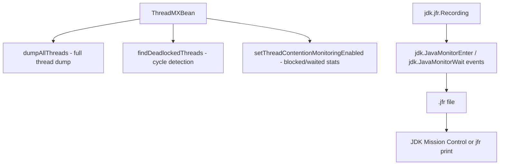

← [16. Concurrency Design Patterns](16-concurrency-design-patterns.md) | **17. Performance & Observability** | Next → [18. Capstone: Order Matching Engine](18-capstone-order-matching-engine.md)

# 17 — Performance and Observability

## The failure, first

A production service under load suddenly stops responding. No exception in
the logs, no crash, CPU usage near zero. Everything module 13 taught you
says this smells like a deadlock — but "it smells like one" isn't a
diagnosis, and guessing is not a fix. You need to *prove* it, on a live
process, without attaching a debugger and without restarting anything.
Every module before this one assumed you'd verify correctness by reading
demo output on your own machine; this module is about the tools that let
you ask the same questions of a JVM you don't control and can't
instrument in advance — because "my code looks correct" and "I can prove
what my threads are actually doing right now" are very different claims,
and only the second one holds up in an incident.

## Mental model: the JVM already keeps score — you just have to ask

Every JVM ships `java.lang.management`, an API that can answer detailed
questions about live threads without attaching a debugger or restarting
anything:



Think of `ThreadMXBean` as asking the JVM to hand you the exact state
machine from module 01 (`NEW`/`RUNNABLE`/`BLOCKED`/`WAITING`) for every
thread, live, on demand — the same states that module's demos produced
deliberately are the same states a real production thread dump reports,
just for threads you didn't write and can't predict. JFR (JDK Flight
Recorder) goes further: it's a continuously-running, low-overhead event
recorder built into the JVM itself, capturing exactly which monitors were
entered, waited on, and for how long — a permanent, queryable record
instead of a single point-in-time snapshot.

## Concept, from first principles

### Programmatic deadlock detection: the same check `jstack` runs, callable from your own code

`ThreadDumpAnalysisDemo` builds a self-contained two-lock deadlock —
daemon threads, so the JVM can still exit even though these two threads
never finish — then polls for it:

```java
public static long[] waitForDeadlock(Duration timeout) throws InterruptedException {
    ThreadMXBean bean = ManagementFactory.getThreadMXBean();
    long deadlineNanos = System.nanoTime() + timeout.toNanos();
    while (System.nanoTime() < deadlineNanos) {
        long[] ids = bean.findDeadlockedThreads();
        if (ids != null) {
            return ids;                 // cycle found
        }
        Thread.sleep(50);
    }
    return null;                        // no deadlock observed within the window
}
```

`findDeadlockedThreads()` is the exact cycle-detection logic behind
`jstack`'s `"Found one Java-level deadlock"` line — module 13's deadlock
diagram, made queryable in code instead of only visible in an external
tool's output. The detail that trips people up: this call only detects a
deadlock that exists **at the instant you call it** — calling it once,
immediately after starting the suspect threads, can easily run before the
threads have even acquired their first lock. The demo polls in a bounded
loop specifically because a deadlock (unlike most bugs) is a *stable*
condition once it forms — it will still be there 50ms later — so polling
for a bounded window is reliable in a way a single check is not.

### Contention monitoring: turning "it feels slow under load" into a number

`ContentionMonitoringDemo` runs six threads repeatedly through a shared
`synchronized` block and reads back exactly how much each thread waited:

```java
ThreadMXBean bean = ManagementFactory.getThreadMXBean();
bean.setThreadContentionMonitoringEnabled(true);   // must be explicitly turned on
// ... run contended workload ...
ThreadInfo info = bean.getThreadInfo(t.getId());
info.getBlockedCount();  // how many times this thread waited to ENTER a monitor
info.getBlockedTime();   // total time spent doing so
info.getWaitedCount();   // how many times this thread was in wait()/join()/parking
info.getWaitedTime();    // total time spent doing so
```

This is the direct, measured answer to "is lock contention actually my
bottleneck," instead of guessing from CPU graphs or intuition —
`blockedTime` quantifies exactly module 02's "threads queueing for a
monitor" cost, and `waitedTime` quantifies module 09's "threads
cooperatively waiting for a signal" cost, as two genuinely different
numbers instead of one vague "waiting" bucket. Two details matter for using
this correctly: monitoring must be **explicitly enabled** (it's off by
default, and not every JVM is guaranteed to support it — check
`isThreadContentionMonitoringSupported()` first), and a **terminated**
thread's counters are no longer queryable at all — which is why this demo
deliberately parks each worker on a second latch after finishing its work,
so a `ThreadInfo` snapshot can still be captured while the thread is alive,
before it's allowed to exit.

### JFR: the same contention events, recorded continuously instead of sampled once

`JfrRecordingDemo` starts a real recording scoped to monitor-contention
events around the identical kind of contended workload:

```java
Recording recording = new Recording();
recording.enable("jdk.JavaMonitorEnter").withThreshold(Duration.ZERO);
recording.enable("jdk.JavaMonitorWait").withThreshold(Duration.ZERO);
recording.setDestination(recordingFile);

recording.start();
runContendedWorkload();
recording.stop();
recording.close();
```

The output is a `.jfr` file — the same event stream JDK Mission Control
visualizes graphically — but produced here programmatically so you can see
exactly what triggers a `jdk.JavaMonitorEnter` event (blocking to enter a
`synchronized` block) versus a `jdk.JavaMonitorWait` event (`wait()`,
module 02's cooperative wait). `withThreshold(Duration.ZERO)` captures
*every* occurrence, which is appropriate for a short, deliberate demo but
would be far too much data — and overhead — to leave running in
production; real profiling setups use a non-zero threshold or JFR's
built-in default profile, trading completeness for sustainable overhead.
The difference between this and `ThreadMXBean`'s contention counters is
scope: `ThreadMXBean` gives you a live snapshot/aggregate per thread right
now; JFR gives you a durable, replayable timeline of every individual
event, inspectable after the fact.

### Live pool metrics: the same getters a real metrics library wraps

`ExecutorMetricsController` exposes a running `ThreadPoolExecutor`'s
`getPoolSize()`/`getActiveCount()`/`getQueue().size()`/
`getCompletedTaskCount()` over a REST endpoint, fed a continuous synthetic
workload so the numbers genuinely move. These are the same four numbers
module 08's admission policy reasons about in the abstract — how many
threads exist, how many are busy, how deep the queue is, how much work has
finished — made observable on a live instance instead of only inferred from
behavior. This is deliberately the same shape of getter a Micrometer
`Gauge` would wrap in a real service — the demo strips away the metrics
library to show exactly what data is available underneath it.

## Misconceptions worth naming directly

- **Belief: "Calling `findDeadlockedThreads()` once, right after starting
  the suspect threads, is enough to check for a deadlock."**
  Wrong — the call only reports a deadlock that has already fully formed
  at the moment it's invoked; calling it too early (before both threads
  have acquired their first lock) can easily return `null` even though a
  deadlock forms moments later. Polling for a bounded window is the
  reliable approach, since a deadlock, once formed, is a stable condition.

- **Belief: "Thread contention monitoring is always available and always
  on, since it's just reading thread state."**
  Wrong — it must be explicitly enabled via
  `setThreadContentionMonitoringEnabled(true)`, and support isn't
  guaranteed on every JVM; always check
  `isThreadContentionMonitoringSupported()` before relying on it.

- **Belief: "I can inspect a thread's blocked/waited stats any time after
  it's done running, the same way I'd read a log file after the fact."**
  Wrong — `ThreadMXBean.getThreadInfo(long)` cannot return contention
  counters for a thread that has already terminated; any code that wants
  to inspect them must capture a `ThreadInfo` snapshot while the thread is
  still alive.

- **Belief: "`withThreshold(Duration.ZERO)` is a good default setting for
  JFR monitoring in production, since it captures everything."**
  Wrong — capturing every single monitor-enter/wait event is appropriate
  for a short, targeted demo, but the volume of data and overhead would be
  unsustainable running continuously in production; real setups use a
  non-zero threshold or JFR's default profile to keep overhead low.

## Where this shows up for real

`ThreadMXBean`-based deadlock detection is exactly what health-check
endpoints and monitoring agents use to alert on a genuinely stuck JVM
before a human notices the service is unresponsive. Contention
monitoring's `blockedTime`/`waitedTime` split is the same distinction
production APM tools (and `jstack`/thread-dump analysis during an
incident) use to tell "threads fighting over a lock" apart from "threads
legitimately waiting on I/O or another service." JFR is the standard,
always-available profiling mechanism built into every modern JVM
deployment — it's what JDK Mission Control, and increasingly cloud
provider profiling tools, read directly. The live pool-metrics pattern
here is precisely what Micrometer `Gauge`s wrap for real Spring Boot
Actuator `/actuator/metrics` and Prometheus exports — this module shows you
the raw getters underneath the abstraction you'd normally just configure.

## Check yourself

1. Why does `ThreadDumpAnalysisDemo` poll `findDeadlockedThreads()` in a
   loop with a timeout, instead of calling it once immediately after
   starting the suspect threads?
2. What's the difference between what `blockedCount`/`blockedTime` measure
   versus what `waitedCount`/`waitedTime` measure on a `ThreadInfo`?
3. Why must both demos in this module park their worker threads on a
   second latch after finishing their main work, instead of letting them
   exit immediately?
4. Why would running JFR with `withThreshold(Duration.ZERO)` be a bad
   choice for a long-running production service, even though it's fine for
   this module's short demos?

---

<details>
<summary>Answers</summary>

1. Because a deadlock takes a small but nonzero amount of time to actually
   form (each thread needs to acquire its first lock and then attempt the
   second) — calling the check exactly once, immediately, risks running
   before the cycle has formed and returning a false "no deadlock" result.
   Polling for a bounded window is reliable because once a deadlock does
   form, it's a stable condition that will still be there on the next poll.
2. `blockedCount`/`blockedTime` measure time spent waiting to *enter* a
   monitor (contending for a `synchronized` lock, module 02's mutual
   exclusion) — `waitedCount`/`waitedTime` measure time spent in
   cooperative waiting (`Object.wait()`, `Thread.join()`, parking, module
   09's coordination). They're tracking two different kinds of "not
   running" for two different reasons.
3. Because `ThreadMXBean.getThreadInfo(long)` cannot report contention
   counters for a thread that has already terminated — parking the thread
   on a second latch keeps it alive long enough for the demo to capture its
   `ThreadInfo` snapshot before letting it actually exit.
4. Because it captures every single monitor-enter/wait event with no
   sampling or threshold — appropriate for a short, deliberately contended
   demo, but the resulting data volume and recording overhead would be far
   too costly to sustain continuously in a real production service; a
   non-zero threshold or the default profile trades some completeness for
   overhead low enough to run indefinitely.

</details>

---

← [16. Concurrency Design Patterns](16-concurrency-design-patterns.md) | Next → [18. Capstone: Order Matching Engine](18-capstone-order-matching-engine.md)
