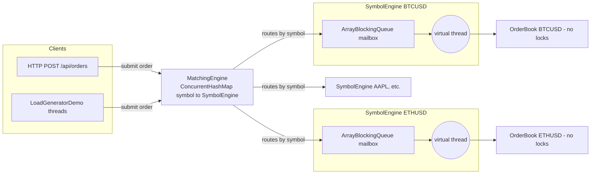

← [17. Performance & Observability](17-performance-and-observability.md) | **18. Capstone: Order Matching Engine** | Next → [19. Benchmarks](19-benchmarks.md)

# 18 — Capstone: Concurrent Order Matching Engine

## The failure, first

A matching engine has to take incoming buy/sell orders and cross them
against resting orders at compatible prices, correctly, under real
concurrent load — many symbols trading simultaneously, many orders per
symbol arriving at once. The obvious first design is "one shared order
book per symbol, guarded by a lock, so concurrent submissions serialize
safely." It would even work. But every order for that symbol would then
queue up behind a single lock, and the busiest symbols — the ones under the
most real trading activity — would be exactly the ones paying the highest
lock-contention cost, the module 02/05 tax applied at the worst possible
moment. The interesting design decision in this capstone isn't "how do I
lock this correctly" — it's the discovery, already previewed in module 16,
that you can make the hard part of concurrent correctness disappear
entirely by giving each symbol's book **exactly one** thread that is ever
allowed to touch it. No lock, because there's never a second writer to
exclude.

## Mental model: an actor per symbol, wired together with everything else you've learned



Every symbol is its own independent actor (module 16): a bounded mailbox
plus one dedicated worker thread that drains it. Different symbols never
share a lock, never contend, and run fully in parallel — the concurrency
problem this system has to solve is entirely pushed into the mailbox, where
a well-tested `BlockingQueue` (module 07) already solves it correctly. This
is the whole curriculum's answer to "how do you build a real concurrent
system": not one clever trick, but recognizing which already-proven pattern
each piece of the problem is, and composing them.

## Concept, from first principles

### `OrderBook`: zero synchronization, by construction, not by care

```java
final class OrderBook {
    private final NavigableMap<BigDecimal, Deque<RestingOrder>> buyLevels = new TreeMap<>(Comparator.reverseOrder());
    private final NavigableMap<BigDecimal, Deque<RestingOrder>> sellLevels = new TreeMap<>();
    private long nextTradeId = 1;

    List<Trade> match(Order incoming) {
        // walks the opposite side's best price levels, fills what crosses,
        // rests whatever quantity remains at the incoming order's price
    }
}
```

Not one line of `OrderBook` is `synchronized`, holds a `Lock`, or touches
an atomic. A plain `TreeMap`, a plain `long nextTradeId`, plain mutation of
a `RestingOrder`'s remaining quantity — every one of these would be a
module 02/03 race condition under concurrent access. It's correct here for
exactly one reason, stated explicitly in the source: **a `SymbolEngine`
only ever calls `match()`/`snapshot()` from its own single dedicated
thread**, so this mutable state is *never* touched concurrently in the
first place. This is module 12's single-writer principle (the SPSC ring
buffer's `head`/`tail`) generalized from two fields to an entire object
graph — the correctness argument isn't "the locking is right," it's "there
is no second writer to synchronize against."

### `SymbolEngine`: the actor — a bounded mailbox and one virtual thread

```java
final class SymbolEngine {
    private final OrderBook book = new OrderBook();
    private final BlockingQueue<Order> inbox;   // module 07: bounded, backpressure built in
    private final LongAdder ordersProcessed = new LongAdder();  // module 04
    private final Thread worker;

    SymbolEngine(String symbol, int inboxCapacity) {
        this.inbox = new ArrayBlockingQueue<>(inboxCapacity);
        this.worker = Thread.ofVirtual().name("symbol-engine-" + symbol).start(this::processLoop);  // module 14
    }

    void submit(Order order) throws InterruptedException {
        inbox.put(order);   // blocks the CALLER if this symbol's mailbox is full
    }

    private void processLoop() {
        while (running) {
            Order order = inbox.take();
            List<Trade> trades = book.match(order);   // the ONLY caller of match(), ever
            ordersProcessed.increment();
            // ...
        }
    }
}
```

Every design choice here is a direct, named application of an earlier
module: the mailbox is an `ArrayBlockingQueue` specifically so a burst of
orders for one hot symbol creates backpressure on its *callers* — module
07's lesson that a bounded queue is a dam, not a pipe — rather than
accumulating unbounded memory if the matching thread ever falls behind. The
worker is a **virtual thread** (module 14), not a platform thread, because
the system wants one dedicated thread *per symbol* — potentially hundreds
or thousands of them — and virtual threads make that cheap in a way a
platform thread per symbol never could be. `ordersProcessed`/
`tradesExecuted` are `LongAdder`s (module 04) specifically because they're
hot, write-heavy counters incremented on every single order, exactly the
write-contention shape `LongAdder` beats `AtomicLong` on.

### `MatchingEngine`: routing by symbol, and the `computeIfAbsent` trap module 06 warned about

```java
private final Map<String, SymbolEngine> engines = new ConcurrentHashMap<>();
private final AtomicLong orderIdGenerator = new AtomicLong();   // module 04

private SymbolEngine engineFor(String symbol) {
    return engines.computeIfAbsent(symbol, s -> new SymbolEngine(s, DEFAULT_INBOX_CAPACITY));
}
```

This is module 06's `computeIfAbsent` pattern, used precisely for the
reason that module taught: lazily creating a `SymbolEngine` the first time
a symbol is seen, atomically, with no `containsKey`-then-`put` race that
could construct two competing engines for the same symbol. But module 06
also flagged the trap this code has to respect: `computeIfAbsent`'s mapping
function runs while the map holds that bin's internal lock — so the
mapping function here (`SymbolEngine`'s constructor) had better be fast and
non-blocking. It is: starting a virtual thread is cheap. If that
constructor instead did something slow or blocking, it would serialize
**unrelated symbols that happen to hash into the same bin**, silently
reintroducing exactly the cross-contention this whole design exists to
eliminate — a subtle bug this system avoids by construction, not by luck.

### Shutdown: module 08's discipline, applied per actor

```java
@PreDestroy
void shutdown() {
    engines.values().forEach(SymbolEngine::shutdown);
}
// SymbolEngine.shutdown():
void shutdown() {
    running = false;
    worker.interrupt();
}
```

Every `SymbolEngine`'s worker thread gets an explicit, graceful shutdown
signal on application teardown — module 08's "don't just let the JVM kill
threads mid-task" discipline, applied once per symbol actor instead of once
per pool.

## How every module maps onto this system

| Design decision | Module | Why that module's tool was the right fit here |
|---|---|---|
| No locks inside `OrderBook` — single-writer thread owns it | 12, 16 | The single-writer/actor principle removes the need for synchronization entirely, rather than making synchronization fast — no CAS, no lock, because there is no second writer. |
| `ArrayBlockingQueue` mailbox blocks producers when full | 07 | Backpressure on a per-symbol basis: a slow-to-match symbol never grows memory without bound, and the cost is visible (a blocked producer), not hidden. |
| One virtual thread per symbol, and per inbound HTTP request | 14 | The system wants potentially thousands of dedicated, always-blocked-on-`take()` threads; virtual threads make that cheap where platform threads would exhaust OS resources. |
| `ConcurrentHashMap.computeIfAbsent` to lazily create per-symbol engines | 06 | Atomic "create exactly one engine per symbol," with the module's own compound-action lesson (keep the mapping function fast) directly informing the implementation. |
| `LongAdder` counters for orders/trades processed | 04 | Hot, write-heavy, per-order counters — exactly the contention profile `LongAdder` is built to win on over `AtomicLong`. |
| `AtomicLong` order-id generator | 04 | A single global sequence needing atomic, low-contention increments — `AtomicLong`, not `LongAdder`, because callers need the exact assigned ID back immediately, not just an eventually-consistent total. |
| Graceful `@PreDestroy` shutdown of every worker thread | 08 | The same shutdown discipline as any executor, applied per actor instead of per pool. |
| Concurrency correctness proven with a latch-driven load test | 09 | Correctness under load is demonstrated, not eyeballed — coordinated with the same primitives module 09 teaches for deterministic concurrent tests. |

## Misconceptions worth naming directly

- **Belief: "Adding a lock inside `OrderBook`, just as a safety net, can't
  hurt — it's belt-and-suspenders."**
  Wrong — it would reintroduce exactly the contention the entire
  single-writer design exists to eliminate, for a scenario (a second
  concurrent writer) that structurally cannot occur given how
  `SymbolEngine` is built. It isn't a redundant safety net; it's a
  regression that defeats the design's central idea.

- **Belief: "`computeIfAbsent` here is just a convenient way to lazily
  create engines — any constructor logic would be equally safe."**
  Wrong — the mapping function runs while the map holds that bin's
  internal lock; a slow or blocking `SymbolEngine` constructor would
  serialize unrelated symbols sharing a hash bin, silently reintroducing
  cross-symbol contention this design is supposed to avoid entirely.

- **Belief: "An unbounded mailbox would be simpler and just as correct,
  since the matching thread will eventually catch up."**
  Wrong — module 07's lesson applies directly: an unbounded queue would let
  a slow-to-drain symbol accumulate unlimited memory under sustained
  overload instead of applying visible backpressure to its callers.

- **Belief: "Using `LongAdder` for the order-id generator would be a minor
  style choice, equally valid as `AtomicLong`."**
  Wrong — an order ID generator needs the exact, immediately-usable value
  from each increment (the ID assigned to *this* order); `LongAdder.sum()`
  is only an eventually-consistent aggregate, wrong for a use case that
  needs a precise value back from every single call, which is exactly
  module 04's `AtomicLong`-vs-`LongAdder` distinction.

## Where this shows up for real

This entire architecture is a direct, teaching-scale descendant of the
LMAX Disruptor's single-writer, mechanical-sympathy design — real financial
exchanges and high-throughput trading systems use precisely this
"one thread, no locks, per partition of the problem" shape for their
matching cores. The `ConcurrentHashMap`-of-actors pattern generalizes far
beyond trading: any system that partitions work by a key (per-tenant, per-
shard, per-connection) and wants zero cross-partition contention is the
same shape — one mailbox and one owning thread per partition, exactly like
one `SymbolEngine` per symbol here.

## Check yourself

1. Why does `OrderBook` need zero locks or atomics to be correct, when a
   `TreeMap` and a plain `long` field would normally be a textbook race
   condition under concurrent access?
2. What specifically would go wrong if `SymbolEngine`'s constructor did
   something slow or blocking, given how `MatchingEngine.engineFor` calls
   it?
3. Why is the per-symbol mailbox bounded rather than unbounded, and what
   does a full mailbox's `submit()` call actually do to the caller?
4. Why does the order-id generator use `AtomicLong` while the
   orders-processed counter uses `LongAdder`, given that both are just
   "count something under concurrent access"?
5. If you added a `synchronized` block inside `OrderBook.match()` "to be
   extra safe," what would actually happen to the system's performance and
   correctness, and why?

---

<details>
<summary>Answers</summary>

1. Because `OrderBook.match()`/`snapshot()` are only ever called from one
   specific thread — the `SymbolEngine`'s single dedicated worker — for
   the entire lifetime of that book. There is no second writer for the
   `TreeMap` or `nextTradeId` field to ever race against, so the
   preconditions for a race condition (multiple threads accessing shared
   mutable state, at least one a write) are never met in the first place.
2. `computeIfAbsent`'s mapping function runs while the `ConcurrentHashMap`
   holds that key's bin lock. A slow or blocking constructor would hold
   that lock for longer, serializing any other symbol that happens to hash
   into the same bin — reintroducing contention between unrelated symbols
   that the whole per-symbol-actor design is meant to prevent.
3. It's bounded so a slow-to-drain symbol's queue can't grow memory without
   limit under sustained overload. A full mailbox's `submit()` call blocks
   the calling thread (inside `inbox.put()`) until the matching thread
   drains room for it — this is the backpressure signal propagating back
   to whatever submitted the order, including an HTTP request thread.
4. `AtomicLong` gives back the exact, immediately usable value from every
   single increment — needed here because each order must receive its
   precise assigned ID right away. `LongAdder` trades away that
   per-call exact value for higher write throughput under contention,
   which fits a counter you only ever read in aggregate (`sum()`), like
   orders-processed, but not one where every individual call's return
   value matters.
5. It would reintroduce real lock contention on every single order for
   that symbol, directly undermining the reason this architecture exists —
   without adding any correctness benefit, since there was never a second
   writer for that lock to protect against in this design. It's pure
   overhead with no upside: strictly worse performance, no improvement in
   correctness.

</details>

---

← [17. Performance & Observability](17-performance-and-observability.md) | Next → [19. Benchmarks](19-benchmarks.md)
